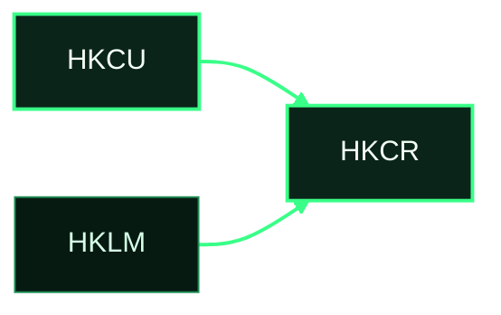
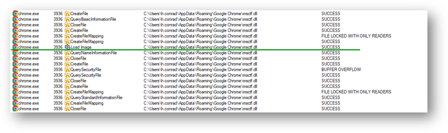
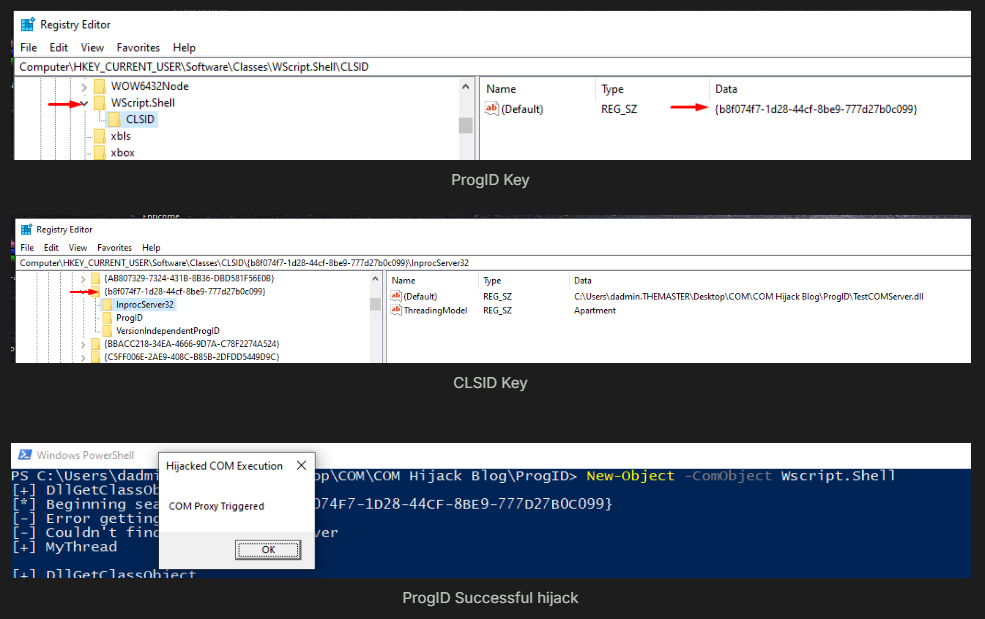
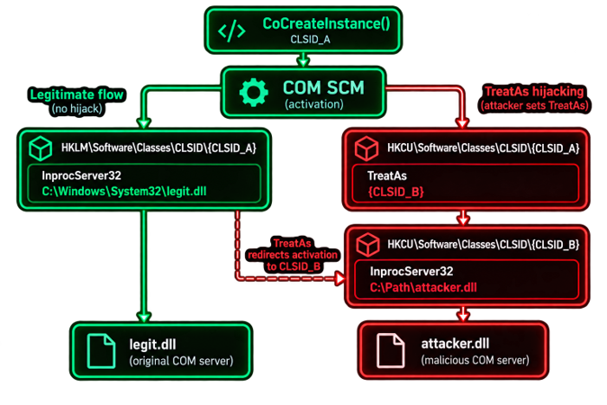
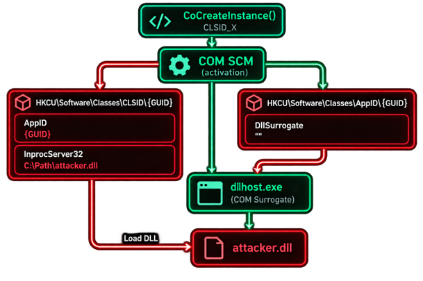
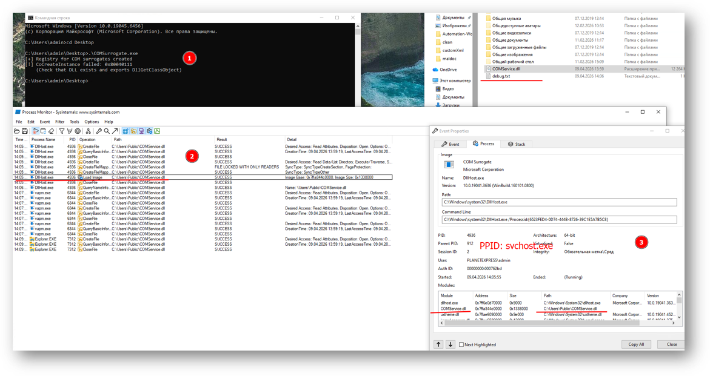
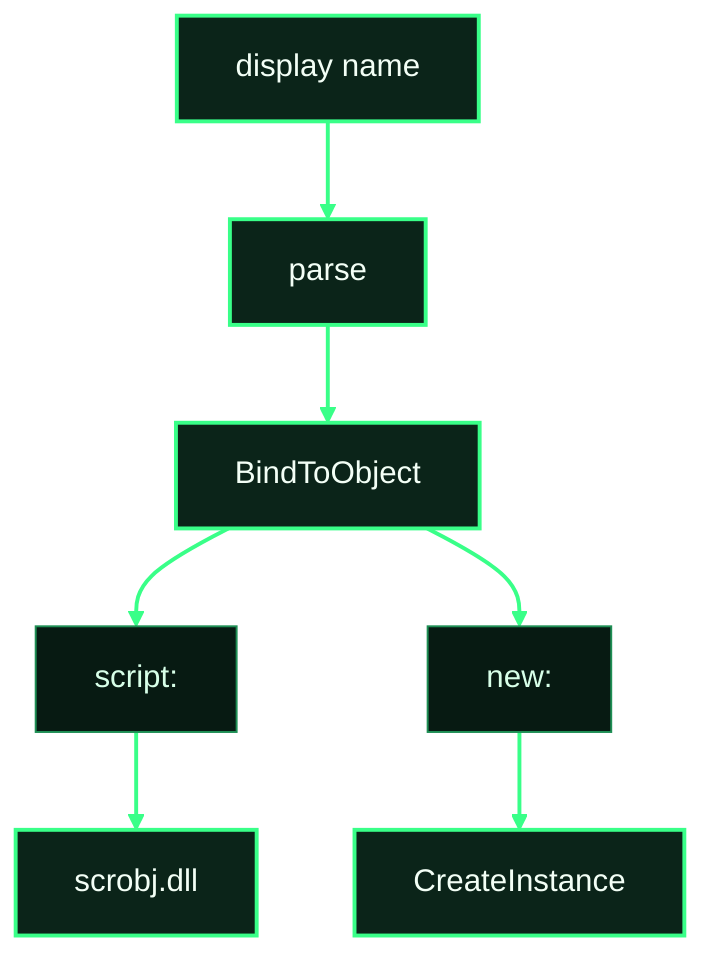
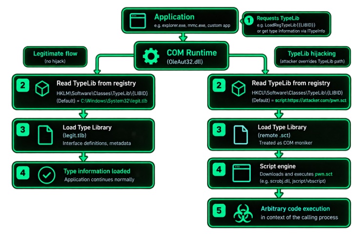
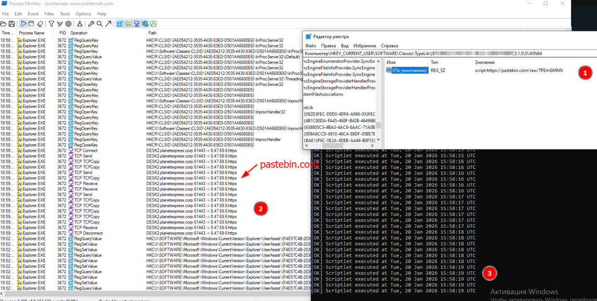
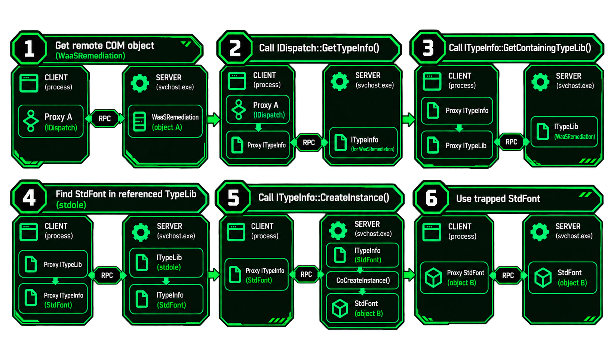

# COM as a Code-Execution Primitive

A process asks for a class. COM loads whatever the lookup returns, in whatever process and token that lookup selected. For any chain, name four facts: the CLSID or ProgID that was requested, the server value that was actually opened, the process that mapped it, and that process's token and session.

Three different starting points lead there. An existing class can be made to resolve to another server. A new class can be registered and loaded by the normal path. A method on an already-registered server can run inside that server. Correlation of the change with the load is in [detection-and-hardening.md](detection-and-hardening.md).

Read both registry views. A 32-bit process is redirected: the key a 64-bit tool sees under `Wow6432Node` is the one that process opened as `Software\Classes`.

## Per-user shadow

### Description

Every later "per-user" technique is this merge. The process opens `HKCR`. For its user and its bitness, a value in `HKCU\Software\Classes` is what comes back. The same value in HKLM stays on disk and is not returned.

### Concept

1. A process of user A, 64-bit, opens `HKCR\CLSID\{guid}\InprocServer32`.
2. The registry builds that view from `HKCU\Software\Classes` over `HKLM\Software\Classes`. The 32-bit process is redirected; a 64-bit tool sees its writes under `Wow6432Node`.
3. HKCU value present: that string is the result. HKLM is not read for this open.
4. HKCU value absent: HKLM is the result. A partial HKCU key does not hide a sibling that exists only in HKLM. `TreatAs` is the exception, because COM stops before the server subkey.
5. Session 0 as SYSTEM or LocalService does not have user A's hive mapped. The open returns HKLM.
6. The hive file for these classes is `%LocalAppData%\Microsoft\Windows\UsrClass.dat`. `NTUSER.DAT` is the rest of HKCU.

```text
HKCU\Software\Classes\CLSID\{guid}\InprocServer32   ← returned
HKLM\Software\Classes\CLSID\{guid}\InprocServer32   ← still on disk
```



### Requirements

- The target process runs as the user whose hive you wrote, in a session where that hive is loaded.
- The write matches the process bitness.
- You do not need a write under HKLM.

### Steps to reproduce

1. From a 64-bit and a 32-bit process, read the same `HKCR` path. Note which view shows the HKCU value.
2. Write the value only under `HKCU\Software\Classes` and read `HKCR` again as that user.
3. Repeat the read from `nt authority\system` in session 0. The HKCU value is absent there.
4. If a registry callback is in scope, also replace bytes in `UsrClass.dat` while the hive is not loaded, then log on and read `HKCR`. The value appears without a `RegSetValue` from your process.

### Indicators of compromise

- Sysmon 12/13 on `HKCU\Software\Classes\...` from a user process.
- A change to `UsrClass.dat` with no matching registry event, when the hive was edited offline.
- The HKLM key is unchanged. A diff of effective `HKCR` against HKLM shows the extra value only in that user's sessions.

## Phantom and dangling

### Description

Two missing pieces look alike and leave different telemetry. A phantom class has no server registration until you create it, almost always under HKCU. A dangling class is already in HKLM, the file named by the server value is missing, and the directory is writable. You drop the file. You do not write the registry.

### Concept

1. Phantom: COM would have returned `REGDB_E_CLASSNOTREG` (`0x80040154`). After the HKCU key exists, the next activation of that CLSID loads your server, subject to the [per-user shadow](#per-user-shadow).
2. Dangling: the HKLM key is already complete. Activation calls `LoadLibrary` or `CreateProcess` on a path whose file is absent. Creating that file is enough. The next activation loads it.
3. Dangling is not elevation by itself. A process that is allowed to activate the class has to be the one that loads the file. The scan and the published loaders are in [vulnerability-research.md](vulnerability-research.md#dangling-registration).

### Requirements

- Phantom: you can create `HKCU\Software\Classes\CLSID\{CLSID}` in the view the target will open, and something will activate that CLSID.
- Dangling: the HKLM server path's file is missing, the directory ACL lets you create it, and a process you care about activates that CLSID.
- The file architecture matches the loader.

### Steps to reproduce

1. Phantom: search HKCU and HKLM for the CLSID. Absence in both, plus a host that will call it, is the case. Create the HKCU server subkey and trigger that host.
2. Dangling: enumerate HKLM `InprocServer32` and `LocalServer32` values, keep rows whose file does not exist, then check write access on the directory. `C:\ProgramData\...` is the usual shape.
3. Drop the file on the registered path. Do not touch the key. Trigger a process that activates the CLSID.
4. Confirm the load in that process and the absence of a registry event on the CLSID.

### Indicators of compromise

- Phantom: Sysmon 12/13 creating `HKCU\Software\Classes\CLSID\{guid}\InprocServer32` or `LocalServer32`, then a module or process from that path.
- Dangling: Sysmon 11 creating a file at a path already named by an HKLM server value. No Sysmon 12/13 on that CLSID. Sysmon 7 or Sysmon 1 of that path afterward.
- This is row 2 of [registration without owning the write](#registration-without-owning-the-write).

## In-process hijacking

### Description

The caller asks for a CLSID. The effective `InprocServer32` string is the DLL. `LoadLibrary` and `DllGetClassObject` run in the caller, on the caller's token. There is no new process and no SCM.

### Concept

1. The host calls `CoCreateInstance(CLSID, NULL, CLSCTX_INPROC_SERVER, iid, &p)`. `CLSCTX_ALL` takes the same path when `InprocServer32` exists, and never reaches `LocalServer32`.
2. [Per-user shadow](#per-user-shadow), then [TreatAs](#treatas) if that subkey exists.
3. `combase` reads the default of `InprocServer32`. A `REG_EXPAND_SZ` is expanded in this process.
4. `LoadLibrary` maps the DLL in the caller. `DllGetClassObject` returns the factory. `CreateInstance` returns a vtable in this process. `LaunchPermission` is not consulted.
5. An apartment mismatch still maps the DLL here. The pointer the caller receives is a proxy to another thread in the same process.
6. If the default is `%SystemRoot%\System32\scrobj.dll` and the CLSID has `ScriptletURL`, `scrobj` runs the scriptlet named by that value, still in the caller.

```text
HKCU\Software\Classes\CLSID\{CLSID}\InprocServer32
    (Default)      = C:\path\server.dll
    ThreadingModel = Both
```

Code runs in whatever process called `CoCreateInstance`. Its token and integrity are the ones you get.

A hit looks like this: the host (`chrome.exe`) maps a DLL from the user profile. No new process.



### Requirements

- Some process actually activates this CLSID with an in-proc bit set.
- The DLL matches that process's architecture and exports `DllGetClassObject`.
- The registration is visible to that process: right user, right session, right bitness.
- A raw HKCU `InprocServer32` pointing at a user path is the most common COM rule. Prefer a path from [registration without owning the write](#registration-without-owning-the-write) when that rule is in play.

### Steps to reproduce

1. Procmon the host through the action you care about. Filter `RegOpenKey` / `RegQueryValue` on `\CLSID\` and keep the GUIDs that are followed by `Load Image`.
2. Record the bitness, the user, and the full `InprocServer32` value, including whether it is `REG_EXPAND_SZ`.
3. Put your DLL on the effective path, or override the value in the hive that this process reads.
4. Repeat the action. The DLL must load in the host, not in a helper you started.
5. If the host caches a class factory, restart the host. An already-mapped DLL is not replaced by a registry edit.

### Indicators of compromise

- **Sysmon 13.** `TargetObject` ends with `\CLSID\{guid}\InprocServer32` or `\ScriptletURL` under `HKCU\Software\Classes`. `Details` is a path outside `System32`.
- **Sysmon 7.** `Image` is the host that activated the CLSID (`explorer.exe`, a browser, Office). `ImageLoaded` is that path. There is no Sysmon 1 for a new EXE.
- The host's token is the token the code runs with. A rule that only alerts on process creation does not see this.

Sources: [bohops](https://bohops.com/2018/06/28/abusing-com-registry-structure-clsid-localserver32-inprocserver32/), [SpecterOps](https://specterops.io/blog/2025/05/28/revisiting-com-hijacking/), [T1546.015](https://attack.mitre.org/techniques/T1546/015/).

## Local server hijacking

### Description

The caller asks for a local server. The effective `LocalServer32` string is the EXE. `svchost -k DcomLaunch` starts it with `-Embedding`. The token is chosen before the first instruction. A brand-new CLSID uses this same launch and is not a hijack of a system class.

### Concept

1. The host calls `CoCreateInstance` with `CLSCTX_LOCAL_SERVER` (`0x4`). If the mask is `CLSCTX_ALL` and `InprocServer32` exists, this key is never opened.
2. The call reaches the local SCM in the RpcSs service over ALPC. `MachineLaunchRestriction`, then `LaunchPermission`. An empty launch permission is the machine default, not "everyone".
3. Identity is fixed before `CreateProcess`: activating user, AppID `RunAs`, or `LocalService`. `LocalService` wins over `RunAs`.
4. `svchost -k DcomLaunch` creates the process. The command line is the registered string plus `-Embedding`.
5. The EXE calls `CoRegisterClassObject`. The client receives a proxy. If the process exits without registering, the HRESULT is `CO_E_SERVER_EXEC_FAILURE` (`0x80080005`).
6. A class object already in the RPCSS table is reused. Editing `LocalServer32` does nothing until that process exits.

```text
HKCU\Software\Classes\CLSID\{CLSID}\LocalServer32
    (Default) = C:\path\server.exe

svchost.exe -k DcomLaunch
    └─ server.exe -Embedding          token = RunAs, or the activating user
```

### Requirements

- The caller requests a local server. A caller that passes `CLSCTX_ALL` and finds `InprocServer32` never hits this key.
- You can write the effective `LocalServer32`, or replace the EXE file it already names.
- The EXE registers a class object for this CLSID.
- Launch permission allows the caller you are using.

### Steps to reproduce

1. Find a CLSID the target activates with local context: Procmon shows `LocalServer32`, or the process tree shows `svchost -k DcomLaunch` spawning the EXE with `-Embedding`.
2. Note AppID `RunAs` and `LocalService`. Those decide the token, not the path string.
3. Point `LocalServer32` at your EXE, or replace the file if the path is writable and the key should stay untouched.
4. If an instance is already registered, stop it. Then trigger the caller again.
5. Confirm parent `svchost.exe -k DcomLaunch`, command line containing `-Embedding`, and the token you expected from step 2.

### Indicators of compromise

- **Sysmon 13.** `TargetObject` ends with `\CLSID\{guid}\LocalServer32`. `Details` is an image outside the baseline for that GUID.
- **Sysmon 1.** `Image` is that EXE. `ParentImage` is `svchost.exe` and `ParentCommandLine` contains `-k DcomLaunch`. `CommandLine` contains `-Embedding`.
- A new GUID plus a new EXE has the same parent chain. The difference is whether the GUID already existed in HKLM.

## Environment-variable server paths

### Description

A server value of type `REG_EXPAND_SZ` is expanded when COM loads it. The string stored on the CLSID can stay constant while `HKCU\Environment` selects a different directory on the next activation.

### Concept

1. COM reads `InprocServer32` or `LocalServer32`.
2. If the type is `REG_EXPAND_SZ`, the loader expands `%NAME%` from the environment of the process that is loading.
3. A user variable in `HKCU\Environment` is visible to processes of that user started after the variable was set.
4. The CLSID value does not change when you retarget. There is no second write under `CLSID`.
5. A process that already expanded the path and cached the class factory keeps the old directory until it restarts.

```text
InprocServer32 (REG_EXPAND_SZ) = %C2ROOT%\impl.dll
HKCU\Environment\C2ROOT        = C:\Users\user\AppData\Local\stage1
```

Status: confirm expansion on the build you are testing. The type is standard `REG_EXPAND_SZ`. The cache behaviour depends on the host.

### Requirements

- The server value is `REG_EXPAND_SZ`, not `REG_SZ`. A `REG_SZ` that contains percent signs is not expanded.
- The variable is defined in the environment block of the process that loads the server.
- Something activates the CLSID again after the variable changes. A live cache hides the change.

### Steps to reproduce

1. Read the server value and its type. Keep only `REG_EXPAND_SZ` rows whose string contains a `%NAME%` you can define. System names (`SystemRoot`, `ProgramFiles`, `CommonProgramFiles`) are not the interesting ones.
2. Set `HKCU\Environment\<NAME>` to a directory you control. Start a new process as that user and print the environment block to confirm it inherited the variable.
3. Trigger activation. The module path should be the expanded directory.
4. Change only the variable. Trigger a fresh process. The CLSID value is identical, the loaded path is not.

### Indicators of compromise

- `InprocServer32` or `LocalServer32` of type `REG_EXPAND_SZ` containing a `%NAME%` that is not a known system variable.
- Sysmon 13 on `HKCU\Environment\<NAME>`, then Sysmon 7 from the expanded directory, with no new write on the CLSID.
- A static rule that matches `\AppData\` inside the CLSID value does not see this, because that substring is not in the CLSID value.

## ProgID hijacking

### Description

Callers that pass a name never pass a CLSID. `CLSIDFromProgID` reads one default, `HKCR\<ProgID>\CLSID`. That GUID is what gets activated. The server key of the original class is never the thing you had to overwrite.

### Concept

1. The host calls `CreateObject("WScript.Shell")`, `New-Object -ComObject`, or `Dispatch`. The argument is a string.
2. `combase` reads `HKCR\WScript.Shell\CurVer` when it exists, then `HKCR\<that name>\CLSID`.
3. Activation continues at that GUID: [per-user shadow](#per-user-shadow), [TreatAs](#treatas), then `InprocServer32` or `LocalServer32`.
4. A pass-through `DllGetClassObject` to the stock server keeps the caller working. The forwarder is in [persistence.md](persistence.md#pass-through-com-server).

```text
HKCU\Software\Classes\WScript.Shell\CLSID
    (Default) = {your CLSID}

HKLM\Software\Classes\WScript.Shell\CLSID
    (Default) = {72C24DD5-D70A-438B-8A42-98424B88AFB8}   ← hidden, not deleted
```

`New-Object -ComObject Wscript.Shell` reads `HKCU\...\WScript.Shell\CLSID` and activates that GUID. In this shot the value is `{b8f074f7-1d28-44cf-8be9-777d27b0c099}`, and that CLSID's `InprocServer32` is `TestCOMServer.dll`. The key sits under `Wow6432Node`, so only a 32-bit caller of `WScript.Shell` sees it.



Names that scripting hosts actually use:

| ProgID | Stock server |
|---|---|
| `WScript.Shell`, `WScript.Shell.1` | `wshom.ocx` |
| `Shell.Application` | `shell32.dll` |
| `Schedule.Service` | Task Scheduler 2.0 |
| `Scripting.FileSystemObject` | `scrrun.dll` |
| `WinHttp.WinHttpRequest.5.1` | `winhttp.dll` |
| `Outlook.Application` | Outlook |

### Requirements

- The host resolves a ProgID. A host that calls `CoCreateInstance` with a hardcoded GUID never reads this key.
- The HKCU ProgID value is in the hive and bitness that host opens.
- The CLSID you place there activates: it has a server, or it is one you obtained without a raw CLSID write.
- Status of "no CLSID write, still a reliable primitive": hypothesis until you have watched this host call `CLSIDFromProgID`.

### Steps to reproduce

1. In the host, confirm the string. Script source, a Procmon hit on `HKCR\<ProgID>`, or `CLSIDFromProgID` in a trace.
2. Read `CurVer` and the versioned `\CLSID` in HKCU and HKLM, both bitnesses.
3. Set `HKCU\Software\Classes\<ProgID>\CLSID` to the class you want. Leave `CLSID\{guid}` alone if the goal is to avoid that write.
4. Run the script or macro again. The process that called `CreateObject` should load your server.
5. If the caller breaks, the replacement did not return the interfaces it uses. Forward `DllGetClassObject` to the stock server and keep the extra behaviour in your DLL.

### Indicators of compromise

- Sysmon 13 on `HKCU\Software\Classes\<ProgID>\CLSID` or `\CurVer`. No write under `CLSID\{guid}`.
- The GUID stored on the ProgID is missing from HKLM, or its server path is user-writable.
- Script-host activity (`wscript.exe`, `cscript.exe`, Office) followed by a module load that the stock ProgID does not perform.

Source: [221B, ProgID hijacking](https://www.221bluestreet.com/offensive-security/windows-components-object-model/com-hijacking-t1546.015#progid-hijacking).

## TreatAs

### Description

The caller still passes CLSID A. One default value, a CLSID string under `TreatAs`, makes activation start over at B. A's `InprocServer32` can stay in HKLM forever. It is not opened.

### Concept

1. The host calls `CoCreateInstance({A}, ...)`.
2. `combase` opens `HKCR\CLSID\{A}` in this process's hive and bitness.
3. Subkey `TreatAs` exists. Its default is `{B}` and nothing else. `{A}\InprocServer32` is not queried.
4. Resolution runs again at `{B}`, including a `TreatAs` on B. The original `CLSCTX` mask is applied to B. An in-proc caller loads B only when B has an in-proc server.
5. `LoadLibrary` / the SCM acts on B's server. `DllGetClassObject` is B's. The caller's variable is the object it asked for as A.

```text
HKCU\Software\Classes\CLSID\{A}\TreatAs
    (Default) = {B}

HKLM\Software\Classes\CLSID\{A}\InprocServer32
    (Default) = C:\Windows\System32\legit.dll     ← present, not opened

HKCU\Software\Classes\CLSID\{B}\InprocServer32
    (Default) = C:\path\server.dll                ← this file is mapped
```

Code runs where B's server runs: in the caller if B is in-proc, in `dllhost` or an EXE if B is a local server.

Left column is the path with no `TreatAs`. Right column is the HKCU subkey. The dashed arrow is the restart at B. For an in-proc class the lookup in the middle runs in the caller. The SCM is involved only when B's server is out of process.



### Requirements

- You can create `HKCU\Software\Classes\CLSID\{A}\TreatAs` in the view the activating process opens. You do not need to change A's server value.
- B activates under the same `CLSCTX` and the same hive.
- Some process activates A after the subkey exists. A cached class object is not re-resolved.

### Steps to reproduce

1. Pick CLSID A from a real activation (Procmon on the host), not from a list of writable keys.
2. Read A's HKLM server value so you know what a failed override would still load.
3. Create `TreatAs` under A's HKCU key. Set the default to B. Register B in the same view, or point B at a class that already loads what you need.
4. Restart the host if it has already activated A. Trigger it again.
5. In Procmon, the successful chain queries `TreatAs`, then opens CLSID B, and does not query A's `InprocServer32`. The module that loads belongs to B.

### Indicators of compromise

- **Sysmon 13.** `TargetObject` ends with `\CLSID\{A}\TreatAs`. `Details` is a CLSID string. Sigma `registry_set_treatas_persistence` matches this write. A's HKLM `InprocServer32` is unchanged.
- **Sysmon 7 or 1.** The image is B's server. `Image` (Sysmon 7) or the parent chain (Sysmon 1) is the process that activated A, not a process that activated B by name.
- Procmon on a successful hit queries `TreatAs`, then opens `{B}`, and has no `RegQueryValue` on `{A}\InprocServer32`.
- When the activator is a remote COM server, the process that reads `TreatAs` is that server. See [Trapped COM objects](#trapped-com-objects).

Sources: [TreatAs](https://learn.microsoft.com/en-us/windows/win32/com/treatas), [ESET, Turla Outlook](https://www.welivesecurity.com/2018/08/22/turla-unique-outlook-backdoor/).

## DLL surrogate

### Description

The DLL path does not change. Two values tell the SCM to map that same `InprocServer32` inside `dllhost.exe` instead of inside the caller. The client holds a proxy. The token does not go up.

### Concept

1. `CoCreateInstance` with `CLSCTX_INPROC_SERVER`, or with `CLSCTX_ALL` when `InprocServer32` exists, calls `LoadLibrary` in the caller. `DllSurrogate` is not read.
2. `CoCreateInstance` with `CLSCTX_LOCAL_SERVER` reaches the SCM. The SCM reads `CLSID\AppID`, then `AppID\DllSurrogate`.
3. An empty `DllSurrogate` is the system host. `svchost -k DcomLaunch` starts `dllhost.exe /Processid:{AppID}`. The GUID on that command line is the AppID. Every CLSID with the same AppID shares the process.
4. COM calls `ISurrogate::LoadDllServer` inside `dllhost`. `dllhost` loads the `InprocServer32` DLL and returns the class object. Further calls from the client are ORPC into `dllhost`.
5. A path in `DllSurrogate` is used instead of `dllhost`. That EXE implements `ISurrogate`.
6. Token is the activating user, `RunAs`, or `LocalService`. Integrity follows that token.

```text
HKCU\Software\Classes\CLSID\{CLSID}\AppID = {AppID}
HKCU\Software\Classes\CLSID\{CLSID}\InprocServer32
    (Default) = C:\path\server.dll
HKCU\Software\Classes\AppID\{AppID}\DllSurrogate
    (Default) =                          ← empty string

svchost.exe -k DcomLaunch
    └─ dllhost.exe /Processid:{AppID}
           └─ LoadLibrary server.dll
```

The SCM reads both HKCU keys. An empty `DllSurrogate` starts `dllhost.exe`, and `dllhost` loads the `InprocServer32` path. The direct arrow is the other context: `CLSCTX_INPROC_SERVER` maps that same DLL in the caller and never reads `DllSurrogate`.



### Requirements

- The activation that you want to move uses `CLSCTX_LOCAL_SERVER`. An in-proc activation of the same CLSID still maps the DLL in the caller.
- `InprocServer32` names a DLL the host can load, matching `dllhost`'s bitness.
- Launch permission allows the caller.
- A custom CLSID plus these two values is a launcher you registered. No system class was replaced.

### Steps to reproduce

1. Decide which outcome you want. In-proc load in a chosen host is [in-process hijacking](#in-process-hijacking). A `dllhost` parent chain is this section.
2. Write `HKCU\Software\Classes\CLSID\{CLSID}\AppID` and `HKCU\Software\Classes\AppID\{AppID}\DllSurrogate` as an empty string. Point `InprocServer32` at the DLL.
3. Activate with `CLSCTX_LOCAL_SERVER` only. `CLSCTX_ALL` will load the DLL in your own process and tell you nothing about the surrogate.
4. Confirm `dllhost.exe /Processid:{AppID}`, parent `svchost.exe -k DcomLaunch`, and a `Load Image` of your DLL inside `dllhost`.
5. Call a method. The call arrives in `dllhost`, on `dllhost`'s token.

In this trace the class was registered, `CoCreateInstance` returned `0x80040111` (`CLASS_E_CLASSNOTAVAILABLE`: the DLL did not hand back a factory for that CLSID), and `dllhost.exe` had already mapped `COMService.dll` from `C:\Users\Public`. Parent is `svchost.exe`. The command line is `dllhost.exe /Processid:{GUID}`.



### Indicators of compromise

- **Sysmon 13.** `TargetObject` ends with `\AppID\{guid}\DllSurrogate`. `Details` is empty or a path outside `System32`. The AppID is not in the baseline. A second value, `CLSID\{guid}\AppID`, points at it.
- **Sysmon 1.** `Image` ends with `dllhost.exe`. `CommandLine` contains `/Processid:{GUID}` equal to that AppID. `ParentCommandLine` contains `-k DcomLaunch`.
- **Sysmon 7.** `Image` is that `dllhost.exe`. `ImageLoaded` is the `InprocServer32` path, often under `\Users\` or `\ProgramData\`.
- One `dllhost` for every CLSID that shares the AppID, not one process per CLSID.

### Surrogate context shift

Same two values, applied to a CLSID that some other program already activates with local context. The next local activation maps the DLL in `dllhost` instead of in the original client. Rules bound to the client process do not see the load. The token is still the one AppID and `RunAs` selected.

```text
HKCU\Software\Classes\CLSID\{CLSID}\AppID = {AppID}
HKCU\Software\Classes\AppID\{AppID}\DllSurrogate = (empty)
```

To reproduce, find a local activation of that CLSID, add the two values in the hive that activation reads, restart any cached server, and trigger it again. The new process is `dllhost`. The client no longer has the DLL mapped.

Sources: [DLL surrogates](https://learn.microsoft.com/en-us/windows/win32/com/dll-surrogates), [bohops, part 2](https://bohops.com/2018/08/18/abusing-the-com-registry-structure-part-2-loading-techniques-for-evasion-and-persistence/).

## Running Object Table binding

### Description

`GetActiveObject`, and `GetObject` with an empty path, bind an object that is already in the Running Object Table of the caller's logon session. The lookup does not read the registry and does not start a server. Whoever called `RegisterActiveObject` first owns that CLSID until the registration is revoked or the session ends.

### Concept

1. A process in the session calls `CLSIDFromProgID` if it started from a name, then `RegisterActiveObject(pObj, clsid, ACTIVEOBJECT_STRONG, &cookie)`.
2. RPCSS stores the object in the ROT for this logon session.
3. A later `GetActiveObject` or empty-path `GetObject` in the same session receives that object.
4. `CoCreateInstance` does not consult the ROT. A caller that creates a new instance still hits the registry.
5. The object needs `IDispatch` for the names the client will invoke. When the real application starts, forwarding to a genuine instance keeps those callers working.
6. The entry dies with the session.

```text
CLSIDFromProgID("Excel.Application")
  → RegisterActiveObject(pObj, clsid, ACTIVEOBJECT_STRONG, &cookie)
  → later GetActiveObject binds to pObj
```

### Requirements

- The client uses `GetActiveObject` or `GetObject` with an empty path. `CreateObject` / `CoCreateInstance` will not hit you.
- Your process stays alive in the same logon session and registers before the real server.
- Cross-integrity use inside one session (a Medium object bound by a High client) is not confirmed on 24H2/25H2. Treat it as unverified.

### Steps to reproduce

1. Identify a client that binds the ROT. VBA `GetObject(, "Excel.Application")` is the usual one. A `CoCreateInstance` in the same trace is a different path.
2. Before that client runs, register an object for the CLSID from a process in the same session.
3. Run the client. It should call into your object, and Procmon should show no `InprocServer32` read for that activation.
4. Start the real application afterward and confirm whether the client is still on your object or moved.
5. Log off. The binding is gone until something registers again.

### Indicators of compromise

- No Sysmon 12/13/14 on `Classes\CLSID`.
- The ROT owner for a well-known CLSID is not that application. OleView or `IRunningObjectTable::EnumRunning` shows the other PID.
- The client process calls into that PID. After the real server starts, traffic to the other PID continues.

Sources: [RegisterActiveObject](https://learn.microsoft.com/en-us/windows/win32/api/oleauto/nf-oleauto-registeractiveobject), [GetActiveObject](https://learn.microsoft.com/en-us/windows/win32/api/oleauto/nf-oleauto-getactiveobject).

## Interface proxy/stub hijacking

### Description

When COM marshals an interface across apartments or processes, it loads a proxy/stub DLL named by the interface key. A per-user `ProxyStubClsid32` makes both sides of that marshal load your DLL. In-proc calls do not read this key.

### Concept

1. A call crosses an apartment, a process, or a machine, and the interface uses standard marshaling.
2. COM reads `HKCR\Interface\{IID}\ProxyStubClsid32`. HKCU hides HKLM here the same way it does for a CLSID.
3. That CLSID's `InprocServer32` is loaded in the client and in the server. `DllGetClassObject` must return an `IPSFactoryBuffer`.
4. The stock value for `IDispatch` `{00020400-0000-0000-C000-000000000046}` is `{00020424-0000-0000-C000-000000000046}` in `oleaut32.dll`.
5. Custom marshaling skips this key and loads the CLSID from `IMarshal::GetUnmarshalClass`.
6. An in-proc call uses the vtable. The interface key is not consulted, so overriding it does nothing until something marshals that IID.


### Requirements

- The IID is actually marshaled. An in-proc-only class never loads the stub.
- Your DLL loads in every process that marshals it, including processes you did not mean to touch. It has to return a working factory or those processes break.
- Status: hypothesis. Prefer a CLSID you did not have to create with a raw `InprocServer32` write, so the only new registry value is under `Interface`.

### Steps to reproduce

1. Diff `HKCU\Software\Classes\Interface` against HKLM. For a candidate IID, record the stock `ProxyStubClsid32`.
2. Pick an IID you can force across a process boundary. `IDispatch` is the common one. Confirm with a trace that marshaling happens: an out-of-proc call, not an in-proc `Invoke`.
3. Point `HKCU\Software\Classes\Interface\{IID}\ProxyStubClsid32` at your CLSID, in the bitness of both ends if both ends will marshal.
4. Make the call. Both processes should load your DLL at marshal time.
5. If the call fails with `REGDB_E_IIDNOTREG` (`0x80040155`), the key is missing or not visible to that side. If the call fails later, the factory did not accept the IID.

### Indicators of compromise

- Sysmon 13 on `HKCU\Software\Classes\Interface\{IID}\ProxyStubClsid32`, especially `{00020400-0000-0000-C000-000000000046}` pointing at anything other than `{00020424-0000-0000-C000-000000000046}`.
- Sysmon 7 of that CLSID's DLL in two processes at the same time, where the baseline module is `oleaut32.dll`.
- No write under `CLSID\{system-guid}\InprocServer32` when the stub CLSID was borrowed from an existing registration.

Sources: [Interface key](https://learn.microsoft.com/en-us/windows/win32/com/interface-key), [IPSFactoryBuffer](https://learn.microsoft.com/en-us/windows/win32/api/objidl/nn-objidl-ipsfactorybuffer).

## Registration-free COM

### Description

While an activation context is active, `CoCreateInstance` takes the server from that context and does not read the registry for that CLSID. A `<comClass>` entry is enough. There is no CLSID write.

### Concept

1. Something calls `CreateActCtx` on a manifest, then `ActivateActCtx`.
2. `CoCreateInstance` of a CLSID listed in that manifest loads the file named there.
3. `DeactivateActCtx` returns later lookups to the registry.
4. An external `app.exe.manifest` beside a signed EXE is ignored unless `HKLM\SOFTWARE\Microsoft\Windows\CurrentVersion\SideBySide\PreferExternalManifest` is `1`.
5. `CreateActCtx` from code inside a process applies even when external manifests are ignored.
6. The effect lasts as long as the context stays active. A trusted host that activates the context on its own trigger is what turns this into something that survives a restart of your tool.

```xml
<file name="impl.dll">
  <comClass clsid="{TARGET-CLSID}" threadingModel="Both"/>
</file>
```

### Requirements

- You can place a manifest the process will activate, or the process already calls `CreateActCtx` on a file you can influence.
- The CLSID in `<comClass>` is one that this process creates while the context is active.
- The DLL architecture matches the process.
- Status: hypothesis. External-manifest deployment is off by default. Count on in-process `CreateActCtx`.

### Steps to reproduce

1. Search the host for `CreateActCtx` / `ActivateActCtx`, and for manifests (file or RT_MANIFEST) that already contain `<comClass>`.
2. Add a `<comClass>` for a CLSID you have watched this process create, with `file name` pointing at your DLL.
3. Activate the context, then trigger the creation. Procmon should show no `HKCR\CLSID\{that guid}\InprocServer32` query, and a load of your file.
4. Deactivate the context and trigger again. The registry server should load, which confirms the context was the reason.

### Indicators of compromise

- A manifest, on disk or in a resource, whose `<comClass clsid=` is a system CLSID and whose file name is outside `System32`.
- Side-by-side ETW for `CreateActCtx` / `ActivateActCtx` in a signed host, then Sysmon 7 of a user-path DLL.
- No Sysmon 12/13 on that CLSID.
- `PreferExternalManifest` = 1 is its own registry change. It is not required for an in-process `CreateActCtx`.

Source: [Activation contexts](https://learn.microsoft.com/en-us/windows/win32/sbscs/activation-contexts).

## Registration without owning the write

### Description

Most of the techniques above still need a CLSID that points at code you control. The write defenders already alert on is `HKCU\Software\Classes\CLSID\{guid}\InprocServer32` set to a user path. The same load can be reached by a change that rule does not name.

### Concept

Try these in order. Stop at the first one the target environment actually allows.

1. No registry. ROT, or an activation context.
2. File planted on a [dangling HKLM path](vulnerability-research.md#dangling-registration). The key already names the file.
3. Replace a DLL a vendor already registered under `%LOCALAPPDATA%` (Chrome, Edge, Teams, Slack, ClickOnce, printer classes). The HKCU write belongs to the installer.
4. Let a trusted installer write the class: MSI, ClickOnce, VSIX, Office add-in. The event exists. The source image is the installer.
5. Point `InprocServer32` at a signed System32 COM server and use that server's methods ([living off the COM](#living-off-the-com)). Path rules for `\Users\` miss it.
6. Raw write of a user path. Assume this is logged.

These stack. An Interface override whose CLSID is a dangling HKLM class leaves the registry event under `Interface` only. A ProgID override whose target is an installer-owned class leaves the event on the ProgID name only.

### Requirements

- You know which sensor is in play before you pick a row. A lab with no Sysmon still needs a working load. A lab with a COM-hijack rule should not use row 6 and then call the test silent.
- Row 2 needs a privileged-enough activator. The file drop alone does not run.
- Row 3 needs a class the vendor registered for this user and a host that loads it. Confirm the host does not check the DLL's signature.

### Steps to reproduce

1. List the sensors: registry on `Classes\CLSID`, file create on `ProgramData` and `%LOCALAPPDATA%`, image load.
2. Walk the list from row 1. For each row, write down the event you expect and the event you must not see.
3. Perform only that row's change. Trigger the real host.
4. Compare the trace to the expectation. A load with no CLSID event is rows 1–3. A CLSID event whose process is `msiexec.exe` or the vendor updater is row 4.

### Indicators of compromise

- Row 2 and row 3: Sysmon 11 creating or replacing a file that an existing `InprocServer32` already names, under `ProgramData` or `%LOCALAPPDATA%`. Sysmon 7 of that path. No new CLSID value.
- Row 4: the CLSID write is present, and the writing image is an installer. The interesting follow-up is a later load from a path the installer does not ship.
- Row 6: Sysmon 13 on `InprocServer32` with a user path. Treat a hit here as the noisy case, not as proof that the other rows are absent.
- Join image loads to COM server paths even when the registry is quiet. A rule that only watches Sysmon 12/13 on `CLSID` misses rows 1–3.

## Living off the COM

### Description

The class is one Windows already registered. You activate it and call a method. There is no hijack write. The code runs in the server process, as that server's token.

### Concept

1. Resolve the ProgID or CLSID the normal way. Do not override it.
2. `CoCreateInstance` / `CoCreateInstanceEx` starts the registered server if it is not already running.
3. The method you call runs in that server. Out of process, you hold a proxy and the work happens on the other side.
4. A method named `Run` or `Execute` is a reason to open the type library. The name is not the finding. Read the arguments: a command line, a path, or a URL that the server will act on.

Published shapes:

- `Outlook.Application` can read and send mail in `OUTLOOK.EXE`. Parent is `svchost.exe` when COM started it with `-Embedding`. Cross-machine note: [lateral-movement.md](lateral-movement.md#c2-over-dcom-and-office).
- `MMC20.Application` and the other shell classes used for remote execution start a child from `mmc.exe -Embedding`, parent `svchost.exe -k DcomLaunch`.
- `IRundown::DoCallback` is a callback into code the caller arranged, inside a process that already holds the object. The documented detection gap is user-mode hooks on `CreateRemoteThread`. The write-up is [MDSec](https://mdsec.co.uk/2022/04/process-injection-via-component-object-model-com-irundowndocallback/). Confirm the interface on the build before treating it as available.

### Requirements

- The class is registered for the caller you have, and launch/access checks allow you.
- You need a method that does the work in the server. Enumeration of names is the search, not the execution.
- For a remote case, the remote SCM has to be willing to activate that CLSID. That is [lateral-movement.md](lateral-movement.md), not a second local primitive.

### Steps to reproduce

1. From the inventory you trust ([windows-com-objects](https://github.com/sahar55/windows-com-objects) or a local `oleview` dump), keep classes whose type library shows a method with a command, path, or URL argument, running in a process you want.
2. Activate locally with the registered CLSID. Do not write HKCU first. If activation fails, fix the context (`CLSCTX`, permissions), do not hijack the class to "make it work".
3. Call the method with a benign argument you can see (a local process, a file create, a mail item in a lab mailbox).
4. Record who spawned: parent, command line, token, session. That is the execution context.
5. Repeat from a second machine only after the local case is understood. The server process on the far side is the one that matters.

### Indicators of compromise

- No new `CLSID` or `TreatAs` value.
- `OUTLOOK.EXE -Embedding` or `mmc.exe -Embedding` whose parent is `svchost.exe`, then a child, a file, or a mail action that the interactive start of that program does not perform.
- For `IRundown::DoCallback`, a thread in the target process without `CreateRemoteThread` in the caller's stack. This needs a stack trace, not a registry event.

Sources: [FireEye, Hunting COM Objects](https://www.fireeye.com/blog/threat-research/2019/06/hunting-com-objects.html), [windows-com-objects](https://github.com/sahar55/windows-com-objects).

## Moniker execution

### Description

Some callers pass a string, not a CLSID. `CoGetObject`, `GetObject` with a string, and `MkParseDisplayNameEx` parse it as a display name. `BindToObject` runs in the process that parsed the string, and that is where the server loads.

### Concept

1. The string enters `MkParseDisplayNameEx`. The parser order is in [fundamentals.md](fundamentals.md#monikers). The first strategy that succeeds wins.
2. A ProgID followed by `:` is the first strategy when `CLSIDFromProgID` on that prefix succeeds. `script`, `new`, `Session`, and `Elevation` are ProgIDs of moniker classes, so those strings take this step.
3. `BindToObject` on the resulting moniker creates the object in the binding process.
4. `script:<path or URL>` loads `scrobj.dll` there and runs the scriptlet.
5. `new:{CLSID}` and `new:<ProgID>` call `IClassFactory::CreateInstance`. In-proc or out-of-proc follows that class's registration.
6. `Session:<id>!new:{CLSID}` and `Elevation:Administrator!new:{CLSID}` are the same `new:` activation with a different location. They do not skip `BindToObject`. Session applies only when AppID `RunAs` is `Interactive User`. Elevation is out of process and only for a class that opted in. Boundaries: [trust-boundaries.md](trust-boundaries.md#cross-session-activation), [trust-boundaries.md](trust-boundaries.md#elevation-moniker).
7. A filesystem path becomes a file moniker. `file:` and `http:` become URL monikers. Neither starts a COM server by itself.



`LoadTypeLib` is one caller of this parser. A TypeLib value of `script:…` is step 4, reached because metadata loading handed the string over. See [TypeLib hijacking](#typelib-hijacking).

### Requirements

- A program passes the string to `CoGetObject`, `GetObject`, or `MkParseDisplayNameEx`. A string sitting in the registry does nothing until such a call reads it.
- For `script:`, `scrobj.dll` has to load in that process. A host that refuses the moniker prefix will not.
- For `new:`, the class on the right has to activate in that process's hive and bitness.
- `Session:` and `Elevation:` add a boundary. They are not a second execution primitive on top of `new:`.

### Steps to reproduce

1. Find the string source: script text, a command line, or a registry value that a process reads and then passes to `CoGetObject`.
2. For `script:`, point it at a local `.sct` and bind it. `scrobj.dll` should load in the binding process, and the scriptlet should run there. A URL is the same bind after the fetch.
3. For `new:`, bind `new:{CLSID}` of a class you can see load. The server process should match that class's `InprocServer32` or `LocalServer32`, not the moniker parser.
4. Watch a `file:` or `http:` string the same way. You should get a moniker object and no COM server unless the host then activates a class itself.
5. If the parse fails, check which prefix `CLSIDFromProgID` accepted. A colon does not force the ProgID strategy when that lookup fails.

### Indicators of compromise

- Command lines or script blocks containing `script:` or `new:`.
- Sysmon 7 of `scrobj.dll` in a process that is not `wscript.exe`, `cscript.exe`, or `mshta.exe`.
- Sysmon 11 creating a `.sct`, or an HTTP GET whose URL is the tail of a `script:` value.
- A registry value whose data begins with `script:`. The value is often a TypeLib `win32` / `win64` default. The process that loaded `scrobj.dll` is the one that read it.

Sources: [subt0x11, scriptlet URLs](https://subt0x11.blogspot.com/2016/04/bypass-application-whitelisting-script.html), [CoGetObject](https://learn.microsoft.com/en-us/windows/win32/api/objbase/nf-objbase-cogetobject).

## TypeLib hijacking

### Description

The application still passes its real LIBID. One default string, under `win32` or `win64`, is what `oleaut32` acts on. The class server under `CLSID\...\InprocServer32` is a different key and is not opened. A `script:` string runs in the process that loaded the library.

### Concept

1. The host calls `LoadRegTypeLib(LIBID)`, or walks `ITypeInfo` until the registered library is loaded.
2. `oleaut32` opens `HKCR\TypeLib\{LIBID}\{version}\0\win64` or `win32`, matching the caller's bitness. HKCU hides the HKLM default. The LIBID in the call does not change.
3. A filesystem path is mapped as a `.tlb` and returned as `ITypeLib`.
4. A string `script:` plus a path or a URL is handed to `MkParseDisplayNameEx` in this same process. `scrobj.dll` runs the scriptlet here. That is [moniker execution](#moniker-execution).
5. A `LoadTypeLib` that does not read this registered default does nothing with the override. Find the call that queries the value before treating the LIBID as a trigger.

```text
HKCU\Software\Classes\TypeLib\{LIBID}\{version}\0\win64
    (Default) = script:C:\path\lib.sct

HKLM\Software\Classes\TypeLib\{LIBID}\{version}\0\win64
    (Default) = C:\Windows\System32\legit.tlb     ← hidden for this user and bitness
```

Code runs in the process that called `LoadRegTypeLib`. A 32-bit host reads `win32`. Writing only `win64` misses it.

Left column is a `.tlb` path from HKLM. Right column is the same LIBID with an HKCU default that is a `script:` display name. `scrobj.dll` then runs in the process that requested the library.



### Requirements

- You have a process that opens this exact value. A LIBID nobody loads is not a trigger.
- The override is on the subkey of the caller's bitness. A `win32` write does nothing for a 64-bit `LoadRegTypeLib`.
- For execution rather than a metadata swap, the string has to be a display name this loader will bind. A random path to a `.tlb` changes type information. It does not run a scriptlet.

### Steps to reproduce

1. Procmon the host for `TypeLib\{`. Note LIBID, version, and whether the query is `win32` or `win64`.
2. Read the HKLM default and the HKCU default of that same value.
3. Set the HKCU default to `script:` plus a local scriptlet path. Leave the LIBID and the CLSID server keys alone.
4. Trigger the action that queried the value. `scrobj.dll` should load in that process.
5. If nothing loads, the call you watched was not `LoadRegTypeLib` on the registered path. Find the call that reads this default before changing anything else.

The trace below is that sequence in `explorer.exe`: the HKCU `win64` default is `script:https://...`, Procmon shows the fetch, and the scriptlet runs in Explorer.



### Indicators of compromise

- **Sysmon 13.** `TargetObject` contains `\TypeLib\{LIBID}\` and ends with `\win32` or `\win64`. `Details` begins with `script:`, `http`, `https`, or a path under `\Users\` or `\ProgramData\`. The LIBID is one the host already loads. No write on `CLSID\...\InprocServer32`.
- **Sysmon 7.** `Image` is that host. `ImageLoaded` ends with `scrobj.dll`, in the same window as the registry read.
- Procmon shows `RegQueryValue` on that `win32`/`win64` default and no query of the class's `InprocServer32`.

Sources: [ReliaQuest](https://reliaquest.com/blog/threat-spotlight-hijacked-and-hidden-new-backdoor-and-persistence-technique/), [Outflank, Visual Studio](https://www.outflank.nl/blog/2023/03/28/attacking-visual-studio-for-initial-access/).

## Trapped COM objects

### Description

By-reference marshaling leaves the object in the server. The client holds a proxy, and the method runs there. `ITypeInfo::CreateInstance` is a method, so the `CoCreateInstance` it performs uses the server's token, hive, and bitness. A `TreatAs` written in the client's HKCU is invisible when that server is session 0 SYSTEM.

### Concept

1. The client activates `WaaSRemediation` out of process. The object stays in `svchost`. The client holds a proxy.
2. `IDispatch::GetTypeInfo` returns `ITypeInfo`, also by reference, still in `svchost`. `ITypeInfo::Invoke` is not reachable on that proxy. `CreateInstance` is.
3. `GetContainingTypeLib` reaches `StdFont` in `stdole`, CLSID `{0BE35203-8F91-11CE-9DE3-00AA004BB851}`.
4. `ITypeInfo::CreateInstance` calls `CoCreateInstance(StdFont)` inside `svchost`. That call is ordinary [TreatAs](#treatas): `StdFont`'s own server is not opened. The replacement server loads in `svchost`.
5. The client receives a proxy to whatever came back.
6. On current Windows 11 the CLR is not mapped into that protected host. A `.NET` class as B does not load there even when step 4 resolves it.

```text
read by svchost, not by the client:

HKCU or HKLM\Software\Classes\CLSID\{0BE35203-8F91-11CE-9DE3-00AA004BB851}\TreatAs
    (Default) = {B}

session 0 SYSTEM does not have the interactive user's hive
```

Steps 1–4 stay in `svchost` and only hand proxies back. Step 5 is `CoCreateInstance` inside that process. A `TreatAs` on `StdFont` is read there, not on the client. Step 6 is the proxy to whatever that call returned.



### Requirements

- The server exposes `IDispatch` far enough to return a by-reference `ITypeInfo` for a coclass, and `CreateInstance` is allowed on that proxy.
- The registration you depend on (`TreatAs`, a server path) is in the hive the server process opens, not the hive of the client.
- A published chain is a shape, not a promise about the build in front of you. If the service is PPL and refuses the CLR, stop. The bug class can still be true for a different server.

### Steps to reproduce

1. Activate the server out of process so you hold a proxy, not an in-proc pointer. Confirm the object lives in the server PID.
2. Call `GetTypeInfo`, then `GetContainingTypeLib`, and list coclasses. You are looking for one whose `ITypeInfo` still answers from the server PID.
3. Call `CreateInstance` on that coclass with no registry changes. Note which DLL the server loads. That is the unhooked behaviour.
4. Put `TreatAs` on that coclass in the hive the server reads. Repeat `CreateInstance`. The server should load the replacement and should not open the original `InprocServer32`.
5. If the server is session 0 SYSTEM, repeat the read of `TreatAs` from that account. A value that exists only in the interactive HKCU will not be in this lookup.

### Indicators of compromise

- Inbound TCP 135 and a dynamic RPC port to the host, then a module load inside the COM server's `svchost` that this service does not load on a normal start.
- `TreatAs` on `{0BE35203-8F91-11CE-9DE3-00AA004BB851}` in the hive that server opens, target CLSID outside the `StdFont` baseline.
- Sysmon 7 of an unexpected DLL in that `svchost`. `mscoree.dll` or `clrjit.dll` there is the managed-code variant. On current Windows 11 that load into the protected WaaS host is blocked, so the absence of the CLR is not evidence the `TreatAs` lookup was skipped.
- `HKLM\SOFTWARE\Microsoft\.NETFramework\AllowDCOMReflection` = 1 is the older reflection switch. It is a separate configuration from the `TreatAs` lookup.

Sources: [Forshaw, Project Zero](https://projectzero.google/2025/01/windows-bug-class-accessing-trapped-com.html), [IBM X-Force](https://www.ibm.com/think/news/fileless-lateral-movement-trapped-com-objects), [ForsHops](https://github.com/xforcered/ForsHops).

## Cross-session execution

### Description

This is not another way to load a server. It is one of the lookups above, with the server process in a different session from the client. The usual reason is AppID `RunAs` set to `Interactive User`, plus a session id on the activation.

### Concept

1. The caller activates a class whose AppID says `Interactive User`.
2. The SCM places the server in the interactive window station that activation named. `Session:<id>!new:{CLSID}` is one way to name it. See [trust-boundaries.md](trust-boundaries.md#cross-session-activation).
3. `LaunchPermission` and `AccessPermission` still apply. The string does not override `RunAs`. A fixed username, `LocalService`, or a COM+ server application keeps its own session.
4. Methods then run in the server's session, as the interactive user of that session.

### Requirements

- `RunAs` is exactly `Interactive User`. Any other identity ignores the session you named.
- The caller passes launch and access checks.
- You can observe session ids. A process name match is not a session match.

### Steps to reproduce

1. Read `HKCR\AppID\{AppID}\RunAs` for the class. Keep only `Interactive User`.
2. Activate from session A into session B using the session moniker, or whatever activator you are testing.
3. Record the server's session id and token. They should be session B and that session's interactive user.
4. Change `RunAs` to a fixed account in a lab copy and repeat. The server should stay with that account. That confirms the moniker did not override identity.

### Indicators of compromise

- Sysmon 1 for the server: session id different from the client's, parent `svchost.exe -k DcomLaunch`, image consistent with the class.
- `AppID\RunAs` flipped to `Interactive User` on a class whose baseline identity was a fixed account.
- The follow-on action (file, network, outbound authentication) happens in the interactive session, not in the caller's session.

Remote activation of the same servers is [lateral-movement.md](lateral-movement.md).

## Sources

- [MITRE T1546.015](https://attack.mitre.org/techniques/T1546/015/)
- [SpecterOps, Revisiting COM Hijacking](https://specterops.io/blog/2025/05/28/revisiting-com-hijacking/)
- [Project Zero, trapped COM objects](https://projectzero.google/2025/01/windows-bug-class-accessing-trapped-com.html)
- [Microsoft, DLL surrogates](https://learn.microsoft.com/windows/win32/com/dll-surrogates)
