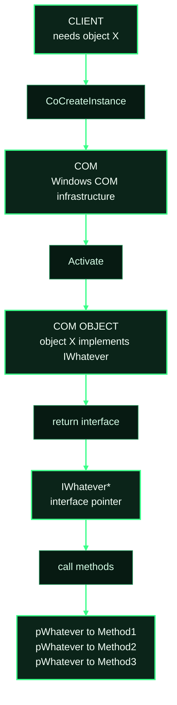
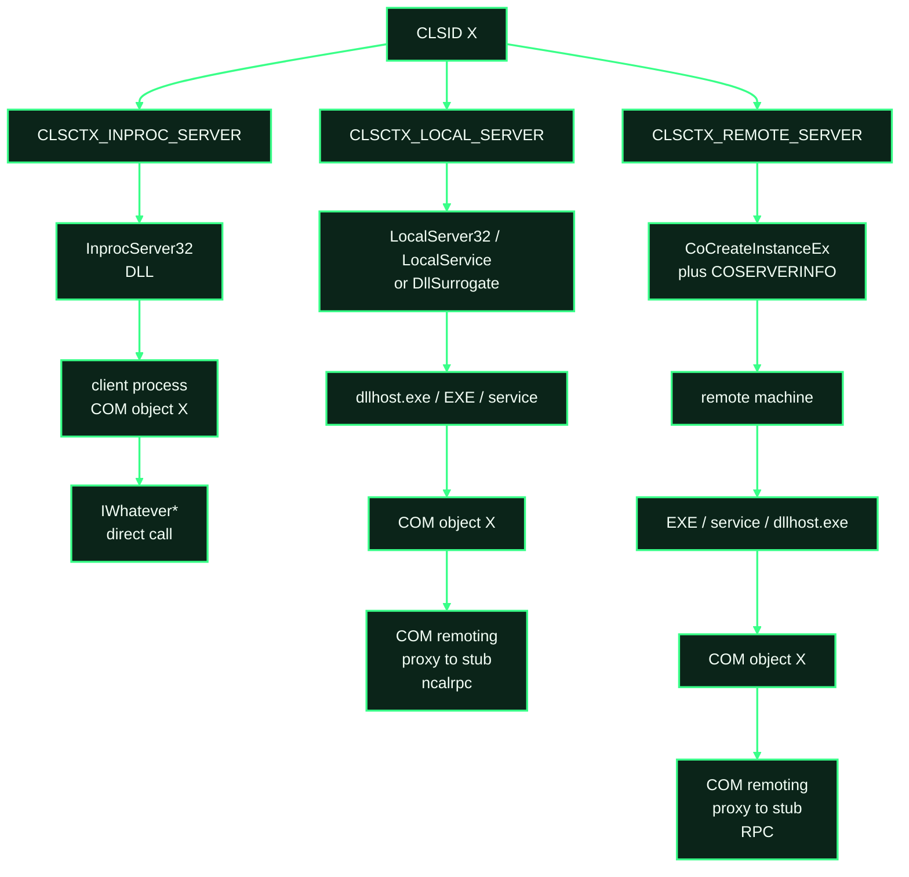
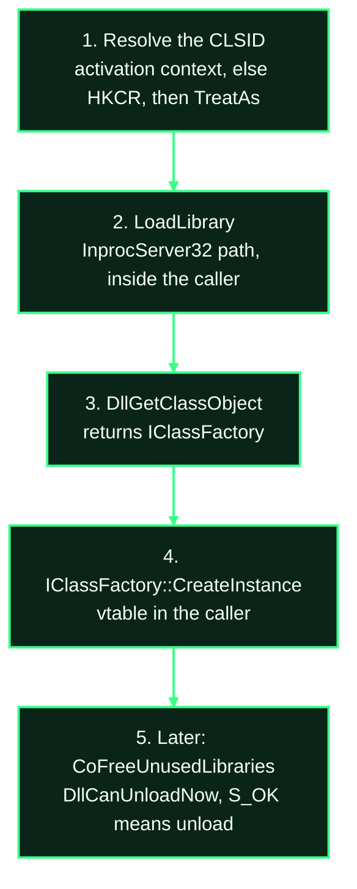
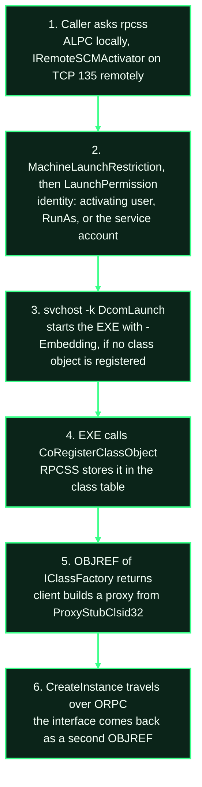
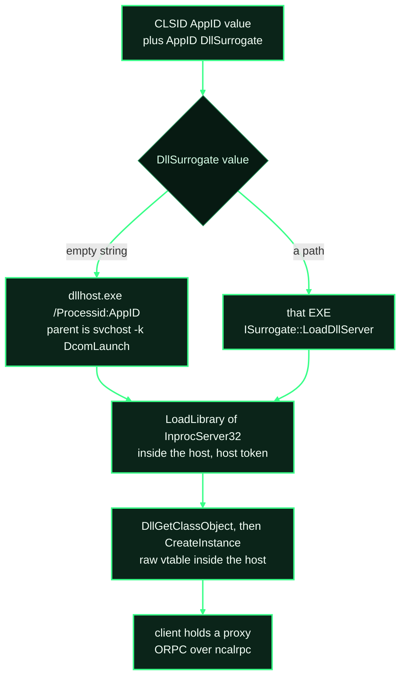
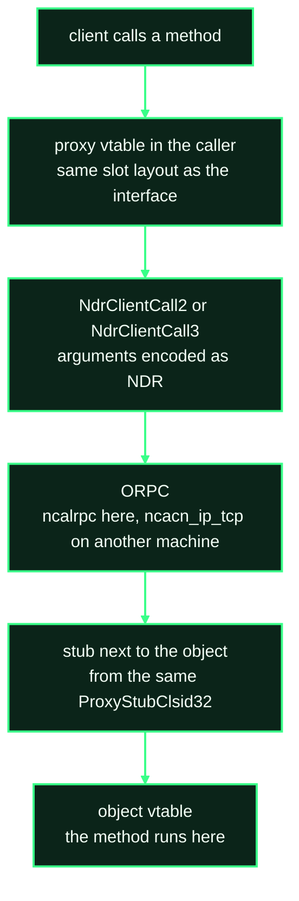
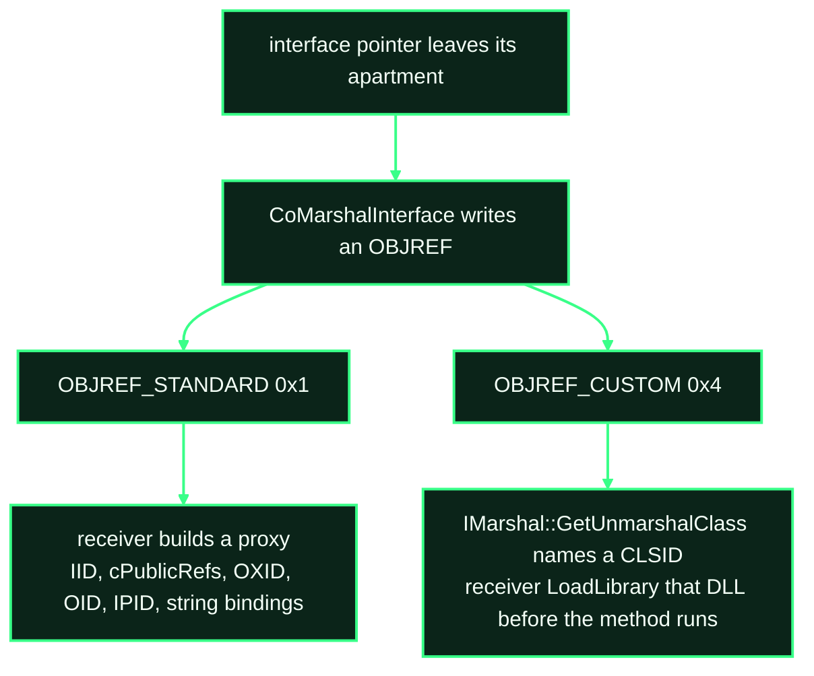
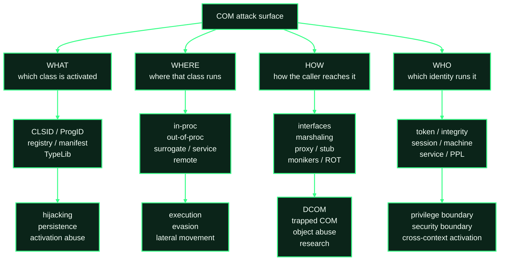

# How COM Works

A program asks Windows for an object by name. COM returns an interface pointer, either to the object itself or to a proxy for it.

Three decisions happen before the pointer comes back:

1. **Which code.** The name is a class id, or a short string that resolves to one. A registry key (or a manifest) names the DLL or EXE.
2. **Which process.** That file is loaded into the caller, started as its own process, or started on another machine.
3. **How the call travels.** In the caller's process the pointer is the object. Anywhere else the pointer is a stand-in, and Windows carries the arguments to the real object.



The rest of this file is those three decisions, with the real key names and APIs. The two examples at the end are the same request: one loads a DLL into the caller, the other starts `mmc.exe` and returns a stand-in.

## Contents

**Object model**

- [Runtime](#runtime)
- [Interfaces and the class factory](#interfaces-and-the-class-factory)

**Names and where they live**

- [Identifiers and the registry](#identifiers-and-the-registry)
  - [CLSID](#clsid)
  - [ProgID](#progid)
  - [AppID](#appid)
  - [TypeLib](#typelib)
  - [Interface](#interface)
- [Resolution order](#resolution-order)

**Activation**

- [Activation](#activation)
- [Where the server runs](#where-the-server-runs)
  - [In-proc](#in-proc)
  - [Local server](#local-server)
  - [Surrogate](#surrogate)
  - [Service](#service)
  - [Already running](#already-running)
- [Monikers](#monikers)
  - [Session moniker](#session-moniker)
  - [Elevation moniker](#elevation-moniker)
  - [Script moniker](#script-moniker)

**Who runs it, and how the call crosses a process**

- [Token, session, and call security](#token-session-and-call-security)
  - [Launch and access](#launch-and-access)
  - [Authentication and impersonation](#authentication-and-impersonation)
- [Marshaling](#marshaling)
- [Apartments](#apartments)
- [COM+ and DCOM](#com-and-dcom)
- [What the pieces are for](#what-the-pieces-are-for)

**Check it on a machine**

- [Worked examples](#worked-examples)
  - [In-proc: `WScript.Shell`](#in-proc-wscriptshell)
  - [Out-of-proc: `MMC20.Application`](#out-of-proc-mmc20application)
  - [What to record for any other class](#what-to-record-for-any-other-class)
  - [Checks](#checks)
  - [Tools](#tools)
- [Further reading](#further-reading)

---

## Runtime

These are the binaries every activation touches.

| Binary | Role |
|---|---|
| `combase.dll` | Client-side runtime. `CoCreateInstance`, class lookup, marshaling, call security. On current Windows the `Co*` exports in `ole32.dll` forward here. |
| `ole32.dll` | Older surface: monikers, the Running Object Table, OLE embedding. Most `Co*` entry points forward to `combase.dll`. |
| `oleaut32.dll` | Automation. `VARIANT`, `BSTR`, type libraries, `IDispatch`, and the universal marshaler. |
| `rpcss.dll` | Loaded in the RpcSs service (`svchost.exe -k rpcss`). That process keeps the class table, the ROT, and the OXID resolver, and listens for remote activation on TCP 135. |
| `svchost.exe -k DcomLaunch` | DCOM Server Process Launcher. Starts `LocalServer32` executables, COM services, and `dllhost.exe`. |
| `dllhost.exe /Processid:{AppID}` | Default surrogate. Hosts an in-proc DLL out of process when `DllSurrogate` is an empty string. |

`rpcss.dll` decides. `DcomLaunch` creates the process. A normal out-of-proc activation is `svchost.exe -k DcomLaunch` spawning either the registered EXE with `-Embedding` or `dllhost.exe /Processid:{AppID}`.

## Interfaces and the class factory

An interface pointer is the address of a vtable. The IID names which vtable. Slot 0 is `QueryInterface`, slot 1 is `AddRef`, slot 2 is `Release`, slot 3 is the first method of that IID.

The layout does not change after the interface is published. Another compiler or another process sees the same slots. There is no separate runtime type check: `QueryInterface` is how a caller discovers a second vtable on the same object.

Return values are `HRESULT`. Bit 31 is severity (1 = failure). Bits 16–26 are the facility. Bits 0–15 are the code.

| Constant | Value | Meaning |
|---|---|---|
| `S_OK` | `0x00000000` | success |
| `S_FALSE` | `0x00000001` | success, and the answer is "no" |
| `E_NOINTERFACE` | `0x80004002` | `QueryInterface` : this object has no such IID |
| `E_POINTER` | `0x80004003` | a required output pointer was null |
| `E_ACCESSDENIED` | `0x80070005` | launch or access check failed |
| `REGDB_E_CLASSNOTREG` | `0x80040154` | no server for this CLSID in the requested context |

`IUnknown` (`{00000000-0000-0000-C000-000000000046}`) occupies slots 0–2 of every COM interface:

| Slot | Method |
|---|---|
| 0 | `QueryInterface(riid, ppv)` — another vtable on the same object |
| 1 | `AddRef()` |
| 2 | `Release()` — at 0 the object is destroyed |

`IClassFactory` (`{00000001-0000-0000-C000-000000000046}`) is what an in-proc server returns from `DllGetClassObject`:

| Slot | Method |
|---|---|
| 3 | `CreateInstance(pUnkOuter, riid, ppv)` |
| 4 | `LockServer(fLock)` |

`CoCreateInstance` is `CoGetClassObject` + `IClassFactory::CreateInstance` + `Release` on the factory. `CoGetClassObject` stops at the factory.

`IDispatch` (`{00020400-0000-0000-C000-000000000046}`) appends late binding:

| Slot | Method |
|---|---|
| 3 | `GetTypeInfoCount` |
| 4 | `GetTypeInfo` → `ITypeInfo` |
| 5 | `GetIDsOfNames` → `DISPID` |
| 6 | `Invoke(dispid, ...)` |

Script hosts and PowerShell call `Invoke`. They do not link a C vtable. `ITypeInfo` is itself a COM object. When it is returned by reference, its methods run in the process that owns the type information.

In-proc server exports, resolved by name:

| Export | Called by |
|---|---|
| `DllGetClassObject` | COM, during activation |
| `DllCanUnloadNow` | COM, before unload |
| `DllRegisterServer` / `DllUnregisterServer` | `regsvr32`, optional |

## Identifiers and the registry

`HKCR` is a merged view, not a hive. Per-user classes are stored in `%LocalAppData%\Microsoft\Windows\UsrClass.dat`. For a process that has that hive loaded and matches bitness, the user value hides the machine value of the same name.

### CLSID

Which class to create.

```text
HKCR\CLSID\{CLSID}
  (default)                 friendly name
  AppID                     REG_SZ {AppID}
  ProgID                    string name
  TypeLib                   {LIBID}
  TreatAs\(default)         replacement {CLSID}; lookup restarts
  InprocServer32\(default)  DLL path
    ThreadingModel          Apartment | Free | Both | Neutral
  LocalServer32\(default)   EXE command line
  InprocHandler32           handler DLL, not the server. Rare.
```

A server path may be `REG_EXPAND_SZ`. COM expands it at load. The string stored in the key is not necessarily the path that is mapped.

32-bit and 64-bit registrations are different views. A 32-bit process that opens `HKCR\CLSID\{CLSID}` is redirected to the 32-bit view. From a 64-bit process that same data sits at `HKLM\SOFTWARE\Classes\Wow6432Node\CLSID\{CLSID}` and `HKCU\SOFTWARE\Classes\Wow6432Node\CLSID\{CLSID}`. A write to the native 64-bit key does not affect a 32-bit client.

### ProgID

The string a script passes. It resolves to a CLSID.

```text
HKCR\<ProgID>\CLSID\(default)     {CLSID}
HKCR\<ProgID>\CurVer\(default)     versioned ProgID
HKCR\<VersionedProgID>\CLSID
```

`CLSIDFromProgID` follows `CurVer` when the value is present. The ProgID key is subject to the same HKCU-over-HKLM merge as the CLSID key. It is an extra lookup in front of a class, not a separate object.

### AppID

How, where, and as whom the class may run. The CLSID key stores only the AppID GUID.

```text
HKCR\AppID\{AppID}
  RunAs                 "Interactive User", a username, or absent
  DllSurrogate          empty REG_SZ → system dllhost; or a path of a custom surrogate
  LocalService          service name. The server is that service.
  ServiceParameters
  LaunchPermission      REG_BINARY self-relative security descriptor
  AccessPermission      REG_BINARY self-relative security descriptor
```

`RunAs` absent and the server is a newly started EXE: the activating user. `RunAs` absent and `LocalService` is set: the service account. `RunAs` does not override `LocalService`.

Not every CLSID has an AppID. A missing `LaunchPermission` means the machine default, not "allow everyone":

```text
HKLM\SOFTWARE\Microsoft\Ole
  EnableDCOM
  LegacyAuthenticationLevel      DWORD, RPC_C_AUTHN_LEVEL_*
  LegacyImpersonationLevel       DWORD, RPC_C_IMP_LEVEL_*
  DefaultLaunchPermission
  DefaultAccessPermission
  MachineLaunchRestriction
  MachineAccessRestriction
```

Activation is allowed only when both the AppID permission (or the default) and the machine restriction allow the caller.

### TypeLib

Description of interfaces, methods, parameters, and types. Identified by a LIBID. Loading it is part of activation, not a separate documentation step.

```text
HKCR\CLSID\{CLSID}\TypeLib                 {LIBID}
HKCR\TypeLib\{LIBID}\<version>\0\win64     (default) = path or moniker
HKCR\TypeLib\{LIBID}\<version>\0\win32     32-bit view
```

`LoadTypeLib` / `LoadRegTypeLib` read that default value. A filesystem path loads a `.tlb`. The same value can be a moniker display name (`script:…` and others). The LIBID still names the type library. `script:` is the string stored under `win32` or `win64`, not a second LIBID.

### Interface

Which in-proc server marshals an IID.

```text
HKCR\Interface\{IID}
  ProxyStubClsid32      {CLSID of the proxy/stub server}
  TypeLib               {LIBID}
  NumMethods
```

For standard marshaling, COM resolves `ProxyStubClsid32` and loads that DLL into the client (proxy) and into the server (stub). Custom marshaling does not use this key. It loads the CLSID from `IMarshal::GetUnmarshalClass`. `IDispatch`'s own `ProxyStubClsid32` is `{00020424-0000-0000-C000-000000000046}` in `oleaut32.dll`, the type-library marshaler, and that applies when the interface is marshaled. A dual interface can register a different proxy/stub. In-proc, `IDispatch` is a vtable and this key is not consulted. The Interface key is in the same HKCR merge as CLSID.

## Resolution order

For `CoCreateInstance` in a user process:

1. The active activation context (`ActivateActCtx`, or the process manifest). A `<comClass clsid="...">` entry supplies the server. The registry is not consulted for that CLSID.
2. `HKCR\CLSID\{CLSID}` in this bitness. A value defined under `HKCU\SOFTWARE\Classes` hides the `HKLM\SOFTWARE\Classes` value.
3. `TreatAs`, if the subkey exists. Replace the CLSID and repeat from step 2.
4. The server subkey that intersects the `CLSCTX` mask.

`GetActiveObject`, and `GetObject` with an empty path, do not use that list. They bind whatever is already registered in the Running Object Table of the caller's logon session. No `LoadLibrary`, no SCM launch. A string passed to `GetObject` or `CoGetObject` is a display name. That path is the moniker section below.

The interactive user's HKCU is not visible to:

- a service in session 0 running as SYSTEM or LocalService (its own hive, or none);
- a process of the other bitness, unless the same value exists in that view.

The effective key is the one the target process opens. A 64-bit elevated console reading native `HKCU\...\CLSID` does not show what a 32-bit medium-integrity process will load.

`CmRegisterCallback` observes `RegSetValue` on a hive that is already loaded. It does not observe a write to the hive file `UsrClass.dat` or `NTUSER.MAN` that a later logon maps in.

## Activation

```text
CoGetClassObject(rclsid, dwClsContext, pServerInfo, riid, ppv)
CoCreateInstance(rclsid, pUnkOuter, dwClsContext, riid, ppv)
CoCreateInstanceEx(rclsid, pUnkOuter, dwClsContext, pServerInfo, dwCount, pResults)
```

`dwClsContext` is a bitmask. COM selects one registered server that satisfies both the mask and the registration. Several bits may be set; one server is chosen.

| Flag | Value | Registration | Where the object is |
|---|---|---|---|
| `CLSCTX_INPROC_SERVER` | `0x1` | `InprocServer32` | the caller's process |
| `CLSCTX_LOCAL_SERVER` | `0x4` | `LocalServer32`, or AppID `DllSurrogate` / `LocalService` | another process on this machine |
| `CLSCTX_REMOTE_SERVER` | `0x10` | the out-of-proc registration, read by the remote SCM | the other machine |

`CLSCTX_REMOTE_SERVER` does not map the remote machine's `InprocServer32` into the caller. The remote SCM starts an out-of-proc server there (EXE, service, or `dllhost`). The caller keeps a proxy. One bit of the mask wins. The three branches do not all run.



`CoCreateInstanceEx` names the machine in `COSERVERINFO.pwszName`. The remote column is that call. On the far side the SCM still reads `LocalServer32`, `LocalService`, or `DllSurrogate`.

Local ORPC uses `ncalrpc`. Cross-machine ORPC uses RPC, typically `ncacn_ip_tcp`, after the endpoint mapper on TCP 135. The proxy/stub pair is the same mechanism. The transport is not.

Authentication level on the activation (`RPC_C_AUTHN_LEVEL_*`):

| Value | Name | Property |
|---|---|---|
| 1 | `NONE` | no authentication. Anonymous activation. The integrity floor below does not apply |
| 2 | `CONNECT` | authenticate at bind |
| 3 | `CALL` | authenticate each call |
| 4 | `PKT` | authenticate each packet |
| 5 | `PKT_INTEGRITY` | each packet is signed |
| 6 | `PKT_PRIVACY` | signed and encrypted |

Since the March 2023 phase of KB5004442, a server rejects non-anonymous DCOM activation below `PKT_INTEGRITY`. `HKLM\SOFTWARE\Microsoft\Ole\AppCompat\RequireIntegrityActivationAuthenticationLevel` no longer turns that check off. `LegacyAuthenticationLevel` is the default for calls that do not set their own level. It is not that activation floor.

Client-side failures:

| HRESULT | Name | Condition |
|---|---|---|
| `0x80040154` | `REGDB_E_CLASSNOTREG` | no server for this CLSID in this context and registry view |
| `0x80040155` | `REGDB_E_IIDNOTREG` | no proxy/stub registered for the IID being marshaled |
| `0x80070005` | `E_ACCESSDENIED` | launch or access check failed |
| `0x80080005` | `CO_E_SERVER_EXEC_FAILURE` | the local server process did not call `CoRegisterClassObject` |

## Where the server runs

The three columns above are these three paths.

### In-proc

`CLSCTX_INPROC_SERVER` (`0x1`) plus an `InprocServer32` value. No new process, no SCM, no `LaunchPermission`.



`CoCreateInstance` is steps 3 and 4 plus `Release` on the factory:

```text
CoGetClassObject(clsid, ctx, NULL, IID_IClassFactory, &factory);
factory->CreateInstance(NULL, iid, &object);
factory->Release();
```

Token, integrity level, and session are the caller's. The trace is a module load. A fault in the DLL takes down the host.

`ThreadingModel` is read before `CreateInstance`. When it matches the caller's apartment, the pointer is the object's vtable. When it does not, COM still maps the DLL in the caller, creates the object on a compatible thread, and returns a proxy to that thread. Same process, marshaled call.

### Local server

`CLSCTX_LOCAL_SERVER` (`0x4`) and a `LocalServer32` command line. The client never sees the server vtable. A surrogate or a service is the same SCM sequence with a different host. Those hosts are the next two sections.



The token is chosen before `CreateProcess`. The EXE is already that user when its first instruction runs. `-Embedding` is the switch COM appends: register a class object, do not open the normal UI.

If the process exits without `CoRegisterClassObject`, the client gets `CO_E_SERVER_EXEC_FAILURE` (`0x80080005`).

`REGCLS` on that registration:

| Value | Name | Effect |
|---|---|---|
| `0` | `REGCLS_SINGLEUSE` | one activation, then the class object is dropped |
| `1` | `REGCLS_MULTIPLEUSE` | later clients share this process |
| `4` | `REGCLS_SUSPENDED` | hidden until `CoResumeClassObjects` |

A second activation of a class object already in the RPCSS table does not re-read `LocalServer32` and does not start a second process. A registry edit is invisible until that process exits.

### Surrogate

An in-proc DLL hosted out of process. The CLSID names an AppID, and the AppID names the host:

```text
HKCR\CLSID\{CLSID}\AppID = {AppID}
HKCR\AppID\{AppID}\DllSurrogate = (empty string, or a path)
```

This path is taken for `CLSCTX_LOCAL_SERVER` / `CLSCTX_REMOTE_SERVER`. A caller that passes `CLSCTX_INPROC_SERVER` still loads `InprocServer32` into itself.



The GUID on the `dllhost` command line is the AppID. Every CLSID whose `AppID` value is that GUID shares the process.

Inside the host the DLL is in-proc: `DllGetClassObject`, a vtable, the host's token and session. Relative to the client the same object is out of proc, so the client holds a proxy and every call is marshaled.

A path in `DllSurrogate` replaces `dllhost`. That EXE implements `ISurrogate`: `LoadDllServer` receives the CLSID, `FreeSurrogate` unloads the DLL. The surrogate changes which process maps the DLL. The token and the integrity level still come from `RunAs`, the activating user, or `LocalService`.

### Service

`HKCR\AppID\{AppID}\LocalService` is a service name. The SCM starts the service if it is stopped and waits for `CoRegisterClassObject` in that process. Methods then run there, under the service account. `LocalService` wins over `RunAs`. The service process is started by `services.exe`. `DcomLaunch` is who requested the start, not the parent.

### Already running

COM prefers a class object that is already registered over starting a new server. An in-proc DLL that is already mapped stays mapped; a new `InprocServer32` value is not applied until the host unloads it. A local server that has already called `CoRegisterClassObject` is not restarted just because the registry changed.

## Monikers

A moniker is a COM object that turns a string into another COM object. `CoCreateInstance` takes a CLSID. `CoGetObject` takes the string.

```text
CoGetObject(pszName, pBindOptions, riid, ppv)
```

`CoGetObject` creates a bind context, parses `pszName`, and calls `IMoniker::BindToObject`. The explicit split is `CreateBindCtx`, `MkParseDisplayNameEx`, then `BindToObject`.

`MkParseDisplayNameEx` tries these strategies in order and keeps the first one that succeeds:

1. `ProgID:`. The characters before the first `:` must be a legal ProgID longer than one character. `CLSIDFromProgID`, then `IParseDisplayName::ParseDisplayName` (`{0000001A-0000-0000-C000-000000000046}`) on the whole string. `Session`, `Elevation`, `clsid`, `new`, and `script` are registered ProgIDs of moniker classes, so those display names take this step. The ProgID names the moniker class. It does not name the object `BindToObject` returns. A colon does not force the step: if `CLSIDFromProgID` fails, parsing continues.
2. File moniker. A path registered in the ROT, or a path that names an existing file. The display name is the path. A `file:` prefix is not required.
3. `@ProgID`, the older class lookup.

`MkParseDisplayName` has the file checks and `@ProgID`. `MkParseDisplayNameEx` adds step 1, and it also accepts URL display names. `http:` and a `file:` URL are URL monikers. They do not go through the `ProgID:` step.

After the first moniker exists, `!` composes a second one onto it. The left moniker is passed as `pmkToLeft` when the right side is parsed and bound. `c:\dir\file!item` is a file moniker composed with an item moniker. The composite class is `{00000309-0000-0000-C000-000000000046}`. The class moniker, the thing `clsid:` builds, is `{0000031A-0000-0000-C000-000000000046}`.

A string passed to `MkParseDisplayName`, `MkParseDisplayNameEx`, or `CoGetObject` is a display name. Which moniker class parses it is whichever strategy above succeeded.

| Display name | Bind result |
|---|---|
| `Session:<id>!…` | the right-hand moniker, in session `<id>` |
| `Session:Console!…` | the same, in the active physical console session |
| `clsid:{CLSID}` | the class object (`IClassFactory`), not an instance |
| `new:{CLSID}` or `new:<ProgID>` | `IClassFactory::CreateInstance` |
| `Elevation:Administrator!new:{CLSID}` | that instance, on the elevated administrator token |
| `Elevation:Highest!new:{CLSID}` | that instance, on the highest token the user has |
| `script:<path or URL>` | a scriptlet, parsed by `scrobj.dll` |
| `<path>` or `<path>!<item>` | a file, and optionally an item inside it |

`queue:` and `objref:` are the `ProgID:` step. `queue:` is the COM+ queued-component moniker. `objref:` binds a string form of an already marshaled `OBJREF`.

### Session moniker

Microsoft's form:

```text
Session:<session id>!clsid:<class id>
Session:Console!clsid:<class id>
```

`<session id>` is base 10. `Console` means the physical console session, whatever number it currently has. `clsid:` on the right returns the class object. `new:{CLSID}` on the right creates an instance in that session:

```text
Session:1!new:{CLSID}
```

The SCM applies the session id when the AppID `RunAs` value is `Interactive User`. A fixed username, `LocalService`, or a COM+ server application keeps its own session. The string does not override `RunAs`. Naming the session does not pass `LaunchPermission` or `AccessPermission`. The caller still has to satisfy both.

What the moniker changes is the window station of an interactive-user server. A process in session 0 can name the interactive desktop this way. A process in one Remote Desktop session can name another. The server identity is still the interactive user of the target session.

### Elevation moniker

```text
Elevation:Administrator!new:{CLSID}
Elevation:Highest!new:{CLSID}
```

`Administrator` asks for the elevated half of a split token. `Highest` asks for the highest token that user can get. The object is out of process. An in-proc DLL cannot raise the integrity level of the process that loaded it. `Elevation:Administrator!clsid:{CLSID}` returns the elevated class factory. `new:` calls `CreateInstance` on it.

The class opts in under HKLM:

```text
HKLM\SOFTWARE\Classes\CLSID\{CLSID}\Elevation
  Enabled          REG_DWORD 1
```

The client passes `BIND_OPTS3` to `CoGetObject`:

```text
cbStruct        = sizeof(BIND_OPTS3)
hwnd            = owner window for the consent UI
dwClassContext  = CLSCTX_LOCAL_SERVER
```

`consent.exe` draws that UI. A CLSID also present in `HKLM\SOFTWARE\Microsoft\Windows NT\CurrentVersion\UAC\COMAutoApprovalList` can be approved without the UI. That list is HKLM. A per-user class registration is not an entry on it.

### Script moniker

`script` is the ProgID of the script moniker, so the `ProgID:` step above selects it the same way it selects `Session:` and `Elevation:`. The display name is `script:` plus a filesystem path or a URL of a scriptlet (`.sct`). The moniker class is implemented in `scrobj.dll`. `LoadTypeLib` hands a registry string that begins with a moniker prefix to that parser. A TypeLib value of `script:…` is this display name. The library's identity remains its LIBID.

## Token, session, and call security

Record these on the server, not on the client:

| Field | Source |
|---|---|
| User SID | `RunAs`, else the activator, else the service account |
| Integrity level | the token the SCM created |
| Session ID | the window station the server was bound to |
| Thread token | present only while a method impersonates |
| PPL / AppContainer | property of the host process, independent of the CLSID |

`RunAs`:

| Registry | Server identity |
|---|---|
| value absent, new EXE | activating user |
| `Interactive User` | the user attached to the interactive window station. That user can differ from the caller, including a remote caller |
| a username | that account. The SCM has to be able to log it on |
| `LocalService` set | the service account |

`Interactive User` is the server's identity. The caller does not become that user. `LaunchPermission` and `AccessPermission` still apply to the caller.

### Launch and access

`LaunchPermission` is checked by the SCM when the server is activated. `AccessPermission` is checked on calls into a server that is already running. They are different ACLs. A caller allowed to launch can still fail the access check, and the reverse.

Both are `REG_BINARY` self-relative security descriptors. If the AppID omits one, the machine default under `HKLM\SOFTWARE\Microsoft\Ole` applies, and `MachineLaunchRestriction` / `MachineAccessRestriction` still apply on top.

### Authentication and impersonation

Authentication level (table above) answers "was this packet authenticated, signed, encrypted". Impersonation level answers "what may the server do with the caller's token". The client sets it in `CoInitializeSecurity` or on the proxy blanket. `LegacyImpersonationLevel` is the default.

| Value | Name | The server can |
|---|---|---|
| 1 | `ANONYMOUS` | not identify the caller |
| 2 | `IDENTIFY` | identify the caller, not open objects as the caller |
| 3 | `IMPERSONATE` | use the caller's token on the local machine |
| 4 | `DELEGATE` | use the caller's token on another machine. Requires Kerberos and delegation on the account |

The level in that table is a cap the client sets. The server cannot raise it.

The process default is `dwImpLevel` in `CoInitializeSecurity`. One proxy is changed with `CoSetProxyBlanket` (`dwAuthnLevel`, `dwImpLevel`, `dwCapabilities`). Cloaking chooses which client token crosses the call:

| Capability | The server is shown |
|---|---|
| none | the client process token |
| `EOAC_STATIC_CLOAKING` | the thread token captured when the blanket was set |
| `EOAC_DYNAMIC_CLOAKING` | the thread token at the moment of each call |

On the server, the thread that received the call still runs as the process until the method asks otherwise. `CoQueryClientBlanket` reads the caller's identity, authentication level, and impersonation level without switching tokens. `IDENTIFY` is enough for that read.

`CoImpersonateClient` (`RpcImpersonateClient`) puts the client's token on this thread, at or below the offered level. `OpenThreadToken` then sees it. `CoRevertToSelf` takes it off. The process token stays the process token. A different thread does not inherit the impersonation. An STA delivers the call on the object's thread. A worker keeps the client identity only if the method duplicates the token (`DuplicateTokenEx`) and applies it (`SetThreadToken`).

`IMPERSONATE` is local. A further network hop from that thread authenticates as the server, unless the client offered `DELEGATE` and the account is trusted for Kerberos delegation.

A process may put a more privileged token on its thread only when it holds `SeImpersonatePrivilege`. Service accounts hold it. A medium-integrity user process does not. The direction is server-takes-client: a SYSTEM server that impersonates a medium caller continues that thread as the medium user. A medium server does not become SYSTEM by impersonating a privileged caller.

The miss is a server that never calls `CoImpersonateClient` and then uses the process token on something the client supplied: a path, a URL, a CLSID.

## Marshaling

In one apartment, `p->Method()` is a call through the object's vtable. Across a process, an apartment boundary, or a machine, the caller holds a proxy with the same slots. The first three slots (`QueryInterface`, `AddRef`, `Release`) hit the proxy manager. The rest hit the channel.



On this path, standard marshaling, `HKCR\Interface\{IID}\ProxyStubClsid32` is the CLSID of the proxy/stub DLL. COM loads it in the caller and in the server. `IDispatch` (`{00020400-0000-0000-C000-000000000046}`) has `ProxyStubClsid32` `{00020424-0000-0000-C000-000000000046}`, the type-library marshaler in `oleaut32.dll`, so a marshaled `IDispatch` can be driven from the type library instead of a MIDL stub. A dual interface may register its own proxy/stub instead. A missing key on an interface that is being standard-marshaled is `REGDB_E_IIDNOTREG` (`0x80040155`).

When an interface pointer itself is the thing being sent, `CoMarshalInterface` writes an `OBJREF`. The signature is `MEOW` (`0x574F454D`).



| | Standard marshaling | Custom marshaling |
|---|---|---|
| Encoding | `OBJREF_STANDARD` (`0x1`) | `OBJREF_CUSTOM` (`0x4`) |
| Who decides the result | COM builds a proxy | `IMarshal::UnmarshalInterface` |
| Typical result | a proxy. Methods run in the server | a local object, or a proxy the unmarshaler built |

A standard `OBJREF` names the server apartment (`OXID`), the object (`OID`), and this interface pointer (`IPID`), plus the protocol towers (`ncalrpc` or `ncacn_ip_tcp`). A client that has not seen the OXID asks the resolver in `rpcss`. On another machine that resolver is the endpoint mapper on TCP 135, which returns the object's dynamic port.

Custom marshaling is implemented through `IMarshal`. By-value is the case where `UnmarshalInterface` returns a local object. The same interface can return a proxy, and then the method still runs in the original server. Either way the receiver loads the CLSID from `GetUnmarshalClass` before the target method runs.

| Method | Role |
|---|---|
| `GetUnmarshalClass` | CLSID the receiver must load in-proc |
| `GetMarshalSizeMax` | size of the custom blob |
| `MarshalInterface` | write the blob into the `OBJREF` |
| `UnmarshalInterface` | return an interface pointer: a local object or a proxy |
| `ReleaseMarshalData` | free the blob if unmarshal will not run |
| `DisconnectObject` | drop connected clients |

`UnmarshalInterface` runs in the receiving process, with that process's token, while the parameter is unpacked. The target method has not been entered yet. The loaded server is whatever `InprocServer32` the named CLSID resolves to in the receiver's registry view and activation context.

A process refuses custom marshaling if it passed `EOAC_NO_CUSTOM_MARSHAL` to `CoInitializeSecurity`, or set `COMGLB_UNMARSHALING_POLICY_STRONG` through `IGlobalOptions`. The switch is process state. It is not a registry value.

`ITypeInfo` returned across a process boundary is by reference. Calls on it execute in the server that produced the type information.

## Apartments

`ThreadingModel` on `InprocServer32` is the threading contract the DLL declared:

| Value | COM places the object in |
|---|---|
| `Apartment` | an STA. Calls are delivered on the thread that created the object |
| `Free` | the MTA. Calls may enter on different threads concurrently |
| `Both` | whichever apartment the caller is in |
| `Neutral` | the neutral apartment. No thread affinity: any thread in the process may call the object directly |

An STA serializes calls to its objects. An MTA does not. A data race requires a broken invariant inside the server. `ThreadingModel=Free` alone does not establish one.

A mismatch still loads the DLL into the caller. The pointer the caller holds is then a proxy to another thread in that same process, and the call takes the marshaling path above. The raw vtable is the matching-apartment case.

## COM+ and DCOM

DCOM is COM activation and calls on another machine. The call is ORPC carried by RPC, usually `ncacn_ip_tcp`, after the same AppID launch and access checks and the same authentication level. RPC is the transport. DCOM is not a separate class, and a class is reachable on another machine when the caller includes `CLSCTX_REMOTE_SERVER` and the remote AppID permits the activation.

COM+ is a catalog of services hosted on COM: object context, transactions, pooling, queued components, role-based security, COM+ Events. `dcomcnfg.exe` (Component Services) edits that catalog. A COM+ application is still activated by the COM SCM and can still be called over DCOM. A COM+ role is an additional check. It does not replace `LaunchPermission`.

COM+ Events let a subscriber CLSID be activated by a publisher inside the COM+ Event System (logon, network, power, and similar). The subscriber is an ordinary COM class. The publisher is the trigger.

## What the pieces are for

The sections above answer four questions. The bottom row is what each answer is used for.



---

## Worked examples

Two classes, one API (`CoCreateInstance`). The first loads a DLL into the caller. The second starts a process and returns a proxy.

Values below are those of a current Windows install. Read them back on the build you are using before treating a path as fact.

### In-proc: `WScript.Shell`

| Step | Key | Value |
|---|---|---|
| ProgID | `HKLM\SOFTWARE\Classes\WScript.Shell\CLSID` | `{72C24DD5-D70A-438B-8A42-98424B88AFB8}` |
| CurVer | `HKLM\SOFTWARE\Classes\WScript.Shell\CurVer` | `WScript.Shell.1` |
| Server | `...\CLSID\{72C24DD5-D70A-438B-8A42-98424B88AFB8}\InprocServer32` | `%SystemRoot%\System32\wshom.ocx` |
| Threading | `...\InprocServer32\ThreadingModel` | `Apartment` |
| Interface | IID `IWshShell` | `{F935DC21-1CF0-11D0-ADB9-00C04FD58A0B}` |

`{F935DC22-1CF0-11D0-ADB9-00C04FD58A0B}` is another coclass in the same type library (`IWshShell_Class`). It is not the CLSID `CLSIDFromProgID("WScript.Shell")` returns. `{F935DC21-…}` is the IID. Activating an IID fails.

`CreateObject("WScript.Shell")`, `New-Object -ComObject WScript.Shell`, and `win32com.client.Dispatch("WScript.Shell")` all enter through the ProgID.

What activation does:

1. `CLSIDFromProgID` reads `CurVer`, then that ProgID's `CLSID`.
2. The client asks for `IDispatch`. `IWshShell` derives from `IDispatch`, so the script-visible methods are on that vtable.
3. `CLSCTX_INPROC_SERVER` matches `InprocServer32`. COM loads `wshom.ocx` into the caller and calls `DllGetClassObject`.
4. The factory's `CreateInstance` returns the object. The pointer is a vtable in the caller. The SCM does not start a process.

`CLSCTX_LOCAL_SERVER` alone returns `REGDB_E_CLASSNOTREG` (`0x80040154`) because this class has no `LocalServer32`.

```text
reg query "HKLM\SOFTWARE\Classes\WScript.Shell\CLSID"
reg query "HKLM\SOFTWARE\Classes\CLSID\{72C24DD5-D70A-438B-8A42-98424B88AFB8}\InprocServer32"
reg query "HKCU\SOFTWARE\Classes\CLSID\{72C24DD5-D70A-438B-8A42-98424B88AFB8}"
```

On a clean profile the third key is absent, so the HKLM server is the one that loads. If the HKCU key exists, a process of that user and bitness loads whatever path it names. A SYSTEM service, which does not have that hive, still loads `wshom.ocx`.

```powershell
$t = [Type]::GetTypeFromProgID('WScript.Shell')
$t.GUID
Get-Item "Registry::HKEY_CLASSES_ROOT\CLSID\$($t.GUID)\InprocServer32"
```

### Out-of-proc: `MMC20.Application`

ProgID `MMC20.Application`, CLSID `{49B2791A-B1AE-4C90-9B8E-E860BA07F889}`. Read `LocalServer32` and the `AppID` value from the CLSID key. The AppID is not the CLSID.

| Observation | Where it comes from |
|---|---|
| Server | `LocalServer32` points at `mmc.exe` |
| Process | `mmc.exe -Embedding` |
| Parent | `svchost.exe -k DcomLaunch` |
| Client pointer | a proxy |
| Method execution | inside `mmc.exe` |

Sequence:

1. The client calls `CoCreateInstance` or `CoCreateInstanceEx` with `CLSCTX_LOCAL_SERVER`, or with `CLSCTX_REMOTE_SERVER` and a `COSERVERINFO`.
2. The SCM finds a registered class object or starts `mmc.exe`.
3. `mmc.exe` calls `CoRegisterClassObject`.
4. The SCM returns an `OBJREF`. The client unmarshals a proxy.
5. Later calls are ORPC: `ncalrpc` on this machine, `ncacn_ip_tcp` after TCP 135 on another machine.

```text
reg query "HKLM\SOFTWARE\Classes\MMC20.Application\CLSID"
reg query "HKLM\SOFTWARE\Classes\CLSID\{49B2791A-B1AE-4C90-9B8E-E860BA07F889}\LocalServer32"
reg query "HKLM\SOFTWARE\Classes\CLSID\{49B2791A-B1AE-4C90-9B8E-E860BA07F889}" /v AppID
```

Compare the two classes side by side. `WScript.Shell` has `InprocServer32` and a raw vtable in the caller. `MMC20.Application` has `LocalServer32`, a new process under `DcomLaunch`, and a proxy. The client API is the same `CoCreateInstance`.

### What to record for any other class

```text
ProgID / CLSID / AppID / LIBID / IID
HKCU value present?  HKLM value present?  32-bit view, 64-bit view, or both?
InprocServer32 | LocalServer32 | DllSurrogate | LocalService
TreatAs target
RunAs value, and the token that was actually created
Session ID of the server
LaunchPermission and AccessPermission: explicit, default, or machine restriction
IID requested; proxy DLL or raw vtable
Process, parent, and module that were loaded
```

### Checks

1. Resolve the ProgID (`CurVer`, then `CLSID`) and activate once via the ProgID and once via `GetTypeFromCLSID`. The CLSID must match.
2. Query `InprocServer32` and `LocalServer32` in HKCU and HKLM, in the native view and under `Wow6432Node`.
3. Activate with `CLSCTX_INPROC_SERVER` only, then with `CLSCTX_LOCAL_SERVER` only. Note which call returns `0x80040154`.
4. For an out-of-proc server, record process, parent, user, integrity level, session, and `-Embedding` or `/Processid:`. The `/Processid:` GUID is the AppID.
5. Confirm the client loaded a proxy module (`oleaut32.dll` or the `ProxyStubClsid32` server) and the server process loaded the class DLL or EXE. Not the reverse.
6. Repeat the HKCU read from a SYSTEM service. That service must not load the interactive user's key.

### Tools

| Tool | Use |
|---|---|
| `reg.exe` | `CLSID`, `AppID`, `TypeLib`, `Interface` in both registry views |
| PowerShell `New-Object -ComObject`, `[Type]::GetTypeFromProgID`, `[Activator]::CreateInstance([Type]::GetTypeFromCLSID(...))` | activation the way a script client does it |
| OleViewDotNet `Get-ComDatabase`, `Get-ComClass`, `Get-ComInterface` | server path, AppID, interfaces; `CustomMarshalAllowed` on a live process |
| `oleview.exe` (Windows SDK) | type library of one DLL |
| `dcomcnfg.exe` | AppID launch and access ACLs, COM+ applications, machine-wide COM security |
| Process Monitor | `RegOpenKey` on `InprocServer32`, `LocalServer32`, `TypeLib`; `NAME NOT FOUND` against `SUCCESS`; the following image load |
| Process Explorer or Sysmon process creation | parent of `dllhost.exe` and `mmc.exe`; `/Processid:` or `-Embedding` |
| Python `win32com.client.Dispatch` or `comtypes.client.CreateObject` | the same activation from outside PowerShell |

A Procmon filter for the two examples: Path contains `CLSID\{72C24DD5-D70A-438B-8A42-98424B88AFB8}` or `CLSID\{49B2791A-B1AE-4C90-9B8E-E860BA07F889}`, Operation is `RegOpenKey` or `Load Image`.

## Further reading

- Microsoft Learn — [COM technical overview](https://learn.microsoft.com/en-us/windows/win32/com/com-technical-overview), [CLSID key](https://learn.microsoft.com/en-us/windows/win32/com/clsid-key-hklm), [AppID key](https://learn.microsoft.com/en-us/windows/win32/com/appid-key), [ProgID key](https://learn.microsoft.com/en-us/windows/win32/com/-progid--key), [merged view of HKCR](https://learn.microsoft.com/en-us/windows/win32/sysinfo/merged-view-of-hkey-classes-root), [DLL surrogates](https://learn.microsoft.com/en-us/windows/win32/com/dll-surrogates), [CoCreateInstance](https://learn.microsoft.com/en-us/windows/win32/api/combaseapi/nf-combaseapi-cocreateinstance), [CoCreateInstanceEx](https://learn.microsoft.com/en-us/windows/win32/api/combaseapi/nf-combaseapi-cocreateinstanceex), [CLSCTX](https://learn.microsoft.com/en-us/windows/win32/api/wtypesbase/ne-wtypesbase-clsctx), [CoGetObject](https://learn.microsoft.com/en-us/windows/win32/api/objbase/nf-objbase-cogetobject), [session moniker](https://learn.microsoft.com/en-us/windows/win32/termserv/session-to-session-activation-with-a-session-moniker), [elevation moniker](https://learn.microsoft.com/en-us/windows/win32/com/the-com-elevation-moniker), [client impersonation](https://learn.microsoft.com/en-us/windows/win32/com/client-impersonation)
- Microsoft — [MS-DCOM](https://learn.microsoft.com/en-us/openspecs/windows_protocols/ms-dcom/) (`OBJREF`, ORPC), [KB5004442](https://support.microsoft.com/en-us/topic/kb5004442-manage-changes-for-windows-dcom-server-security-feature-bypass-cve-2021-26414-f1400b52-c141-43d2-941e-37ed901c769c)
- Don Box — *Essential COM*
- James Forshaw — [OleViewDotNet](https://github.com/tyranid/oleviewdotnet)
