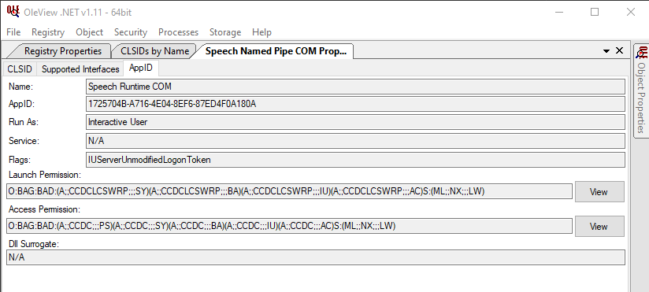
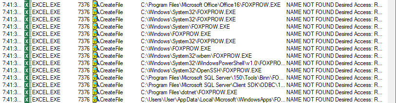
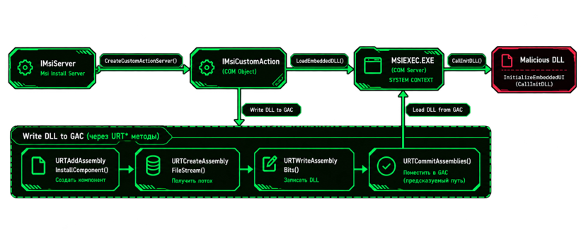
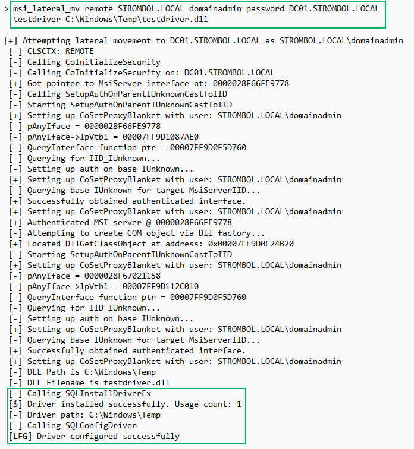
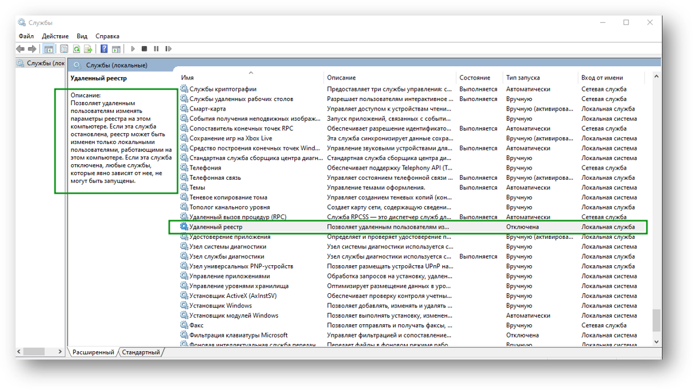
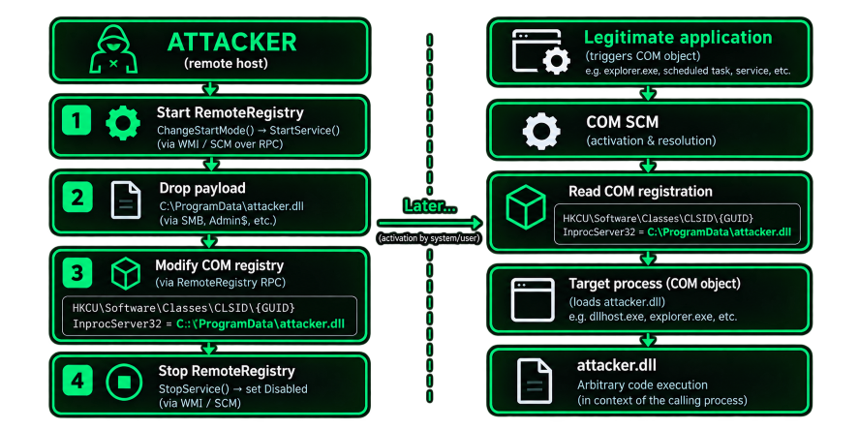
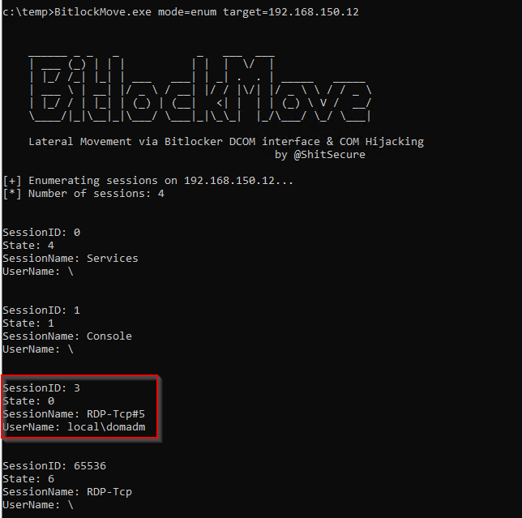
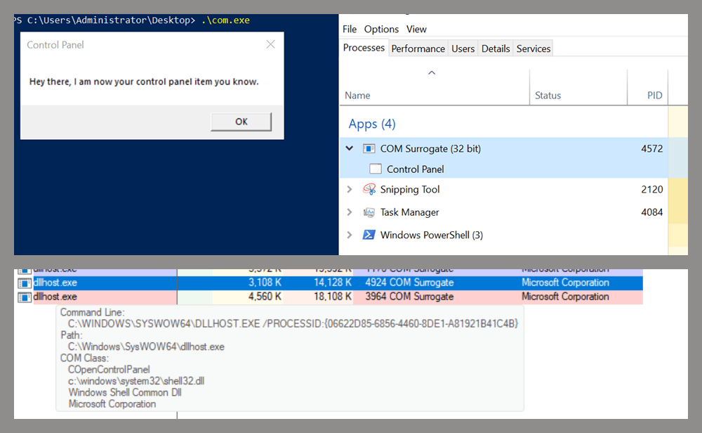
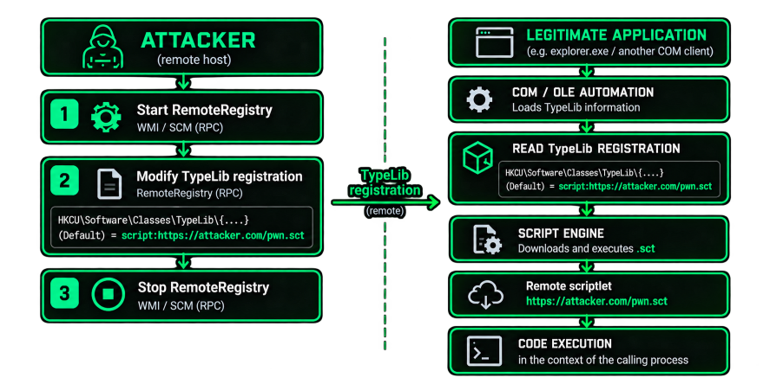
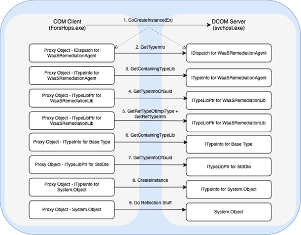

# Lateral Movement

A lateral-movement technique here makes code run on a second machine by using COM. A channel that only carries bytes is its own class, below.

Every technique answers the same chain: which server, which interface, which method, which side effect, and which token and session that side effect runs as. A remotely activatable class is only the start. The result is what that object can make happen on the other machine.

At least three classes. A call that then leaves that machine for a third one is [Second hop](#second-hop).

- **Direct remote execution.** The class is already registered. You activate it and use a method, or the server loads a file through its own search path. The vendor registration stays. [DCOM Execution Objects](#dcom-execution-objects), [Excel ActivateMicrosoftApp](#excel-activatemicrosoftapp), [DCOMUploadExec](#dcomuploadexec), [Installer Custom Action](#installer-custom-action), [DLL Hijacking over DCOM](#dll-hijacking-over-dcom). [Speech Runtime](#speech-runtime-cross-session-movement) is this class plus a cross-session token, once a method or a load in that server actually runs. [Trapped Objects Lateral Movement](#trapped-objects-lateral-movement) becomes this class when the object created inside the server has a useful side effect.
- **Remote write, then a COM load.** You change a registration or a TypeLib value on the target. A later activation on that machine loads it. DCOM is one trigger. A program the user already runs is another. [COM Hijacking over Remote Registry](#com-hijacking-over-remote-registry), [BitlockMove](#bitlockmove), [Control Panel Cpls](#control-panel-cpls), [TypeLib Hijacking over DCOM](#typelib-hijacking-over-dcom). BitlockMove writes one user's hive and triggers it with a BitLocker class whose server runs as `Interactive User`.
- **COM as a channel.** The interface carries data. [Per-user AppID as a DCOM listener](#per-user-appid-as-a-dcom-listener) is a server you installed. [C2 over DCOM and Office](#c2-over-dcom-and-office) is the mailbox path. Execution is the first two classes.


## How DCOM works


### Remote activation

`CoCreateInstanceEx` takes the target in `COSERVERINFO.pwszName` and `CLSCTX_REMOTE_SERVER` (`0x10`). The client connects to TCP 135, the endpoint mapper returns a dynamic port, and the remote SCM activates the class. The call after that is ORPC on `ncacn_ip_tcp`.


1. The remote SCM checks `MachineLaunchRestriction`, then AppID `LaunchPermission`. An empty launch permission is the machine default.
2. Identity is fixed before `CreateProcess`: the activating user, AppID `RunAs`, or `LocalService`. `LocalService` wins over `RunAs`. `Interactive User` is the interactive window-station user, not the caller.
3. `svchost -k DcomLaunch` starts `LocalServer32` with `-Embedding`, or `dllhost.exe /Processid:{AppID}`, or asks `services.exe` to start a `LocalService`.
4. The server must `CoRegisterClassObject`. The client receives a proxy. A process that exits without registering returns `CO_E_SERVER_EXEC_FAILURE` (`0x80080005`). Later calls hit `AccessPermission`, a different ACL from launch.
5. The SCM reads `LocalServer32`, `LocalService`, or `DllSurrogate`. A class with only `InprocServer32` is not loaded on the target and is not loaded in the remote caller. `WScript.Shell` is that case: the server is `wshom.ocx` in the local caller.

`E_ACCESSDENIED` (`0x80070005`) is the launch ACL or the access ACL. It is not the authentication-level failure in [hardening](#hardening). TCP 135 open and the dynamic range closed fails after the mapper answers. `MachineLaunchRestriction`, and the launch ACL on many AppIDs, limits remote activation to Administrators. That is per AppID and per build. Read the SDDL. An empty AppID permission is the machine default, not a grant to everyone.

### Launch is the SDDL

Administrators is the common remote-launch principal. It is not a requirement of DCOM. `MachineLaunchRestriction` and AppID `LaunchPermission` are security descriptors. A SID on that descriptor can activate the class without membership in Administrators. The built-in group Distributed COM Users exists so an administrator can grant launch, activation, and access. On a default install the group is empty, and many AppIDs still name only Administrators for remote launch. Membership is a lead. The SDDL on that AppID, and the machine restriction above it, are the check.

OleView .NET on the Speech Runtime AppID. `Run As` is `Interactive User`. Launch Permission and Access Permission are two different strings. Read both. This class is [Speech Runtime](#speech-runtime-cross-session-movement).



BloodHound records a principal who can instantiate a class remotely as the ExecuteDCOM edge. The edge is this ACL. Activation still needs authentication level 5 or 6, and the method still has to have a side effect. An edge with no usable method is a permission, not execution.

Sources: [Distributed COM Users](https://learn.microsoft.com/en-us/windows-server/identity/ad-ds/manage/understand-security-groups), [BloodHound ExecuteDCOM](https://bloodhound.specterops.io/resources/edges/execute-dcom).

Only a technique that calls `CoCreateInstanceEx` needs this path: an account on both ACLs, authentication level 5 or 6, and both port ranges. A remote registry write that waits for a local program does not.

What the shared trace proves, and what it does not:

- **4624 type 3** is a network logon. It does not name a CLSID or a method.
- **Sysmon 3** to TCP 135, then a dynamic port, is the mapper and then an RPC server. It does not name the interface.
- **Sysmon 1** with parent `-k DcomLaunch` is a local server or `dllhost` that was not already running. A `LocalService` is started by `services.exe`. `ShellWindows` often binds an `explorer.exe` that is already there, so there is no new process.
- **Sysmon 13** is a registry write. It is not activation.
- **Sysmon 7** is a mapped image. It is a COM load only when `Image` is the server you activated or the process that read the key you wrote.
- **10036** is authentication level. **10016** is permission. One of them does not imply the other, and neither one is a successful method call.


### Hardening

Since 14 March 2023 the server refuses an activation whose authentication level is below `RPC_C_AUTHN_LEVEL_PKT_INTEGRITY` (`5`). That is KB5004442 / CVE-2021-26414. `CONNECT` (`2`), `CALL` (`3`), and `PKT` (`4`) fail. `PKT_PRIVACY` (`6`) passes. June 2021 the check was opt-in, June 2022 it was on and could be disabled, and the March 2023 enforcement cannot be turned off. `HKLM\SOFTWARE\Microsoft\Ole\AppCompat\RequireIntegrityActivationAuthenticationLevel` no longer rolls it back. A value of `0` on a current build is a tampered key, not a working bypass.

Anonymous activation does not go through this check. The check does not read `LaunchPermission`, does not stop a registry edit, and does not stop an outbound authentication a method makes afterward. A client at level 5 or 6 that also passes launch permission can complete activation. The access ACL can still reject the call, the class can be absent, and the method can refuse the arguments. No 10036 means the level was accepted. It does not mean the technique worked.

DistributedCOM **10036** on the target names the user, the SID, the client address, and the CLSID when the level was too low. **10037** on the client means the application set that level. **10038** means the client's default was low. **10016** is a permission failure, a different event. A successful integrity-level activation does not write 10036.

Sources: [KB5004442](https://support.microsoft.com/en-us/topic/kb5004442-manage-changes-for-windows-dcom-server-security-feature-bypass-cve-2021-26414-f1400b52-c141-43d2-941e-37ed901c769c), [Microsoft, DCOM authentication hardening](https://techcommunity.microsoft.com/blog/windows-itpro-blog/dcom-authentication-hardening-what-you-need-to-know/3657154).

## DCOM Execution Objects


### Description

Class: direct remote execution. The class is already registered on the target. You activate it and call a method whose side effect starts a process, opens a document, or loads a file. The child runs on the target, as the server's token. Nothing in the registry changes.

### Concept

1. `CoCreateInstanceEx` follows [remote activation](#remote-activation). The server process is whatever `LocalServer32` says on that build. A server that is already running is reused. You do not get a new `DcomLaunch` child in that case.
2. The method runs inside that process. You hold a proxy. A second pointer returned by the method (`MMC20` hands back a document) is still a proxy into the same process.
3. The rows below are automation classes: a type library exposes the method name. That is one interface shape, not the definition of a useful DCOM method.
  - **IDispatch / dispinterface.** `GetIDsOfNames` and `Invoke`. A name such as `Execute` or `ShellExecute` is visible. The name is still only a hint.
  - **Dual.** A vtable and `IDispatch` on the same interface. Late binding works. The side effect can sit on either path.
  - **Custom vtable.** `QueryInterface` for `IDispatch` fails. There is no method list to enumerate. [DCOMUploadExec](#dcomuploadexec) is this shape: `IMsiServer` never appears in a search for `Execute`.
  - **Undocumented.** Slots recovered by reversing. They match the build where the vtable was read, not the next build.
4. Do not hunt only for `Execute`. Hunt for an interface whose method creates a process, loads a file, opens a document, runs a script, or has another side effect you can use. Confirm `LocalServer32` on the target before you depend on the image name.

These four rows are published examples. A DCOM execution object is any out-of-proc server whose method has a side effect you can use.

| ProgID               | CLSID                                    | What runs                                                                              |
| -------------------- | ---------------------------------------- | -------------------------------------------------------------------------------------- |
| `MMC20.Application`  | `{49B2791A-B1AE-4C90-9B8E-E860BA07F889}` | `mmc.exe -Embedding`. `Document.ActiveView.ExecuteShellCommand`                        |
| `ShellWindows`       | `{9BA05972-F6A8-11CF-A442-00A0C90A8F39}` | `explorer.exe`. `Document.Application.ShellExecute`                                    |
| `ShellBrowserWindow` | `{C08AFD90-F2A1-11D1-8455-00A0C91F3880}` | `explorer.exe`, same `ShellExecute` shape                                              |
| `Excel.Application`  | `{00024500-0000-0000-C000-000000000046}` | `EXCEL.EXE`. Public methods include `DDEInitiate`, `ExecuteExcel4Macro`, `RegisterXLL` |


The next class is any other out-of-proc server on that build with a method you can use and a launch ACL that includes your account. Drop pure `InprocServer32` rows. If the binary is not installed, the class is absent. That activation fails because the server is missing, not because the ACL denied it. Who is on the ACL is [Launch is the SDDL](#launch-is-the-sdll).

Kaspersky's December 2025 retest of the first three rows: ShellWindows and ShellBrowserWindow did not execute on Server 2022 or Server 2025, ShellBrowserWindow did not execute on Windows 11, and MMC20 on Server 2025 was blocked by Defender when the command output matched a known dcomexec file pattern. Re-test the row on the build. [Excel ActivateMicrosoftApp](#excel-activatemicrosoftapp) is a different side effect of the Excel process.

### Requirements

- The account is on the launch ACL and the access ACL. On a default install these four are commonly limited to Administrators. Read both ACLs on this AppID. An empty value is the machine default.
- The class is installed. No Office, no `EXCEL.EXE` row.
- Authentication level is 5 or 6. See [hardening](#hardening).
- The CLSID still has an out-of-proc server on this build.


### Steps to reproduce

1. On the target, read `LocalServer32` and the AppID. Activate once locally and note the process and the token.
2. From the client, `CoCreateInstanceEx` with `CLSCTX_REMOTE_SERVER` and level 5 or 6.
3. Call the method with a marker: a child with a fixed command line, or a file in a directory you watch.
4. Record parent, command line, user, integrity, and session of the server and of the child. The child is not parented by the client.
5. If you are hunting a replacement class, dump CLSIDs with `LocalServer32`, `LocalService`, or `DllSurrogate`, keep the ones that return a proxy, and call one method with a marker. The row you write down is the process, the token, and the child.


### Indicators of compromise

- **Sysmon 1.** `mmc.exe -Embedding` or `EXCEL.EXE`, parent command line `-k DcomLaunch`, then a child an interactive start of that program does not create. `ShellWindows` against an existing `explorer.exe` has no new process. The 4624 and the method's child are the trace in that case.
- **Security 4624 type 3** from a workstation in the same window. The logon alone is not this technique.
- No Sysmon 13 on the CLSID.
- A burst of DistributedCOM 10016 against many CLSIDs is someone walking the list. A single 10016 is one denied class. 10016 is not 10036.

Sources: [enigma0x3, MMC20](https://enigma0x3.net/2017/01/05/lateral-movement-using-the-mmc20-application-com-object/), [enigma0x3, round 2](https://enigma0x3.net/2017/01/23/lateral-movement-via-dcom-round-2/), [MDSec, DCOM](https://www.mdsec.co.uk/2020/09/i-like-to-move-it-windows-lateral-movement-part-2-dcom/), [BloodHound ExecuteDCOM](https://bloodhound.specterops.io/resources/edges/execute-dcom), [Kaspersky, Control Panel DCOM](https://securelist.com/lateral-movement-via-dcom-abusing-control-panel/118232/).

## Excel ActivateMicrosoftApp

### Description

Class: direct remote execution. `Excel.Application` is already in the table above. `ActivateMicrosoftApp` is a different method. It asks `EXCEL.EXE` to start a legacy Microsoft application by a bare file name. The published names are `FOXPROW.exe` (argument `5`), `WINPROJ.exe` (`6`), and `SCHDPLUS.exe` (`7`). Those programs are not installed on a current Office image, so the search fails until a file with that name sits on a directory `EXCEL.EXE` searches. The child runs as the Excel process token.

### Concept

1. Resolve `Excel.Application` on the target. The ProgID is stable. The CLSID is not: Office versions differ, and `{00020812-0000-0000-C000-000000000046}` in the 2023 write-up is not `{00024500-0000-0000-C000-000000000046}`. Use the CLSID `LocalServer32` actually points at on this build.
2. [Remote activation](#remote-activation) starts or reuses `EXCEL.EXE`. `ActivateMicrosoftApp` runs inside it.
3. Argument `5` searches for `FOXPROW.exe`. `EXCEL.EXE` calls `CreateFile` on that bare name and gets `NAME NOT FOUND`: Office16 first, then `System32`, `Windows`, `wbem`, PowerShell, OpenSSH, the SQL client SDK, `dotnet`, and the per-user `WindowsApps` directory. Plant only on a directory this search walks.



4. The file that gets created is an image `EXCEL.EXE` will start. The method does not change a CLSID.
5. Their published prerequisite is a local administrator, because the plant they used needed a write an administrator can make. A directory only the Excel token can write is a different check. Read the token before you assume Administrators.

### Requirements

- Excel is installed and the account can launch and access the class. See [Launch is the SDDL](#launch-is-the-sdll).
- You can write a file on a directory this `EXCEL.EXE` searches for that bare name.
- Authentication level is 5 or 6.

### Steps to reproduce

1. On the target, resolve `Excel.Application` to a CLSID and read `LocalServer32`. Activate once and note the token and PATH search for a missing `FOXPROW.exe`.
2. Plant a marker image under that name on the first writable directory in the search you recorded.
3. From the client, activate Excel and call `ActivateMicrosoftApp` with `5`. Repeat with `6` and `7` only after you have recorded `WINPROJ.exe` and `SCHDPLUS.exe` in the same search.
4. Confirm the child parent is `EXCEL.EXE` and the token matches the Excel process. Remove the file. The next call should fail the search.

### Indicators of compromise

- **Sysmon 11.** `FOXPROW.exe`, `WINPROJ.exe`, or `SCHDPLUS.exe` created under an Office directory or a user PATH directory.
- **Sysmon 1.** That image, parent `EXCEL.EXE`. `EXCEL.EXE` itself may show `-Embedding` and parent `-k DcomLaunch` when COM started it.
- **4624 type 3** and TCP 135 before Excel starts. No CLSID write.
- A scheduled task that calls the same method later is a local persistence trigger. It is not this remote activation.

Source: [SpecterOps, Excel ActivateMicrosoftApp](https://specterops.io/blog/2023/10/30/lateral-movement-abuse-the-power-of-dcom-excel-application/).

## DCOMUploadExec


### Description

Class: direct remote execution through one reversed interface. Windows Installer exposes `IMsiServer` over DCOM. The interface is a custom vtable. `QueryInterface` for `IDispatch` fails, and a type-library walk will not list it, so a search for `Execute` or `ShellExecute` never sees it. The published primitive is the combination of remote activation, calls on that vtable, a write into the GAC, and a load inside the Installer service. It is not a pattern you can point at an arbitrary CLSID. Deep Instinct published it in November 2024. It is a researched interface, not an unfixed zero-day.

### Concept

1. The client activates the Installer class `{000C101C-0000-0000-C000-000000000046}` with [remote activation](#remote-activation). The server process is the Windows Installer service. On a default install that process is `msiexec.exe` running as LocalSystem. If the service account was changed, the token changes with it.
2. Calls are on `IMsiServer`. There is no type-library method list. The vtable was recovered by reversing. The leaked XP installer tree is a map of method names, not slot numbers for a current build.
3. One call writes the DLL under the GAC (`C:\Windows\Microsoft.NET\assembly\...`). A later call loads that assembly in the service process. The file is on disk. The transport is the DCOM call, not a separate SMB copy.
4. A further call on the same interface is how the published tool gets a result back. That channel exists because this interface implements it. Another custom interface does not grow the same channel.
5. [Hardening](#hardening) still applies. Level 5 or 6, and an account on this class's launch ACL and access ACL. Read both. Do not copy "Administrators" from a write-up onto a hardened AppID.

The lower row is the GAC write used here: `URTAddAssembly`, a file stream, `WriteAssemblyBits`, `CommitAssemblies`, then the service `msiexec.exe` loads the assembly. The upper row's `IMsiCustomAction` and `LoadEmbeddedDLL` are [Installer Custom Action](#installer-custom-action).



### Requirements

- The account can remotely launch the Installer service class.
- The DLL is a managed assembly the GAC will accept. A native DLL on that path is a different load.
- You are using the published interface, or you have re-derived the vtable on this build. Slots from a blog are not stable across Windows versions until you check them.
- Authentication level is 5 or 6.


### Steps to reproduce

1. On the target, confirm the Installer service class and which `msiexec.exe` instance is the service. Note its token. On a default install it is LocalSystem. Record it if it is not.
2. From the client, `CoCreateInstanceEx` at level 5 or 6. You should hold a proxy whose interface is `IMsiServer`, and `QueryInterface` for `IDispatch` should fail.
3. Drive the upload and the load with the published tool ([DCOMUploadExec](https://github.com/deepinstinct/DCOMUploadExec)) or with offsets you confirmed in a debugger on this build. Watch the GAC for the new assembly and `msiexec.exe` for the corresponding image load.
4. Confirm the load is in the service `msiexec`, not in a user `msiexec /i` you started yourself.
5. Remove the GAC assembly when the test is done. A later Installer operation will not clean it up for you.


### Indicators of compromise

- **Sysmon 11** under `C:\Windows\Microsoft.NET\assembly\`, a new directory written while `msiexec.exe` is the service, with no interactive install in progress.
- **Sysmon 7.** `Image` is that SYSTEM `msiexec.exe`. `ImageLoaded` is the assembly from the GAC, or `clr.dll` / `mscoree.dll` if this service does not normally load the CLR.
- **4624 type 3** and TCP 135 from a workstation immediately before that write. No `InprocServer32` change.
- DistributedCOM 10036 only if the client was below integrity level.

Sources: [Deep Instinct, DCOM Upload & Execute](https://www.deepinstinct.com/blog/forget-psexec-dcom-upload-execute-backdoor), [DCOMUploadExec](https://github.com/deepinstinct/DCOMUploadExec). The Custom Action Server path is a different interface: [Installer Custom Action](#installer-custom-action).

## Installer Custom Action

### Description

Class: direct remote execution through a second Windows Installer interface. [DCOMUploadExec](#dcomuploadexec) uses `IMsiServer` and loads a managed assembly in the service. This one uses the Custom Action Server. The published calls are `SQLInstallDriverEx` and `SQLConfigDriver`. Those forward to `odbccp32.dll`. `SQLConfigDriver` loads a DLL that exports `ConfigDriver`. SpecterOps published the chain in September 2025. The code they observed ran in `msiexec.exe` as the account that authenticated, not as LocalSystem. Read the token. Do not copy the SYSTEM sentence from DCOMUploadExec onto this interface.

### Concept

1. The client activates the Installer class `{000C101C-0000-0000-C000-000000000046}` with [remote activation](#remote-activation). A further call returns the Custom Action Server. That pointer is not `IDispatch`, and it is not the GAC upload on `IMsiServer`.
2. `SQLInstallDriverEx` registers an ODBC driver. `SQLConfigDriver` then calls the driver's `ConfigDriver` export. The DLL has to already be on a path the service process can read. Their tool writes that file to the target first.
3. The vtable was recovered by reversing `msi.dll`, with the leaked installer IDL as a map. Slot numbers from the blog match the build they reversed. Confirm them on yours before you call.
4. [Hardening](#hardening) still applies. Their BOF runs as a member of Administrators on the target. That is the ACL they tested, not a proof that every Installer launch ACL is Administrators. Read it. See [Launch is the SDDL](#launch-is-the-sdll).

The published BOF calls `SQLInstallDriverEx`, then `SQLConfigDriver`, on a DLL already staged on the target.



### Requirements

- The account can remotely launch the Installer class and can write the DLL on the target.
- The DLL exports `ConfigDriver`. A DLL with only `DllMain` is a different load.
- You are using the published BOF, or offsets you confirmed in a debugger on this build.
- Authentication level is 5 or 6.

### Steps to reproduce

1. On the target, identify the service `msiexec.exe` and the interactive `msiexec.exe`. Note both tokens.
2. From the client, activate the Installer class at level 5 or 6 and obtain the Custom Action Server. `QueryInterface` for `IDispatch` should fail.
3. Stage the DLL, then drive `SQLInstallDriverEx` and `SQLConfigDriver` with the published BOF ([msi_lateral_mv](https://github.com/werdhaihai/msi_lateral_mv)) or with offsets confirmed on this build.
4. Confirm the `ConfigDriver` side effect is in the `msiexec.exe` you expected. Record whether that token is the caller or LocalSystem.
5. Remove the ODBC driver registration and the DLL.

### Indicators of compromise

- **Sysmon 13** under `HKLM\SOFTWARE\ODBC\ODBCINST.INI` for a driver that no interactive installer created. Their note names `ODBC Driver`. Confirm the value name on this build.
- **Sysmon 11** of the DLL, then **Sysmon 7** with `Image` the `msiexec.exe` that loaded it. The token on that process is the fact that separates this chain from [DCOMUploadExec](#dcomuploadexec).
- **4624 type 3** and TCP 135 immediately before the registry write.
- No new assembly under `C:\Windows\Microsoft.NET\assembly\`. That path is the other installer technique.

Source: [SpecterOps, DCOM Again](https://specterops.io/blog/2025/09/29/dcom-again-installing-trouble-lateral-movement-bof/).

## COM Hijacking over Remote Registry


### Description

Class: remote write, then a COM load. Remote Registry, or any other write you already have, delivers the file and the registration. The execution mechanism is the hijack in [execution.md](execution.md): `InprocServer32`, `LocalServer32`, `TreatAs`, or a ProgID `\CLSID`. DCOM is one way to trigger the load. A program the user already runs is another. DCOM is not required. The code runs in the process that loads the registration, which can be a different session from the account that wrote the key.

### Concept

1. The Remote Registry service, or another write you already have, reaches the target hive. Starting `RemoteRegistry` when it was stopped is its own event. On a default install the service is stopped and its start type is Disabled.


2. The value is one of the substitutions in [execution.md](execution.md): `InprocServer32`, `LocalServer32`, `TreatAs`, a ProgID `\CLSID`, or a TypeLib `win32` / `win64` default. The file sits where that loader can read it.
3. HKLM is visible to every process. A per-user class is `HKU\<SID>\Software\Classes`, and only while that hive is loaded. Session 0 SYSTEM does not see the interactive user's HKCU. Writing your own HKCU does not redirect a service.
4. The trigger activates the CLSID. An in-proc value maps into the process that called. A local-server value is started by `DcomLaunch`.
5. Flipping `RunAs` so the server authenticates outbound, without running your code, is [trust-boundaries.md](trust-boundaries.md#authentication-coercion-and-relay).

```text
HKLM or HKU\<SID>\Software\Classes\CLSID\{CLSID}\InprocServer32
    (Default) = the file you wrote
```

Remote Registry writes the per-user `InprocServer32` and the DLL is staged on the target. A later process on that machine loads it. The trigger on this picture is the local application.



### Requirements

- A credential that can write that hive and that directory. HKLM and the Remote Registry service are administrative.
- You know which process opens the key, and its bitness matches the view you wrote.
- Something actually activates the CLSID after the write.


### Steps to reproduce

1. Note whether `RemoteRegistry` was already running.
2. Write one value from [execution.md](execution.md), in the hive the loader opens. Stage the file on the path that value names.
3. Trigger the loader. A remote trigger is [remote activation](#remote-activation) of a class that will read your key. A local trigger is the program that already activates it.
4. Confirm the module or EXE and the token on the target. Remove the value and the file. The next activation should load the original server.


### Indicators of compromise

- The Remote Registry service starting when it is not in the baseline, then a remote registry connection.
- **Sysmon 11.** A new file on a path a COM server value already names, written by a network logon.
- **Sysmon 13** on `CLSID`, `TreatAs`, a ProgID, or `TypeLib`, same logon.
- **Sysmon 7** of that path minutes or hours later, in the process that activated the class.

The published client chain that uses this write is [BitlockMove](#bitlockmove).

## BitlockMove

### Description

Class: remote write, then a COM load, triggered by an `Interactive User` server. `BDEUILauncher` is a BitLocker class. Remote activation calls `BdeUIProcessStart`, and that method starts `BaaUpdate.exe` in the logged-on user's session. `BaaUpdate.exe` then activates `{A7A63E5C-3877-4840-8727-C1EA9D7A4D50}` in-process. The `InprocServer32` written in that user's hive is the DLL that gets mapped. The token on the thread that loads the DLL is the interactive user. The account that called from the other machine is the account that passed launch permission. You do not need the interactive user's password.

This is [COM Hijacking over Remote Registry](#com-hijacking-over-remote-registry) plus the session rule in [Speech Runtime](#speech-runtime-cross-session-movement). The load is that per-user `InprocServer32`. The vendor CLSID of `BDEUILauncher` stays as registered.

### Concept

1. The logged-on user's hive receives one value. The hive is loaded only while that user is logged on. Session 0 does not read it. `BaaUpdate.exe` does, because it runs as that user.

```text
HKU\<SID>\Software\Classes\CLSID\{A7A63E5C-3877-4840-8727-C1EA9D7A4D50}\InprocServer32
    (Default) = the DLL you staged
```

2. The DLL has to be on a path that user can read. The published tool writes it over SMB. The path is an argument, not a fixed location.
3. [Remote activation](#remote-activation) of `{AB93B6F1-BE76-4185-A488-A9001B105B94}` (`BDEUILauncher`). The interface is `IBDEUILauncher`, `{8961F0A0-FF62-403B-91B4-7B9280241CEB}`, and it is dual: the method name is visible, and the name is `BdeUIProcessStart`, not `Execute`.
4. `BdeUIProcessStart` starts one of several BitLocker images. The published tool passes enum `4`, which starts `BaaUpdate.exe` on the build the tool was written against. Confirm the image and the token on your build before you treat `4` as stable.
5. `BaaUpdate.exe` calls `CoCreateInstance` on `{A7A63E5C-3877-4840-8727-C1EA9D7A4D50}`. The per-user `InprocServer32` wins for that process. `LoadLibrary` maps your DLL inside `BaaUpdate.exe`, as the interactive user. The July 2025 write-up also names `{896C2B1D-3586-4FA5-B419-41F4A6D38CF1}` and the launcher image `BdeUISrv.exe`. The GitHub tool writes `{A7A63E5C-3877-4840-8727-C1EA9D7A4D50}`. Procmon the load. `BaaUpdate.exe` can open more than one missing class.
6. On a client with one interactive session, `RunAs` was enough. They did not call `ISpecialSystemProperties::SetSessionId`. A host with several sessions is the [Speech Runtime](#speech-runtime-cross-session-movement) case. Enum mode lists those sessions. Session 0 is Services. The interactive logon is the one with a user name.



7. [Hardening](#hardening) still applies to the activation. The published client uses authentication level 6. A missing interactive session means there is no window station for `Interactive User`, and this user's hive is not loaded.

### Requirements

- An account that can write `HKU\<SID>\Software\Classes` and can stage the DLL. On a default client that is an administrator, and starting `RemoteRegistry` when it is stopped is part of the write.
- The target user is logged on. You need that user's SID. The process name is not a SID.
- `BDEUILauncher` is still registered, its `RunAs` is still `Interactive User`, and `BaaUpdate.exe` on this build still activates `{A7A63E5C-3877-4840-8727-C1EA9D7A4D50}`. Read all three.
- The BitLocker UI class is installed. The published note is that this is a client image. A server build without those components has nothing to activate. Confirm the CLSID instead of assuming the role.
- Authentication level is 5 or 6.

### Steps to reproduce

1. On the target, read `RunAs` and `LocalServer32` for `{AB93B6F1-BE76-4185-A488-A9001B105B94}`. Note which users are logged on and which `HKU\<SID>` hives are loaded.
2. Stage a marker DLL of the right bitness on a path that user can read. Write only the `InprocServer32` above in that user's hive.
3. From the client, `CoCreateInstanceEx` at level 5 or 6 and call `BdeUIProcessStart` with the argument that starts `BaaUpdate.exe`. The published tool is [BitlockMove](https://github.com/rtecCyberSec/BitlockMove). Watch which image appears.
4. Confirm `BaaUpdate.exe` is in the interactive session, its token is that user, and Sysmon 7 maps your DLL. The client process must not be the image that mapped it.
5. Remove the CLSID key and the DLL. The next start of `BaaUpdate.exe` should not map the marker.

### Indicators of compromise

- **Sysmon 13.** `TargetObject` ends with `\CLSID\{A7A63E5C-3877-4840-8727-C1EA9D7A4D50}\InprocServer32` under `HKU\<SID>\Software\Classes`. The logon is a network logon when Remote Registry wrote it. `BDEUILauncher`'s own CLSID is unchanged.
- **Sysmon 11.** The DLL on the staged path, written before `BaaUpdate.exe` starts.
- **Sysmon 1.** `BaaUpdate.exe` in the interactive user's session, after a 4624 type 3 from a workstation. Record the parent on this build. A child of `BaaUpdate.exe` is the marker the published DLL spawns. A DLL that stays inside `BaaUpdate.exe` has the load and no child.
- **Sysmon 7.** `Image` is `BaaUpdate.exe`. `ImageLoaded` is the staged DLL.
- `RemoteRegistry` starting, or its start mode changing, in the same window. That is the write path. It is not the execution.

Source: [r-tec BitlockMove](https://github.com/rtecCyberSec/BitlockMove). The July 2025 write-up is the same chain, and it records a second HKCU class: [r-tec, cross-session activation](https://www.r-tec.net/r-tec-blog-revisiting-cross-session-activation-attacks.html).

## Control Panel Cpls

### Description

Class: remote write, then a COM load. `COpenControlPanel` (`{06622D85-6856-4460-8DE1-A81921B41C4B}`, `shell32.dll`) exposes `IOpenControlPanel` (`{D11AD862-66DE-4DF4-BF6C-1F5621996AF1}`). The class has no type library. `Open` is documented in `shobjidl_core.h`. On the build Kaspersky tested, `Open` loaded every DLL registered under the Control Panel `Cpls` keys into `dllhost.exe`, including a DLL that was not a `.cpl` and did not export `CPlApplet`. A name argument that was not a real Control Panel item still caused that load. Confirm both observations on your build. The interface name can be missing from the registry on Windows 11 and Server 2025. The IID is what you activate.

### Concept

1. A remote write adds the DLL's path under one of these keys. The HKCU `Cpls` key is not created by Windows. The HKLM keys are. A 32-bit DLL belongs under `WOW6432Node` and loads in a 32-bit `dllhost.exe`.

```text
HKCU\Software\Microsoft\Windows\CurrentVersion\Control Panel\Cpls
HKLM\Software\Microsoft\Windows\CurrentVersion\Control Panel\Cpls
HKLM\Software\WOW6432Node\Microsoft\Windows\CurrentVersion\Control Panel\Cpls
```

2. [Remote activation](#remote-activation) of `{06622D85-6856-4460-8DE1-A81921B41C4B}`, then `IOpenControlPanel::Open`. Their OleView reading showed empty launch and access permissions, so the machine default applied, and that default was Administrators. Read the SDDL. See [Launch is the SDDL](#launch-is-the-sdll).
3. `dllhost.exe` maps the registered DLL. The surrogate also hosts `COpenControlPanel`. A 32-bit DLL is a 32-bit `dllhost.exe`, command line `/Processid:{06622D85-6856-4460-8DE1-A81921B41C4B}`, server `shell32.dll`.


4. The same `Cpls` value loads again when someone opens Control Panel. That later load is a local trigger. This section is the remote `Open` call.
5. [Hardening](#hardening) still applies to the activation.

### Requirements

- An account that can write the `Cpls` value and stage the DLL, and that passes launch and access on this AppID.
- The DLL's bitness matches the `dllhost.exe` that will load that view.
- Authentication level is 5 or 6.
- You have confirmed `Open` still walks the `Cpls` keys on this build. A documented method name is not that confirmation.

### Steps to reproduce

1. On the target, read the AppID for `{06622D85-6856-4460-8DE1-A81921B41C4B}` and both ACLs. Note whether `Cpls` already has values.
2. Stage a marker DLL. Register its path under one `Cpls` key, in the bitness view you mean to hit.
3. From the client, activate the class at level 5 or 6 and call `Open`. Use a lab name you can recognize in the arguments.
4. Confirm `dllhost.exe` mapped the DLL. A 32-bit image should be the 32-bit surrogate.
5. Remove the value and the file. `Open` should no longer map the marker.

### Indicators of compromise

- **Sysmon 13** on `Control Panel\Cpls` under HKCU, HKLM, or `WOW6432Node`. A new value whose data is a DLL path.
- **Sysmon 11** of that DLL, then **Sysmon 7** with `Image` `dllhost.exe`. A 32-bit `dllhost.exe` on a 64-bit host is the bitness tell.
- **4624 type 3** and TCP 135 when the trigger was remote. A later Control Panel open has the same `Cpls` load and no 4624.
- `RemoteRegistry` starting in the same window, when that is how the value was written.

Source: [Kaspersky, Control Panel DCOM](https://securelist.com/lateral-movement-via-dcom-abusing-control-panel/118232/).

## DLL Hijacking over DCOM


### Description

Class: direct remote execution. The COM registration is the vendor's and stays that way. You do not change the CLSID. Remote activation starts a legitimate server, that process searches for a DLL by bare name, and the first writable directory in the search is where your file gets mapped. The primitive is the DLL search, not a registration write. The load happens inside the server, as the server's token.

### Concept

1. [Remote activation](#remote-activation) starts the server on the target.
2. The server, or a DLL it already loaded, calls `LoadLibrary` on a bare name.
3. Procmon shows `NAME NOT FOUND`. The search walked a directory you can create a file in.
4. The file at the first writable candidate is mapped on the next start.
5. A missing name in a directory you cannot write is not this technique. A path that exists only because the lab image was prepared is not either.


### Requirements

- The CLSID activates remotely into a process you can profile.
- The architecture of the DLL matches that process.
- The same `NAME NOT FOUND` appears on a second, unmodified copy of the build.


### Steps to reproduce

1. Activate remotely. Note image, user, and session.
2. Procmon the server. Keep `Load Image` and `NAME NOT FOUND` for `.dll`.
3. For each missing name, record the first directory in the search and its ACL.
4. Place a marker DLL of the right architecture there. Activate again.
5. Confirm `Load Image` of that full path and the token. Delete the file and confirm `NAME NOT FOUND` returns.


### Indicators of compromise

- **Sysmon 11.** A DLL created in a directory that server searches: `C:\Windows\Temp`, `ProgramData`, or the server's own folder when it is writable.
- **Sysmon 7.** `Image` is the COM server. `ImageLoaded` is an unsigned DLL from that directory. No Sysmon 13 on the CLSID.
- **Sysmon 1** of that server, parent `-k DcomLaunch`, after the client's 4624.

Source: [221B, DCOM DLL hijacking](https://www.221bluestreet.com/offensive-security/windows-components-object-model/com-hijacking-t1546.015). [BitlockMove](#bitlockmove) is the other shape: a per-user `InprocServer32`, not a bare-name search.

## TypeLib Hijacking over DCOM


### Description

Class: remote write, then a COM load. The execution mechanism is [TypeLib hijacking](execution.md#typelib-hijacking). The TypeLib default on the target becomes a `script:` string, `LoadRegTypeLib` binds it, and [moniker execution](execution.md#moniker-execution) runs `scrobj.dll` in the process that loaded the type library. The operator's process does not load `scrobj.dll`.

Remote Registry is how the value usually gets there from another machine. DCOM is an optional trigger, and only when the server you activate is the process that calls `LoadRegTypeLib` for that LIBID. A program the user starts later is the other trigger. There is no DLL dropped next to an EXE. The registry value, the fetch, and `scrobj.dll` are still on the target.

### Concept

1. A remote write sets the default of `TypeLib\{LIBID}\{version}\0\win64` or `win32` to `script:` plus a path or a URL. The LIBID stays the one the application already requests. The local parse is [moniker execution](execution.md#moniker-execution).
2. HKLM is seen by every process. `HKU\<SID>\Software\Classes\TypeLib\...` is seen only by that user's processes.
3. A process on the target calls `LoadRegTypeLib`. `oleaut32` in that process binds the string. `scrobj.dll` runs there.
4. The process is one you started with [remote activation](#remote-activation), or a program the user starts later. The trigger matters only if that process is the one that reads this LIBID.
5. A path to a `.tlb` changes type information. It does not run a scriptlet.

Remote Registry sets a `script:` TypeLib default. A later process on the target calls `LoadRegTypeLib` and runs the scriptlet. The trigger on this picture is that process, not a remote activation.



### Requirements

- The account can write that TypeLib value in the bitness view the loader uses.
- A process on the target calls `LoadRegTypeLib` for that LIBID. Confirm it locally before you add a second machine.
- If the trigger is a remote activation, the authentication level meets [hardening](#hardening). The scriptlet itself is a local load after that.


### Steps to reproduce

1. On the target, Procmon a host for `TypeLib\{`. Note LIBID, version, and `win32` or `win64`.
2. Set that default to `script:` plus a lab scriptlet. Leave `InprocServer32` alone.
3. Trigger the host you watched. Use a remote class from [DCOM Execution Objects](#dcom-execution-objects) only when that class is what loads this LIBID.
4. Confirm `scrobj.dll` and the scriptlet side effect in the target process. The client process should not show `scrobj.dll`.


### Indicators of compromise

- **Sysmon 13.** `TargetObject` contains `\TypeLib\{LIBID}\` and ends in `\win32` or `\win64`. `Details` begins with `script:`. The logon is a network logon when Remote Registry wrote it.
- **Sysmon 7.** `ImageLoaded` ends with `scrobj.dll`. `Image` is the process that called `LoadRegTypeLib`, on the target. The client must not be that image.
- **Sysmon 3** from that process to the host named in the `script:` URL.
- No write on `CLSID\...\InprocServer32`.

Source: [ReliaQuest](https://reliaquest.com/blog/threat-spotlight-hijacked-and-hidden-new-backdoor-and-persistence-technique/). The fileless trapped-COM chain is a different technique: [Trapped Objects Lateral Movement](#trapped-objects-lateral-movement).

## Trapped Objects Lateral Movement


### Description

Class: advanced COM object and remoting primitive, after a remote registry precondition. When the object created inside the server exposes a useful side effect, the same chain is remote execution. You activate an `IDispatch` server on the target and walk to a coclass that server already exposes, `StdFont` from `stdole`. `TreatAs` on `StdFont` points at the .NET `System.Object` class. `ITypeInfo::CreateInstance` then runs inside the target server, the CLR loads there, and `Assembly.Load` takes the bytes that arrived over DCOM. No assembly file is written for that load. The local half of the chain is [execution.md](execution.md#trapped-com-objects).

The published host was `WaaSRemediation` in the WaaSMedic PPL `svchost`. On current Windows 11 that host does not load the CLR. Do not carry that host forward as a working target. The bug class is the trapped object. Outflank published `FileSystemImage` (`IMAPI2FS.MsftFileSystemImage.1`, `{2C941FC5-975B-59BE-A960-9A2A262853A5}`) as a host that still accepted the chain on the build they tested. Treat that CLSID as a lead: confirm the load on your build. A useful method on the trapped object does not have to be a .NET load.

### Concept

The chain is: remote DCOM object → `IDispatch` → `ITypeInfo` → a coclass in that type library → `CreateInstance` → the object is created inside the server → the new object's method runs as the server's token.

ForsHops draws that walk. The client holds proxies. `GetTypeInfo` through `CreateInstance` run in `svchost`. The host on this picture is `WaaSRemediation`. On current Windows 11 that host does not load the CLR.



1. Over Remote Registry, three values go on the target. The published chain sets `AllowDCOMReflection` because .NET reflection over DCOM was turned off in MS14-009, and `OnlyUseLatestCLR` to force CLR 4. Confirm both still change behavior on this build before you treat them as required. `TreatAs` on `StdFont` restarts activation at `System.Object`.

```text
HKLM\SOFTWARE\Microsoft\.NETFramework
    AllowDCOMReflection = 1
    OnlyUseLatestCLR    = 1
HKLM\SOFTWARE\Classes\CLSID\{0BE35203-8F91-11CE-9DE3-00AA004BB851}\TreatAs
    (Default) = CLSID of System.Object
```

1. [Remote activation](#remote-activation) of an out-of-proc `IDispatch` server. The object stays in that process. The client holds a proxy.
2. `GetTypeInfo`, then `GetContainingTypeLib`, then `CreateInstance` on `StdFont`. `CreateInstance` calls `CoCreateInstance` in the server. The server's hive is the one that contains the `TreatAs`. A session 0 service does not read the interactive user's HKCU, which is why these values are under HKLM.
3. The CLR maps in the server. Reflection reaches `Assembly.Load` on the byte array. The assembly does not need a path on disk.
4. On current Windows 11, step 4 does not happen inside the WaaSMedic PPL. `CreateInstance` can still return an object from a different server. What that process loads is a measurement on your build. `FileSystemImage` is only the host Outflank published.


### Requirements

- The account can write HKLM (Remote Registry or an equivalent) and can launch the chosen server.
- The server returns a by-reference `ITypeInfo` for a coclass, and `CreateInstance` is reachable on that proxy. `ITypeInfo::Invoke` is not.
- Authentication level is 5 or 6.
- You have checked the CLR load on this build. A PPL result copied from a 2025 write-up is not a result on Windows 11 today.


### Steps to reproduce

1. Set the two `\.NETFramework` values and the `StdFont` `TreatAs`. Confirm a local `CoCreateInstance` of `StdFont` loads the CLR before you add the network.
2. Activate the server remotely. Walk `GetTypeInfo` → containing typelib → `CreateInstance(StdFont)`.
3. On the target, see which process mapped `mscoree.dll`. It must be the server PID, not the client.
4. If that PID is the WaaSMedic `svchost` and `mscoree.dll` never appears, stop. Repeat from step 2 against `FileSystemImage` on the same build, and record what that process actually loads.
5. Remove the three values. `StdFont` should resolve to its own server again.


### Indicators of compromise

- **Sysmon 13.** `AllowDCOMReflection` and `OnlyUseLatestCLR` set to 1 under `HKLM\SOFTWARE\Microsoft\.NETFramework`.
- **Sysmon 13.** `TargetObject` ends with `\CLSID\{0BE35203-8F91-11CE-9DE3-00AA004BB851}\TreatAs`. `Details` is a .NET class CLSID. The logon that wrote it is a network logon when Remote Registry did the write.
- **Sysmon 7** of `mscoree.dll` or `clr.dll` inside the COM server (`svchost.exe` for WaaSMedic, the IMAPI host for `FileSystemImage`). No new file under the user profile for the assembly itself.
- **4624 type 3** and TCP 135 before that load. The client workstation does not load `mscoree.dll` for this chain.

Sources: [Forshaw, Project Zero](https://projectzero.google/2025/01/windows-bug-class-accessing-trapped-com.html), [IBM X-Force](https://www.ibm.com/think/news/fileless-lateral-movement-trapped-com-objects), [ForsHops](https://github.com/xforcered/ForsHops), [Outflank](https://www.outflank.nl/blog/2025/07/29/accelerating-offensive-research-with-llm/).

## Speech Runtime Cross-Session Movement


### Description

Class: direct remote execution chained with cross-session activation. Remote activation with AppID `RunAs` set to `Interactive User` hosts the Speech Runtime server in the interactive session. The server process token is that logged-on user. The caller's account was checked for launch and access. Code runs as the interactive user when a method, a DLL load, or a hijack inside that process does the work. Activation selects the token and the session. Why `RunAs` selects a session is [trust-boundaries.md](trust-boundaries.md#cross-session-activation). This section does not repeat that analysis.

A DLL load or a named pipe in that process is [DLL Hijacking over DCOM](#dll-hijacking-over-dcom) happening in this session. The published hijack is a per-user `InprocServer32`, the same shape as [BitlockMove](#bitlockmove). The registration and the `RunAs` value move between builds. Read them. A result from one image is a hypothesis on the next.

### Concept

1. The client performs [remote activation](#remote-activation) of the published class `{38FE8DFE-B129-452B-A215-119382B89E3D}` (Speech Named Pipe COM). Confirm the CLSID and `LocalServer32` on this build. The image they recorded is `SpeechRuntimeBroker.exe`.
2. The SCM reads `RunAs`. `Interactive User` selects the interactive window station. A fixed account, `LocalService`, or a COM+ server application keeps its own session. The session moniker does not override `RunAs`.
3. The server starts in the interactive session, as that session's user. Launch and access checks still ran. On a client with one interactive session, that was enough. They did not call `ISpecialSystemProperties::SetSessionId`. On a host with more than one session, the interactive user COM selects and the session you wanted can differ. Name the session only after you have read how many are logged on.
4. The hijack they registered is below. Procmon the process. A pipe, or a different CLSID, is the same class of load if that is what this build opens.

```text
HKU\<SID>\Software\Classes\CLSID\{655D9BF9-3876-43D0-B6E8-C83C1224154C}\InprocServer32
    (Default) = the DLL you staged
```

5. Forcing that activation to authenticate outbound, as a coercion, is [trust-boundaries.md](trust-boundaries.md#authentication-coercion-and-relay). Session rules: [trust-boundaries.md](trust-boundaries.md#cross-session-activation).

### Requirements

- `HKCR\AppID\{AppID}\RunAs` is exactly `Interactive User`. Read it.
- A user is logged on. With no interactive session there is no window station for that identity.
- The caller passes launch permission.
- You can read session ids. The process name is not a session id.


### Steps to reproduce

1. Read `RunAs`, the server subkey, and `{38FE8DFE-B129-452B-A215-119382B89E3D}` on this build. Note how many interactive sessions exist.
2. Activate once while that user is logged on. Procmon the server. Record image, session id, and token.
3. If the trace is a missing `InprocServer32`, write that value in the logged-on user's hive and stage the DLL. If it is `NAME NOT FOUND` for a bare DLL name, follow [DLL Hijacking over DCOM](#dll-hijacking-over-dcom) instead. Activate again and confirm the load.
4. Log the user off and activate again. Placement should fail or move. That ties the session to the logged-on user.


### Indicators of compromise

- **Sysmon 1.** `SpeechRuntimeBroker.exe`, or whichever image `LocalServer32` names, parent `svchost.exe -k DcomLaunch`, session id of the interactive logon.
- **Security 4624 type 3** from a workstation immediately before it.
- **Sysmon 13** on `HKU\<SID>\Software\Classes\CLSID\{655D9BF9-3876-43D0-B6E8-C83C1224154C}\InprocServer32` when the load was the published hijack. A different CLSID means Procmon saw a different key. Write the key you saw.
- **Sysmon 7.** `Image` is the Speech server. `ImageLoaded` is the staged DLL.
- **Sysmon 13** on `AppID\RunAs` only if that value was changed to `Interactive User`. The write is the precondition.

Sources: [r-tec SpeechRuntimeMove](https://github.com/rtecCyberSec/SpeechRuntimeMove), [r-tec, cross-session activation](https://www.r-tec.net/r-tec-blog-revisiting-cross-session-activation-attacks.html).

## Second hop


### Description

Machine A activates a COM server on B. A method on B then calls COM, DCOM, or RPC on C. The account that arrives on C is decided on B: the process token, unless the method impersonates and the outbound call is allowed to use the caller's identity. `DELEGATE` can make that identity available. Whether C then sees A depends on the authentication package, the delegation configuration, and what the method does with the thread token. Impersonation levels stay in [fundamentals.md](fundamentals.md#authentication-and-impersonation).

### Concept

1. Activation on B fixes the process token before any method runs: the activating user, `RunAs`, or `LocalService`. A remote activator is a network logon on B. That logon can touch local objects on B. The incoming DCOM call does not hand A's ticket to C.
2. A method that never calls `CoImpersonateClient` authenticates to C as the process token. `LocalService` or LocalSystem authenticates as B's machine account. `Interactive User` authenticates as the logged-on user, whose interactive logon may already have a ticket. The activating user's network logon does not.
3. A method that calls `CoImpersonateClient` puts A's token on that thread, capped by the level A offered. `IMPERSONATE` is local to B, so the call to C still authenticates as B's process identity. `DELEGATE` can make A's identity available for that outbound hop. C sees A only when the authentication package, the delegation configuration, and the method on B all allow it. Launch and access ACLs do not grant that.
4. [Hardening](#hardening) on A→B says nothing about B→C. C has its own launch ACL, its own authentication level, and its own identity.
5. Read the process token and the thread token on B before you attribute a 4624 on C to the operator.


### Requirements

- You can activate the server on B, and you know which method reaches C.
- You can read the process token on B and, during the call, the thread token.
- C is a host you are allowed to watch.


### Steps to reproduce

1. Activate B from A. Record the process token on B: user, logon type, session.
2. Call the method that reaches C. During the call, record whether a thread token appears and which SID it has.
3. On C, record the 4624 user. Compare it with A's account, with B's process token, and with B's machine account.
4. Repeat with the client impersonation level at `IMPERSONATE`. The account on C should stay B's process identity.
5. Only in a lab where delegation is already configured, repeat at `DELEGATE`. If C then shows A's account, confirm the thread token on B is A. A 4624 for A with no thread token on B means the process token was already A. That is not delegation.


### Indicators of compromise

- **4624 on B**, type 3, from A, then **4624 on C** as B's machine account or as B's interactive user. The pair is a hop. It does not name the COM method.
- **Sysmon 3** from the COM server process on B to TCP 135 on C is the outbound activation. The 4624 on B does not prove that connection.
- A 4624 on C for A's user is not this chain until the thread token on B says the method impersonated A.


## Per-user AppID as a DCOM listener


### Description

Class: infrastructure, not a standard lateral-movement technique. You register your own local server and an AppID whose launch ACL names an account you control. From another machine that account activates the class. The SCM starts your EXE in the user's session. The channel is the interface you registered. This is a listener you installed. It is not abuse of a shipped class, and it is not persistence by itself: the user must be logged on, and the EXE must register its class object. Use it when a later step needs a DCOM server in that session.

### Concept

1. The user's hive has `LocalServer32` pointing at your EXE, and `CLSID\AppID` pointing at an AppID.
2. `LaunchPermission` and `AccessPermission` on that AppID allow the account that will call. Without them the SCM rejects the call even though the EXE exists.
3. The client calls `CoCreateInstanceEx` with `CLSCTX_REMOTE_SERVER`.
4. The SCM starts the EXE in the user's session. The EXE must `CoRegisterClassObject` with `REGCLS_MULTIPLEUSE`, or the client gets `0x80080005`.
5. Later calls are ORPC into that EXE.
6. [Hardening](#hardening) still requires authentication level 5 or 6. Valid credentials satisfy it. The EXE runs as the interactive user.

```text
HKCU\Software\Classes\CLSID\{CLSID}\LocalServer32 = C:\Users\user\svc.exe
HKCU\Software\Classes\CLSID\{CLSID}\AppID         = {AppID}
HKCU\Software\Classes\AppID\{AppID}\LaunchPermission
HKCU\Software\Classes\AppID\{AppID}\AccessPermission
```

Status: hypothesis until the ACL, the session, and the firewall are confirmed on the build. Prefer a CLSID you did not create with a raw `LocalServer32` write ([execution.md](execution.md#registration-without-owning-the-write)). The value that remains yours is the AppID permission.

### Requirements

- That user is logged on. A per-user local server has no session 0 host, and session 0 does not load this HKCU.
- The SDDL names a principal you can authenticate as.
- TCP 135 and the dynamic range are open to the client.
- The client uses authentication level 5 or higher.


### Steps to reproduce

1. In the user's session, register the CLSID, the AppID, and both permissions. Activate locally with `CLSCTX_LOCAL_SERVER` and confirm `CoRegisterClassObject` succeeds.
2. From a second machine, as the principal in the ACL, call `CoCreateInstanceEx` at level 5 or 6.
3. The EXE should accept the call in the user's session. A fresh start is parented by `svchost.exe -k DcomLaunch`.
4. Repeat at `CONNECT`. The call should fail and 10036 should name this CLSID.
5. Log the user off and repeat. The per-user server should not start.


### Indicators of compromise

- **Sysmon 13** on `HKCU\Software\Classes\AppID\{guid}\LaunchPermission` or `AccessPermission`. Also on `LocalServer32` if that write was not avoided.
- **Sysmon 1.** An EXE under the user profile, parent `svchost.exe -k DcomLaunch`, session id of the interactive user.
- Inbound TCP 135 and a dynamic port to a process that is not in the DCOM server baseline.
- **4624 type 3** from another workstation.

Sources: [LaunchPermission](https://learn.microsoft.com/en-us/windows/win32/com/launchpermission), [AccessPermission](https://learn.microsoft.com/en-us/windows/win32/com/accesspermission).

## C2 over DCOM and Office


### Description

Class: COM as a channel, not lateral execution. Two transports. The listener in the previous section is your EXE, and the operator is the DCOM client. The Outlook channel is the opposite: a process on the host is a client of the already-registered `Outlook.Application`, and the bytes leave as mail. There is no socket to an operator address. [DCOM Execution Objects](#dcom-execution-objects) run a command. These carry traffic. Remote activation of Outlook is still [remote activation](#remote-activation); the side effect is a message, not a child process you chose.

### Concept

1. The listener follows [Per-user AppID as a DCOM listener](#per-user-appid-as-a-dcom-listener).
2. Outlook: a process in the user session activates `Outlook.Application`. If COM started Outlook, the image is `OUTLOOK.EXE -Embedding`. It reads a folder and sends a message.
3. The local mechanism is [execution.md](execution.md#living-off-the-com). Over DCOM, the same class is activated from the second machine and the mail is sent as the logged-on user. Launch permission and [hardening](#hardening) still apply. The mail path removes the beacon. It does not remove the ACL.


### Requirements

- Listener: the requirements of the previous section.
- Outlook: Outlook is installed, the profile can send, and the activating account may automate it. A ProgID with no mailbox is not a channel.


### Steps to reproduce

1. For the listener, follow the previous section and confirm the ORPC hits your EXE.
2. For Outlook, activate it in the session first. Read one folder, send one message to a lab mailbox. Confirm `-Embedding` and confirm Outlook has no Sysmon 3 to an external address.
3. Repeat the activation with `CoCreateInstanceEx` from a second machine. The process on the target is still Outlook. The new event is the 4624.


### Indicators of compromise

- Listener: the indicators in the previous section.
- **Sysmon 1.** `OUTLOOK.EXE -Embedding`, parent `svchost.exe`, then mail leaving with nobody at the console.
- A remote start adds 4624 type 3 and TCP 135 before Outlook starts. A local poll of Outlook has the process and not that 4624.

Sources: [outlookC2](https://github.com/Echidna-Pentest/outlookC2), [Optiv, BadOutlook](https://www.optiv.com/insights/discover/blog/badoutlook-c2).

## Sources

- [MITRE T1021.003](https://attack.mitre.org/techniques/T1021/003/)
- [KB5004442](https://support.microsoft.com/help/5004442)
- [enigma0x3, MMC20](https://enigma0x3.net/2017/01/05/lateral-movement-using-the-mmc20-application-com-object/)
- [Forshaw, trapped COM objects](https://projectzero.google/2025/01/windows-bug-class-accessing-trapped-com.html)
- [SpecterOps, DCOM Again](https://specterops.io/blog/2025/09/29/dcom-again-installing-trouble-lateral-movement-bof/)
- [SpecterOps, Excel ActivateMicrosoftApp](https://specterops.io/blog/2023/10/30/lateral-movement-abuse-the-power-of-dcom-excel-application/)
- [Kaspersky, Control Panel DCOM](https://securelist.com/lateral-movement-via-dcom-abusing-control-panel/118232/)
- [r-tec, cross-session activation](https://www.r-tec.net/r-tec-blog-revisiting-cross-session-activation-attacks.html)
- [BloodHound ExecuteDCOM](https://bloodhound.specterops.io/resources/edges/execute-dcom)

