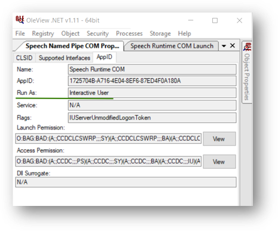
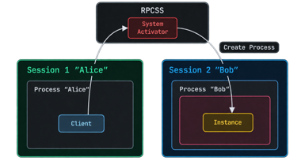
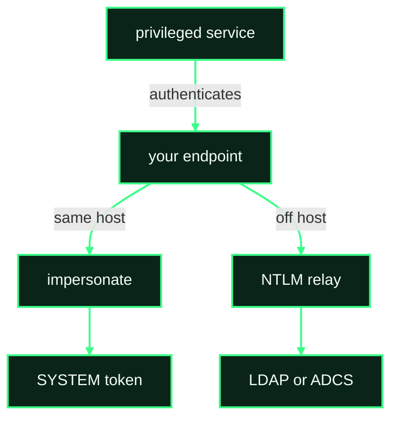
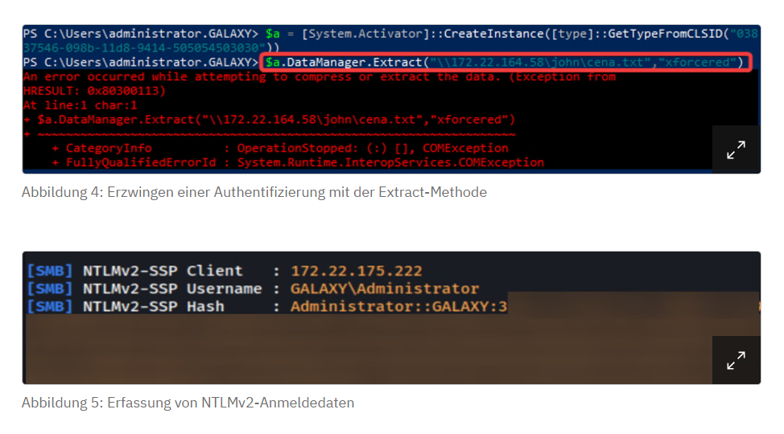
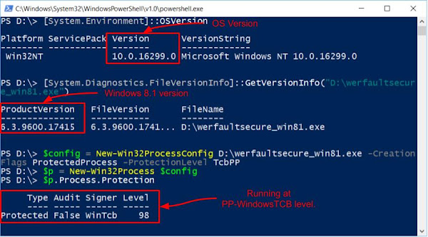
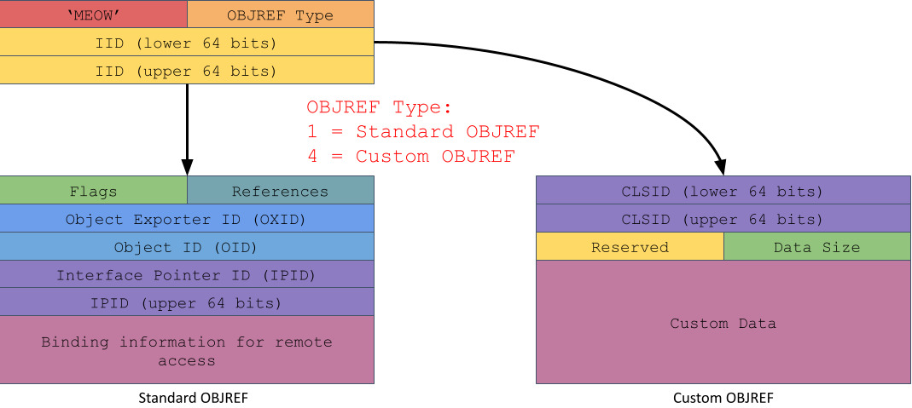

# COM and Trust Boundaries

A result in this chapter changes integrity, user, session, or the account that authenticates. Same user and same integrity in another process is [execution.md](execution.md). A second machine, using the caller's own rights, is [lateral-movement.md](lateral-movement.md).

Record five facts on the server, not on the client: the caller's token, the server process token, whether the thread impersonates, the session, and the side effect. A medium client that reached a high server is the start. The result is which token performed the action.

Privilege escalation is the set of those facts where the caller is weaker, the sensitive action uses a stronger token, the caller controls that action, and consent does not stop it. The same result has to repeat on this build. Missing one of those, name the boundary you actually crossed.

- **Integrity.** [Elevation Moniker](#elevation-moniker), [Wait-for-Admin: MMC Snap-In Override](#wait-for-admin-mmc-snap-in-override), [Text Services Framework as an Integrity Crossing](#text-services-framework-as-an-integrity-crossing).
- **Session.** [Cross-Session Activation](#cross-session-activation). Code that then runs in that session is [lateral-movement.md](lateral-movement.md).
- **Token on one machine.** [Missing impersonation](#missing-impersonation), [Potato Family](#potato-family). Levels: [fundamentals.md](fundamentals.md#authentication-and-impersonation).
- **Authentication material.** [Authentication Coercion and Relay](#authentication-coercion-and-relay). COM emits an authentication. Your code does not run on the target.
- **Protection.** [Protected process](#protected-process).
- **Delivery into a server you can already call.** [Custom Marshaling as an EoP Bridge](#custom-marshaling-as-an-eop-bridge).

## How a boundary is read

```text
Caller    user, integrity, session, machine
Server    user, integrity, session, protection
Policy    AppID, LaunchPermission, AccessPermission, authentication level
Interface method, and which token is on the thread when it runs
Result    the file, process, or authentication that moved
```

1. Find a server whose token or session is not yours.
2. Confirm your caller can activate it. Launch and access are different ACLs.
3. Call one method with a marker: a path you can watch, a child with a fixed command line, or an authentication to a host you control.
4. Read the token on the thread that touched the marker. Process token and impersonation token are different. `CoImpersonateClient` puts the client on that thread only. `CoRevertToSelf` takes it off.
5. Write the boundary in one line: Medium to High, user to SYSTEM, session 0 to the interactive session, or machine account to your listener.

## Elevation Moniker

### Description

Class: integrity crossing, same session. The display name `Elevation:Administrator!new:{CLSID}` asks COM to activate that class out of process at High integrity. AppInfo applies the elevation policy. A consent prompt is the policy working. A silent High-IL server is a class Windows put on the auto-approval list. The moniker is that activation path. A bypass is a method on the elevated server that does something the policy did not constrain.

### Concept

1. The caller, at Medium integrity, passes `Elevation:Administrator!new:{CLSID}` to `CoGetObject`. The parse is the same `new:` activation as any other moniker. The elevation prefix is the location. Details of the parse stay in [execution.md](execution.md#moniker-execution).
2. The class opts in with `Elevation\Enabled` = 1. Without that value the moniker does not elevate this class.
3. Silent elevation also requires the CLSID on `COMAutoApprovalList`. Enabled, and absent from that list, still shows consent.
4. The server process starts at High integrity, out of process. The caller stays Medium. You hold a proxy.
5. The method runs in the elevated process, as that process token, unless the method impersonates you back down to Medium.

```text
HKLM\SOFTWARE\Classes\CLSID\{CLSID}\Elevation
    Enabled = 1
HKLM\SOFTWARE\Microsoft\Windows NT\CurrentVersion\UAC\COMAutoApprovalList
```

The published object in commodity malware is CMSTPLUA, `{3E5FC7F9-9A51-4367-9063-A120244FBEC7}`, method `ICMLuaUtil::ShellExec`. PhantomStealer (2025) calls that moniker, then falls back to `runas`. Treat the CLSID as a lead. UACME records which methods were closed on which build. Confirm `Enabled`, the approval list, and a missing consent prompt on yours before you treat the method as silent.

### Requirements

- The caller is Medium. An already-elevated caller is not crossing integrity.
- `Elevation\Enabled` is 1, and you have read whether this CLSID is on `COMAutoApprovalList`.
- The method you call has a side effect you can see: a process, a file, a registry write.
- You can tell a consent prompt from a silent start.

### Steps to reproduce

1. Read `Elevation\Enabled` and the auto-approval list for the CLSID. Note the server image.
2. From a Medium process, `CoGetObject` the elevation moniker. Watch for `consent.exe`.
3. If consent appears, the moniker elevated through the normal prompt. Stop. That is not a bypass.
4. If the server is High and no prompt appeared, call one method with a marker. Record the server integrity and the child token.
5. Repeat on the next build. A method UACME lists as fixed is a hypothesis until this host shows the silent High server.

### Indicators of compromise

- **Sysmon 1.** A COM server at High integrity whose parent is the elevation path (`svchost` hosting AppInfo, or `dllhost` / the elevated image), started from a Medium client without a consent dialog in the same second.
- **Sysmon 1.** A child of that elevated server. The interesting field is the integrity on the child, and the command line.
- `consent.exe` in the same window means the prompt ran. Its absence is the signal only together with the High server.
- No HKCU write is required for a stock auto-approved class.

Sources: [The COM Elevation Moniker](https://learn.microsoft.com/en-us/windows/win32/com/the-com-elevation-moniker), [UACME](https://github.com/hfiref0x/UACME), [swapcontext, COMAutoApprovalList](https://swapcontext.blogspot.com/2020/11/uac-bypasses-from-comautoapprovallist.html), [ASEC, PhantomStealer](https://asec.ahnlab.com/en/95000/).

## Wait-for-Admin: MMC Snap-In Override

### Description

Class: integrity crossing that waits. You write a per-user `InprocServer32` at Medium. Later an administrator opens an MMC console, `mmc.exe` elevates, and that process loads your DLL because HKCU hides the machine snap-in. The write and the load are different logons and different integrity levels. The `mscfile` shell-open bypass is closed. This path is the snap-in lookup MMC still does with `CoCreateInstance`.

Status: hypothesis until a High-IL `mmc.exe` on this build maps the DLL.

### Concept

1. `HKLM\SOFTWARE\Microsoft\MMC\SnapIns` names the CLSIDs a console loads. Do not hardcode them. They move between builds.
2. The per-user override is the merge in [execution.md](execution.md#per-user-shadow): `HKCU\Software\Classes\CLSID\{that CLSID}\InprocServer32`. A 32-bit `mmc.exe` reads the `Wow6432Node` view.
3. The administrator launches a console that auto-elevates (`eventvwr.msc`, `compmgmt.msc`, `taskschd.msc` are the usual leads). Confirm auto-elevation on this build. A console that stays Medium is persistence into an admin tool, not an integrity crossing.
4. Elevated `mmc.exe` calls `CoCreateInstance`. The DLL maps in that process, at High integrity.
5. The DLL has to forward to the real snap-in or the console fails visibly. The load already happened before the forward.

### Requirements

- You can write the interactive user's `HKCU\Software\Classes`, or the hive of the admin who will open the console. Your own HKCU does not redirect a different user's `mmc.exe`.
- The console's snap-in CLSID is one you read from `SnapIns` on this build.
- An administrator actually opens that console after the write.
- The DLL matches the bitness of `mmc.exe`.

### Steps to reproduce

1. `reg query HKLM\SOFTWARE\Microsoft\MMC\SnapIns /s`. Pick one CLSID a console you can open actually loads. Confirm that console's auto-elevate flag.
2. Write only that CLSID's per-user `InprocServer32` to a marker DLL that also loads the original snap-in.
3. Open the console as the elevated admin. The marker must map inside that `mmc.exe`.
4. Record integrity, user, and bitness. A Medium `mmc.exe` means this was not the crossing.
5. Delete the HKCU value. The next open should load the original server.

Prefer a class you did not create with a raw user-path write ([execution.md](execution.md#registration-without-owning-the-write)). The signal that remains is the snap-in CLSID changing server.

### Indicators of compromise

- **Sysmon 13.** `TargetObject` under `HKCU\Software\Classes\CLSID\{guid}\InprocServer32`, where `{guid}` is also under `HKLM\SOFTWARE\Microsoft\MMC\SnapIns`.
- **Sysmon 7.** `Image` is `mmc.exe` at High integrity. `ImageLoaded` is a DLL outside the console's normal directory.
- The registry write and the load are different users when the writer is not the admin. Correlate them. Either event alone is not this chain.
- No `mscfile\shell\open\command` write. That older path is a different, closed technique.

Sources: [MMC snap-in registration](https://learn.microsoft.com/en-us/windows/win32/mmc/snap-in-and-namespace-extensions), [UACME](https://github.com/hfiref0x/UACME).

## Text Services Framework as an Integrity Crossing

### Description

Class: integrity crossing inside one session, if it still happens on this build. A user registers a Text Services Framework TIP. `msctf` / `ctfmon` loads that DLL into GUI processes that share the session input desktop, including an elevated one. There is no consent prompt on the load. Registration and the persistence case are in [persistence.md](persistence.md#text-services-framework-tip). This section is only the Medium-to-High load.

Status: requires validation on 24H2/25H2. TSF has been hardened before. A same-integrity load into Explorer is persistence, not this crossing.

A ROT object registered at Medium and bound by a High `GetActiveObject` in the same session is a related lead, unverified. The binding itself is [execution.md](execution.md#running-object-table-binding).

### Concept

1. The user writes a TIP registration under `HKCU\SOFTWARE\Microsoft\CTF\TIP`. The DLL path is in that registration.
2. A process in the same session creates an input queue.
3. `msctf.dll` in that process loads the TIP. The integrity of the load is the integrity of the process, not of the user who wrote the key.
4. An elevated process in that session is the crossing: High `mmc.exe`, an elevated installer, a consent UI that still takes input. The DLL is mapped there.
5. A process in another session, and a Session 0 service, does not share that input desktop. They do not load this TIP.

### Requirements

- You can write the TIP keys for the interactive user.
- A High-integrity GUI process in the same session actually creates an input queue after the registration.
- You have reproduced the load on this build. A result from an older write-up is a hypothesis here.

### Steps to reproduce

1. Register a marker TIP the way [persistence.md](persistence.md#text-services-framework-tip) describes. Confirm a Medium GUI process loads it first.
2. Start one elevated GUI process in the same session. Record its integrity and session id.
3. The marker DLL must show as `ImageLoaded` in that elevated process, loaded by `msctf.dll`.
4. If the elevated process does not load it, stop. Do not report a crossing.
5. Remove the TIP. The next elevated process should not map the marker.

### Indicators of compromise

- **Sysmon 13** under `HKCU\SOFTWARE\Microsoft\CTF\TIP`.
- **Sysmon 7.** `Image` is a High-integrity process. `ImageLoaded` is a DLL from the user profile. The stack or the loading image involves `msctf.dll` or `ctfmon.exe`.
- A load into Medium Explorer is the persistence case. The crossing is the High image in the same window as the TIP write.

## Cross-Session Activation

### Description

Class: session boundary. `RunAs` = `Interactive User` starts the server in the interactive window station, as that logged-on user. The caller's token was checked for launch and access. The server token is the other user. That is the boundary. Code runs there only when a method, a load, or a hijack in that server does the work. Those chains are [lateral-movement.md](lateral-movement.md#speech-runtime-cross-session-movement) and [lateral-movement.md](lateral-movement.md#bitlockmove).

Moving from SYSTEM into a standard user's session can lower privilege and raise access to that user's desktop. Call that a session crossing. Call it privilege escalation only when the server's token is actually stronger than the caller's.

### Concept

1. Activation reaches the SCM. `HKCR\AppID\{AppID}\RunAs` is exactly `Interactive User`. Any other value keeps the server in its own session. Speech Runtime is that shape: Run As and the two permission SDDLs are separate fields.



2. The SCM binds the new server to the interactive window station. One interactive session: that user. Several sessions: which user is "the" interactive user is a property of this build. Read the session id. Do not infer it from the image name. RPCSS is the activator. The client stays in its session. The instance is created in the other one.



3. `Session:<id>!new:{CLSID}` names a session only when `RunAs` is `Interactive User`. It does not skip `LaunchPermission` or `AccessPermission`. The moniker parse is [execution.md](execution.md#moniker-execution).
4. `ISpecialSystemProperties::SetSessionId`, used by some cross-session tools, also names a session before activation. It is not a substitute for `RunAs`, and it is not a permission bypass. On a client with one interactive session, `RunAs` alone was enough for the published BitLocker and Speech cases.
5. An already-running server in that session is reused. You may get a proxy into an existing process and no new `DcomLaunch` child.

CVE-2017-0100 is the historical combination. `HelpPane.exe` ran as `Interactive User`, and `IHxHelpPaneServer` did not check the client. `RunAs` selected the user and the session. The missing check was the defect. The value `Interactive User` by itself is not a vulnerability.

These are not this boundary:

- The elevation moniker changes integrity in the same session.
- Potato impersonates a token. The session changes only if that token's logon is in another session.
- MMC20 and the other DCOM execution objects run as the authenticated caller unless their `RunAs` says otherwise.
- Trapped COM runs inside whatever server you activated. The session is that server's session.

### Requirements

- `RunAs` on this AppID is exactly `Interactive User`. Read it. The OleView view of Speech Runtime is the shape: Run As and the two permission SDDLs are separate fields ([lateral-movement.md](lateral-movement.md#launch-is-the-sdll)).
- A user is logged on. No interactive session means no window station.
- The caller passes launch and access.
- You can read session ids on the server process.

### Steps to reproduce

1. Read `RunAs`, `LaunchPermission`, and `AccessPermission` for the AppID.
2. Activate while a user is logged on. Record the server user, integrity, and session id.
3. They should match the interactive logon, not the caller, and not session 0.
4. Log that user off and activate again. The server should fail to bind or bind a different session.
5. With two users logged on, repeat and write down which session COM picked. That result is this build, not a rule.

### Indicators of compromise

- **Sysmon 1.** A COM server whose session id is the interactive logon and whose user is not the account in the preceding 4624, parent `svchost.exe -k DcomLaunch` when the server was not already running.
- **Sysmon 13** on `AppID\{guid}\RunAs` if that value was changed to `Interactive User`. The edit is the precondition. The stock value is not.
- A DLL load or a child inside that process is a separate technique. This event only places the server.

Sources: [RunAs](https://learn.microsoft.com/en-us/windows/win32/com/runas), [CVE-2017-0100](https://msrc.microsoft.com/update-guide/vulnerability/CVE-2017-0100), [TROOPERS 25, COM session boundary](https://troopers.de/troopers25/talks/tbuwdr/).

## Missing impersonation

### Description

Class: user boundary on one machine. A privileged COM server receives your call and then uses its own process token on something you supplied: a path, a URL, a CLSID. `CoImpersonateClient` never ran, or it ran and `CoRevertToSelf` already put the process token back. The file or process is created as the server. You needed a method you can call, and an operation that is security-sensitive. A server that correctly impersonates you, and then writes a file as you, did not cross this boundary.

### Concept

1. You activate a local server whose process token is stronger than yours: SYSTEM, Local Service, or High integrity.
2. The thread that enters the method still has the process token. Impersonation is off until the method calls `CoImpersonateClient`. The level you offered caps that token. `IMPERSONATE` is local. `DELEGATE` is the outbound case, and it is [lateral-movement.md](lateral-movement.md#second-hop).
3. The method opens a path, starts a process, or loads a DLL without impersonating. Procmon shows the server user on that operation.
4. A worker thread does not inherit the impersonation. The method has to duplicate the token and apply it. A missing duplicate is the same bug on the worker.
5. Published shapes, all build-specific: DiagHub collector (arbitrary file write, then a load), Update Session Orchestrator `DllLoader`, UPnP service (CVE-2019-1405 and CVE-2019-1322, COMahawk). Read the patch. A 2018 write-up is a lead.

### Requirements

- You can activate the server. Launch permission for a SYSTEM service is often not "everyone".
- The method takes a path, a URL, or a class you control.
- You can see the user on the resulting file or process.
- The operation matters. A SYSTEM process writing a log you named, into a directory only SYSTEM can create, is not your write.

### Steps to reproduce

1. Activate the server locally. Note its process token and session.
2. Call the method with a marker path under a directory you can read.
3. In Procmon, the `CreateFile` or process create should name the server image. Record the user.
4. If that user is you, the method impersonated. This boundary did not move.
5. If that user is the server, confirm you control the path and that the result is repeatable after the current patches. Then name the token change in one line.

### Indicators of compromise

- **Sysmon 11** or **Sysmon 1** whose user is a service account, path or command line containing a user-writable directory, image a COM server, in the same second as a local COM activation from a weaker client.
- No new `InprocServer32`. The class was already registered.
- The client process does not appear as the creator of the marker.

Sources: [Client impersonation](https://learn.microsoft.com/en-us/windows/win32/com/client-impersonation), [Forshaw, DiagHub](https://googleprojectzero.blogspot.com/2018/04/windows-exploitation-tricks-exploiting.html), [itm4n, USO DllLoader](https://itm4n.github.io/usodllloader-part1/), [CVE-2019-1405](https://msrc.microsoft.com/update-guide/vulnerability/CVE-2019-1405), [CVE-2019-1322](https://msrc.microsoft.com/update-guide/vulnerability/CVE-2019-1322).

## Potato Family

### Description

Class: token boundary, historical and still patched one primitive at a time. A privileged service authenticates to an endpoint you control. You capture that authentication and impersonate the token. The privilege that allows the impersonation is on your process, usually `SeImpersonatePrivilege`. COM is one way to make the service authenticate. It is not a switch that grants SYSTEM.

Each variant has its own trigger, its own privilege, and its own patch. A later name is often the previous chain moved to a build where the last trigger stopped answering, or the same chain rebuilt so the binary looks different.

### Concept

1. Your process holds `SeImpersonatePrivilege` or `SeAssignPrimaryTokenPrivilege`. A Medium user process normally does not. A service account often does. LocalPotato and FakePotato do not use this privilege. They are in the table because of the name, and the result is different.
2. A trigger makes a privileged service authenticate to an endpoint you control. You impersonate the token. Until that token exists, you have a coercion. The split, token on this host or authentication that leaves it, is drawn in [Authentication Coercion and Relay](#authentication-coercion-and-relay).
3. The DCOM-shaped triggers talk to the OXID resolver inside `rpcss`. They differ in where that resolver is allowed to answer.
4. The service-RPC triggers never touch DCOM. The spooler or EFS connects back. If that service is stopped, that row is dead and the DCOM rows are unchanged.
5. A reimplementation (CrystalPotato, RustPotato, SigmaPotato, SweetPotato) does not add a trigger. It packages one that already exists.

Hot Potato (2016) is the start of the nickname and is not COM: NBNS and WPAD spoofing so a privileged process authenticates to you. RottenPotato is the first DCOM form, aimed at BITS. JuicyPotato is that form with a CLSID you choose, because which SYSTEM class still activates depends on the build.

| Variant | Trigger | Result | Where it stops |
| --- | --- | --- | --- |
| JuicyPotato | Local DCOM activation. The OXID resolver answers on the same host | `SeImpersonatePrivilege` or `SeAssignPrimaryTokenPrivilege`, then a SYSTEM token | Windows 10 1809 and Server 2019 stopped that loopback resolution. Older hosts only |
| RoguePotato | The same DCOM authentication. The resolver that answers is on a second host you control | Same privilege, SYSTEM token | Needs the second host. Does not need the spooler |
| JuicyPotatoNG | A local OXID answer again, and an SSPI capture so `SeAssignPrimaryTokenPrivilege` works without `RpcImpersonateClient` | Same privilege, SYSTEM token | Published for builds before DCOM authentication-level enforcement on 14 March 2023. Confirm the build |
| GodPotato | `rpcss` OXID handling on the same host. No off-box resolver | `SeImpersonatePrivilege`, SYSTEM token | The author's stated range is Server 2012 through 2022. The call still has to succeed against this `rpcss` |
| CrystalPotato | GodPotato's chain, rewritten in Crystal | Same bug, same privilege, same token | Not a new trigger. The binary resolves APIs at runtime and obfuscates strings. The author's tests include Windows 10, 11, and Server 2025. That is a test note, not a patch status |
| PrintSpoofer | Print Spooler RPC. The spooler connects back | `SeImpersonatePrivilege`, SYSTEM token | The spooler service has to be running. DCOM can be irrelevant |
| EfsPotato | EFS RPC | `SeImpersonatePrivilege`, SYSTEM token | EFS RPC has to answer. The spooler can be stopped |
| SweetPotato | Picks spooler, DCOM, EFS, or WinRM | Whichever mode ran | A selector. Record which mode produced the token |
| LocalPotato | Two local NTLM handshakes crossed, so a privileged identity is bound to the caller's session | No `SeImpersonatePrivilege`. A file write as that identity. No captured token | CVE-2023-21746, patched January 2023 |
| RemotePotato0 | DCOM activation, authentication leaves the machine | A relay, not a local SYSTEM token | [Authentication Coercion and Relay](#authentication-coercion-and-relay) |
| SilverPotato | Cross-session DCOM. A user already logged on authenticates outward | A principal who can activate remotely. Not `SeImpersonatePrivilege` on the target | Coercion of a session. Read the AppID ACL on this build before treating a 2024 write-up as current |
| FakePotato | Cross-session activation of `ShellWindows` in a high-integrity `explorer.exe` | No NTLM and no impersonation privilege. A method runs in the other session | CVE-2024-38100, patched July 2024. The session rule itself is [Cross-Session Activation](#cross-session-activation) |

RustPotato and SigmaPotato are further GodPotato builds. Same OXID path, different language or packaging. CrystalPotato belongs in that row.

KB5004442 raises the authentication level of remote DCOM activation. It is not what broke JuicyPotato. JuicyPotato stopped when the local resolver no longer answered a loopback request. GodPotato's claim is that it never needed that off-box answer. Confirm the token on this build either way.

### Requirements

- For the token-capture rows, `SeImpersonatePrivilege` or `SeAssignPrimaryTokenPrivilege` is present. LocalPotato needs neither: its result is a file write. FakePotato needs neither: its result is a method in another session.
- The trigger you picked still answers on this build. Read the patch for that row. A GodPotato binary under another name is still the GodPotato row.
- You can see the token on the marker.

### Steps to reproduce

1. Record privileges on the starting process.
2. Pick one published trigger and confirm, from its own notes, that this build is in scope. Run it only against a listener you control.
3. The marker must show the captured user, typically SYSTEM for the local variants. Record the logon type.
4. If the service never authenticates, the trigger is patched or the service is not running. Do not swap in a second variant and call it the same bug.
5. Stop the listener. A leftover authentication target is the artifact.

### Indicators of compromise

- A privileged logon whose workstation or source address is the host that is being elevated, aimed at a listener that is not a domain controller or a file server.
- **Sysmon 1.** A process whose user is SYSTEM and whose parent is a service account that should not spawn that image, in the same window as the outbound authentication.
- The COM activation, when the trigger is DCOM, is a local ALPC or RPC call, not a 4624 type 3 from another workstation.

Sources: [Hot Potato](https://foxglovesecurity.com/2016/01/16/hot-potato/), [Juicy Potato](https://ohpe.it/juicy-potato/), [RoguePotato](https://decoder.cloud/2020/05/11/no-more-juicypotato-old-story-welcome-roguepotato/), [JuicyPotatoNG](https://github.com/antonioCoco/JuicyPotatoNG), [LocalPotato](https://decoder.cloud/2023/02/13/localpotato-when-swapping-the-context-leads-you-to-system/), [PrintSpoofer](https://itm4n.github.io/printspoofer-abusing-impersonate-privileges/), [GodPotato](https://github.com/BeichenDream/GodPotato), [CrystalPotato](https://github.com/ricardojoserf/CrystalPotato), [SweetPotato](https://github.com/CCob/SweetPotato), [RemotePotato0](https://github.com/antonioCoco/RemotePotato0), [CVE-2023-21746](https://msrc.microsoft.com/update-guide/vulnerability/CVE-2023-21746), [CVE-2024-38100](https://msrc.microsoft.com/update-guide/vulnerability/CVE-2024-38100).

## Authentication Coercion and Relay

### Description

Class: authentication material. You force a principal to authenticate to an endpoint you control, then reuse that authentication against a different service. The boundary is the machine account or the user who authenticated, not a COM server token you inherit. No DLL is loaded for you. If the only outcome you need is code on that host, this is the wrong section.

COM is one trigger. PetitPotam (MS-EFSRPC) is the same class through a different RPC interface.

The coerce is the same event as the start of a potato. The ending is not. Impersonation stays on this host and needs `SeImpersonatePrivilege`: that is the [Potato Family](#potato-family). A relay forwards the authentication to another service. The machine that authenticated does not gain a SYSTEM token from the replay.



### Concept

1. **Coerce.** A DCOM activation, or a method that opens a UNC path, makes the server authenticate to a host you named. The historical local form is `CoGetInstanceFromIStorage` and an OXID resolver you control. That is also the Potato trigger. Here the authentication leaves the machine. A method can return an error after the authentication has already been sent. The picture is that case: `Extract` is given a UNC path, the call fails, and the listener still records NTLMv2. The RunAs flip in the next step is a different trigger.


2. **RunAs flip.** Remote Registry changes `AppID\{AppID}\RunAs` to an account you want to hear from. The next remote activation authenticates outbound as that account. RemoteMonologue uses this so the machine account sends NTLM. The flip does not execute code. Lateral movement that writes a server DLL and then runs it is [lateral-movement.md](lateral-movement.md#com-hijacking-over-remote-registry).
3. **Relay.** The captured NTLM is replayed to LDAP, LDAPS, ADCS, or SMB. Signing, channel binding, and a refusal of NTLMv1 stop the replay. They do not stop the COM call.
4. [DCOM hardening](lateral-movement.md#hardening) raises the authentication level of the activation. A client at level 5 or 6 still completes activation. Hardening does not sign LDAP for you.
5. Local impersonation needs `SeImpersonatePrivilege` and stays on this machine. A network relay needs a service that accepts the forwarded authentication. The token you can impersonate locally and the account a domain controller sees are different results. Say which one you got.

### Requirements

- You can either receive the authentication (a listener you control) or you already have the relay target in a lab.
- For the RunAs form: you can write the AppID, and something then activates that class.
- You know which account should appear. Machine account, the RunAs user, and the interactive user are three different outcomes.
- The relay target is in scope for the test. Do not point a coerce at a production certificate authority to "see if it works".

### Steps to reproduce

1. Read `RunAs` and put it back in your notes before you change it.
2. Point the trigger at a listener. Activate, or call the method that opens the UNC path.
3. The listener should show an authentication. Record the account and the package (NTLM version).
4. Confirm the target did not start your EXE and did not load your DLL. The COM process, if it started, is the legitimate server.
5. Restore `RunAs`. A leftover value is what the next activation will authenticate as.

### Indicators of compromise

- **Sysmon 13** on `HKCR\AppID\{guid}\RunAs` or the `HKLM\SOFTWARE\Classes\AppID` equivalent, from a network logon, followed by an outbound NTLM authentication from the machine account.
- The authentication source is the target host. The destination is not a host that host usually authenticates to.
- No Sysmon 7 of an unusual DLL in the COM server. Presence of that load means a different technique ran as well.
- **4624 type 3** on the listener. The account is the fact. The COM CLSID is in the DistributedCOM log on the target only if activation was the trigger.

Sources: [IBM, RemoteMonologue](https://www.ibm.com/think/x-force/remotemonologue-weaponizing-dcom-ntlm-authentication-coercions), [RemoteMonologue](https://github.com/3lp4tr0n/RemoteMonologue), [RemotePotato0](https://github.com/antonioCoco/RemotePotato0), [PetitPotam](https://github.com/topotam/PetitPotam), [The Hacker Recipes, NTLM relay](https://www.thehacker.recipes/ad/movement/ntlm/relay). CertifiedDCOM (Black Hat Asia 2024) is a published path that continues from a COM authentication into domain privilege. Read that talk on its own. It is not RemoteMonologue with a different name.

## Protected process

### Description

Class: protection boundary. Protected Process Light blocks unsigned code and blocks other processes from opening the protected one. It does not remove a COM interface that process already exposes. Calling the interface asks the server to act inside its own boundary. Injection from outside and a method the server runs on itself are different actions.

This is not a universal PPL bypass. You need a server you can activate and a method that does something useful inside it. Trapped COM, including the Windows 11 limit on loading the CLR into the WaaSMedic host, is [execution.md](execution.md#trapped-com-objects). `IRundown::DoCallback` is a callback primitive. The steps for using it as injection stay out of this chapter.

### Concept

1. Note the protection on the process: none, PPL, or PP. The CLSID does not tell you. The process does. The capture below is a Windows 8.1 `WerFaultSecure` image started on build 16299. `Process.Protection` reports signer WinTcb, level 98. Read that field on the binary this host actually runs. An old image is not the current service.



2. Activate the class the way that host allows. A PPL service still has launch and access ACLs.
3. Call the method. The side effect, if it happens, is inside the protected process, because the process executed it.
4. An unsigned DLL mapped in from the outside is a different result, and PPL is built to stop that. A COM method that loads a DLL the service itself asked for is the interface case.
5. Published COM paths into protected processes (Project Zero, 2018; PPLmedic through Windows Error Reporting) are build-specific. Confirm the interface still accepts the call on this host.

### Requirements

- You can activate the server. Protection does not replace the ACL.
- You can see whether the side effect happened inside the protected image.
- You are not treating a 2018 result as current.

### Steps to reproduce

1. Record `Protection` on the host process and the CLSID's launch ACL.
2. Activate and call one method with a marker that can only be observed inside that process: a load, a file the service creates, a thread in that PID.
3. If the marker appears in an unprotected child, you left the boundary. Say so.
4. If the marker is inside the PPL process, record the method and the build. That pair is the finding.
5. Do not generalize to the next PPL service.

### Indicators of compromise

- **Sysmon 7** whose `Image` is a PPL process and whose `ImageLoaded` is not on the signed baseline for that service.
- A COM activation of that service's CLSID in the preceding second, from a caller who is not the service itself.
- A child process of the PPL host is a different event. Name which one you saw.

Sources: [Project Zero, COM into protected processes](https://googleprojectzero.blogspot.com/2018/11/injecting-code-into-windows-protected.html), [PPLmedic](https://github.com/itm4n/PPLmedic).

## Custom Marshaling as an EoP Bridge

### Description

Class: delivery. You already have a privileged COM server that accepts an object parameter. Custom marshaling makes that server load a DLL during unmarshaling, before the method runs. The server did not activate your class on purpose. The bridge needs a class whose in-proc server you control, and a server that has not opted out. Either one missing, and the call is an ordinary method call.

Finding the loadable class is [vulnerability-research.md](vulnerability-research.md#dangling-registration). This section is what the server does with the object you passed.

### Concept

1. A method takes an `IUnknown` across processes. COM writes an `OBJREF`. The header type selects the body. Type 1 is standard: OXID, OID, IPID, and the binding back to the caller. Type 4 is custom: a CLSID and a custom-data blob. The server loads that CLSID.



2. Standard marshaling gives the server a proxy back to your object. Your DLL is not loaded there.
3. Custom marshaling: the object implements `IMarshal`. `GetUnmarshalClass` returns a CLSID you chose. The server's COM runtime loads that CLSID in-process to unmarshal, then the method runs. The load uses the server token, integrity, and session.
4. Since Windows 8 a process can refuse this with `EOAC_NO_CUSTOM_MARSHAL` in `CoInitializeSecurity`, or with `IGlobalOptions` and `COMGLB_UNMARSHALING_POLICY_STRONG`. Many SYSTEM servers still do not set either. The flag is in the process, not in the registry. OleViewDotNet exposes it as `CustomMarshalAllowed` on `Get-ComProcess`. That property was broken on Windows 11 25H2 when this was written. Read the flag on your build another way before you trust a green result.
5. A documented target is the Shell Create Object Handler, `{135FD325-45B7-4C30-89F8-4386961669F0}`: SYSTEM in `dllhost.exe`, custom marshaling allowed, not started by RPCSS. The published start is the scheduled task `\Microsoft\Windows\Shell\CreateObjectTask` after the global event `ShellCreateObjectTaskReadyEvent`. `ICreateObject` takes an `IUnknown`. That is enough to pass the object. A privileged server can require a start step that is not `CoCreateInstance`.

```text
client calls an out-of-proc method
    argument is IMarshal
    GetUnmarshalClass → CLSID you control
    server unmarshals
    CoCreateInstance(CLSID) inside the server
    DLL mapped as the server token
```

A buggy unmarshaler that crashes on load is still this delivery. You do not need a second bug for the crash.

### Requirements

- An in-proc class the server will actually load: dangling server path, a path you can write, or a per-user key the server's token can see. Session 0 SYSTEM does not see the interactive user's HKCU.
- The server process allows custom marshaling. Confirm the flag on this build.
- You can pass an object into some method on that server.
- The DLL bitness matches the server.

### Steps to reproduce

1. Confirm the loadable CLSID with a local `CoCreateInstance` in a process of the same bitness and the same hive the server will use.
2. Confirm `CustomMarshalAllowed`, or the equivalent flag, on the running server. If OleView cannot read it on this build, say so and check another way.
3. If the server is the Shell handler, start it the published way and confirm `dllhost.exe` is SYSTEM before you pass an object.
4. Pass the object. The marker DLL must map in the server PID, before any effect you attribute to the method body.
5. If the DLL maps only in your client, you standard-marshaled. The server held a proxy.

### Indicators of compromise

- **Sysmon 7.** `Image` is `dllhost.exe` or another privileged COM server. `ImageLoaded` is a DLL that server does not load on a normal start. No `CoCreateInstance` of that CLSID from a user process in between.
- **Sysmon 1** of `dllhost.exe` as SYSTEM, correlated with the scheduled task `\Microsoft\Windows\Shell\CreateObjectTask`, when that was the start path.
- **Sysmon 11** on a dangling server path immediately before the load, when the class was a file plant rather than a registry write.
- The client process does not load that DLL. The unmarshal consumed it on the server.

Sources: [Forshaw, dangling COM registrations](https://projectzero.google/2026/09/windows-dangling-com.html), [IMarshal](https://learn.microsoft.com/en-us/windows/win32/api/objidl/nn-objidl-imarshal), [CoInitializeSecurity](https://learn.microsoft.com/en-us/windows/win32/api/combaseapi/nf-combaseapi-coinitializesecurity), [OleViewDotNet](https://github.com/tyranid/oleviewdotnet).

## Sources

- [The COM Elevation Moniker](https://learn.microsoft.com/en-us/windows/win32/com/the-com-elevation-moniker)
- [RunAs](https://learn.microsoft.com/en-us/windows/win32/com/runas)
- [Client impersonation](https://learn.microsoft.com/en-us/windows/win32/com/client-impersonation)
- [CVE-2017-0100](https://msrc.microsoft.com/update-guide/vulnerability/CVE-2017-0100)
- [UACME](https://github.com/hfiref0x/UACME)
- [IBM, RemoteMonologue](https://www.ibm.com/think/x-force/remotemonologue-weaponizing-dcom-ntlm-authentication-coercions)
- [Forshaw, dangling COM registrations](https://projectzero.google/2026/09/windows-dangling-com.html)
